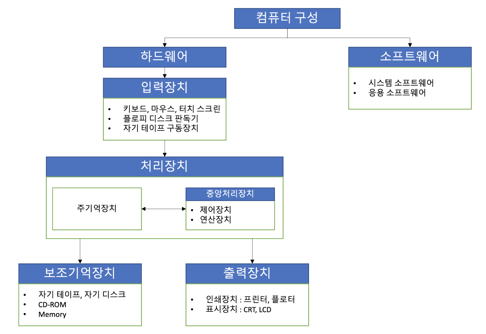
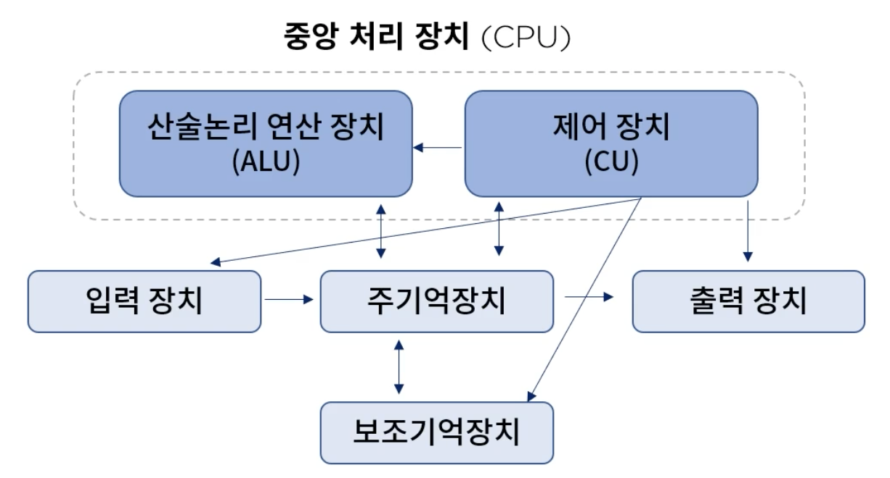
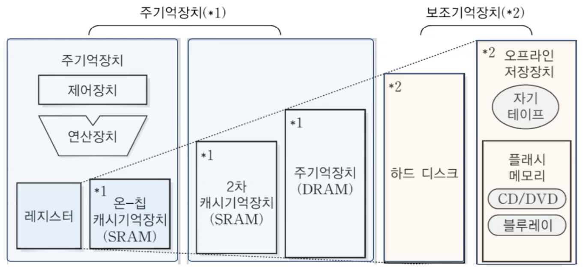

## 1. 컴퓨터 구조

#### 1. 컴퓨터 이해
    

1. 데이터의 표현
* 정보(information)
    * 어떤 사물에 대한 소식이나 자료
    * 가공된 데이터
* 데이터(data)
    * 정보를 작성하기 위해 필요한 자료나 정보를 처리하거나 전송할 때 이진(binary) 이나 디지털과 같은 좀더 편리한 형태로 바뀌어진 자료
    * 정보의 원재료
    
2. 데이터 표현 및 단위
* 수치 데이터 (Numerical data) : 연산용 데이터
* 비 수치 데이터 (Alphanumerical data) : 입출력용 데이터
* 특수문자(Special Character) : 입출력/연산용 데이터

#### 2. 컴퓨터 구성 요소
* 중앙 처리 장치 (Central Processing Unit)
  * CPU/MPU
  * 사물인터넷 디바이스 H/W 플랫폼 종류
  * CPU  
    * 실행 프로그램의 명령 해석, 실행, 장치 제어, ALU, CU 각종 레지스터로 구성
    
  * MPU
    * CPU 를 LSI(고밀도 집적회로)화 한 일종의 통합 장치
    * CISC(Complex Instruction Set Computer)
    * RISC(Reduced instruction Set Computer)
    * Bit Slice MPU 등이 존재한다.
  * 사물인터넷 디바이스류
    * 아두이노(Arduino)
    * 대표적인 오픈소스 H/W 플랫폼
    * Atmel 사의 AVR이나 Coretex-M3를 탑재한 마이크로 컨트롤러 보드
    * Raspberry Pi, Galileo, Edison
  
* 주변장치(Peripheral Device)
  * 기억장치(Memory unit)
    * RAM (Random Access Memory) - flash memory
      * DRAM(Dynamic RAM)
      * SRAM(Static RAM)
    * ROM (Read Only Memory)
  * 보조기억장치(Auxiliary memory device)
    
    * 동작 속도 : 저속
    * 가격 : 저렴
    * 다량의 데이터 저장
    * 플래시 기억장치 - EEPROM 의 한 종류(RAM 과 ROM 의 중간 위치)
      * CF(Compact Flash) 메모리
      * SSD(Solid State Drive)
    * USB 기억장치
    * SD card(Secure Digital Card)
    * 메모리 스틱(memory stick)
  * 입출력장치(Input/Output device)
    * 키보드
    * 마우스
    * 스캐너
    * 터치 스크린, 조이스틱, 광학 마스크 판독기
    * 바코드 판독기
  
#### 3. 컴퓨터 구조와 통신
1. 비즈니스 환경에서 통신과 네트워킹
* 네트워킹과 통신 추세
  * 80년대 이후 지속되고 있는 급속한 정보통신기술의 발전으로 그에 따른 컴퓨터 구조의 변화도 비약적인 발전과 새로운 시장 구도를 변화시키고 있는 상황
  * 네트워크 장비는 4차 산업혁명을 실현하기 위한 핵심 인프라
  * 최근 네트워크 장비가 미중 무역전쟁의 핵심 쟁점으로 부각
  * 유무선 통신, 방송 및 통신, 컴퓨터의 융합 등 컨버전스 가능
  * 고성능 컴퓨팅 기술을 활용한 대용량의 통신회선 교환이 가능
  * 소프트웨어 기술과 고밀도 집적 기술의 발달 -> 신형의 서비스와 장비 등장
  * 사용자 중심의 신기술이 활발하게 개발됨
  
2. 양자 컴퓨터
* 양자 컴퓨터
  * 양자컴퓨터는 중첩(superposition), 얽힘(entanglement) 등 양자의 고유한 물리학적 특성을 이용하여 다수의 정보를 동시 처리할 수 있는 새로운 개념의 컴퓨터
  * 현대 반도체 칩의 미세회로에서 발생하는 누설전류로 인한 고전 컴퓨터 성능 한계 돌파를 위한 대안으로 양자 컴퓨터 필요성이 대두
  * 양자 컴퓨터는 양자적 정보 단위인 양자 비트 또는 큐비트(qubit)를 정보처리의 기본 단위로 하는 양자 병렬처리를 통해 정보처리 및 연산 속도가 지수 함수적으로 증가하여 빠른 속도로 문제 해결이 가능
  * 양자 병렬성 (quantum parallelism) 
    * 단 한 번에 모든 숫자의 연산을 수행할 수 있는 성질
  

