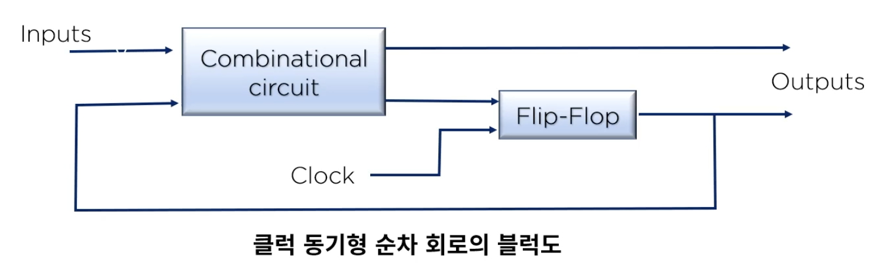

## 2. 데이터의 표현
#### 1. 데이터의 종류
1. 진법과 진법 변환
* 디지털 정보의 단위
    * 1 nibble = 4bit
    * 1 byte = 8bit
    * 1 byte = 1 문자 (character)
    * 영어는 1 byte 로 1 문자 표현 , 한글 2 byte 필요
    * 1 워드 : 특정 CPU 에서 취급하는 명령어나 데이터의 길이에 해당하는 비트 수
    * 워드 길이는 8, 16, 32, 64 비트 등 8의 배수가 가능
    
* 진법
    * 2 진법 : 0 과 1 두가지 기호로 표현하는 수의 체계
    * 8 진법 : 0.1.2.3.4.5.6.7 의 8 가지 기호로 표현하는 수 체계
    * 10 진법 : 0 ~ 9 의 10 가지 기호로 표현하는 수의 체계
    * 16 진법 : 0 ~ 9 , A, B, C, D, E, F 까지의 16 가지 기호로 표현하는 수의 체계
    * 8 진수 <-> 2 진수 (2진수 3자리)
    * 16 진수 <-> 2 진수 (2진수 4자리)
    
* 보수(Complement)
    * 최대값(해당 bit 에서 가장 큰 표현형)을 형성하는데 서로 보완 관계에 있는 두수 사이의 관계를 one's COMPLEMENT 라고 한다.
    * MODULUS(최대 표현 자리 수) 를 형성하는데 서로 보완관계에 있는 두수 사이의 관계를 two's COMPLEMENT 라고 한다.
    * ex) 10 진수에서의 보수
        * 1진 보수 : A+B=9, A+B=99
        * 2진 보수 : A+B=10, A+B=100
    * ex) 2진 보수
        * 1진 보수 : A+B=1, A+B=11, A+B=111
        * 2진 보수 : A+B=10, A+B=100, A+B=1000
        * 2진수의 1의 보수는 자신의 수를 반대로 바꾸면 되고, 2의 보수는 1의 보수에 +1 또는 주어진 수의 우단으로부터 최초의 유효 BIT 까지는 그대로 두고 나머지를 모두 반대로 바꾸면 됨
    
* 정수형(고정 소숫점, Fixed Point Number) 표현
    * 부호화 절대치
    * 정수의 부호와 절대치를 따로 보관 한다.
        * 음수 표현은 절대치가 같은 양수의 부호만 다르다
    * 표현 범위 (n bit 사용) : -2^(n-1) -1 ~ + 2^(n-1) -1
    * +0 과 -0 이 공존
    * 보수를 하는 방법
        * R 의 보수 R - 1 의 보수가 존재한다
        * 양수의 표현은 절대값 표현 방식과 동일
        * 표현의 범위(n bit 사용)
            * -(2^(n-1) -1) <= N <= (2^(n-1) -1)
            * -(2^(n-1)) <= N <= (2^(n-1) -1)
    * 10진수형 정수 표현
        * unpacked decimal
        * zoned decimal 이라고 하며 EBCDIC 의 숫자 표현과 동일
        * 1 byte -> 10 진수 한자만 표현
        * 연산에는 이용 될 수 없으나 입출력 가능
    
* 실수 표현(부동 소수점, Floating-point)
    * 과학적 표기의 지수(exponent)를 사용하여 소수점의 위치를 이동시킬 수 있는 표현 방법
    * 표현의 범위가 확대
    * 비트 수에 따라 분류가 가능
        * 단일 정밀도 부동 소수점 형식
        * 부호 비트 : 0 +
        * 지수(E) = 0000101 = 5
        * 기수(M) = 1001 0000 0000 0000 0000 ->  + 0.1001 * 2^5
    
* 디지털 코드
    * BCD 코드(Binary Coded Decimal Code : 2진화 10진 코드, 8421 코드)
    * 3초과 코드 (excess-3 코드)
    
* 에러 검출 코드
    * 패리티 비트
    * 해밍 비트
        * 8 비트 데이터의 에러 정정 코드
    
##### 2. 논리회로 게이트 (Logical gate)
* 논리 게이트는 논리 연산을 수행하는 전자소자로서 주어진 입력 변수 값에 대해여 정해진 논리 함수를 수행하여 그 함수의 연산 경과와 동일한 결과 값을 출력하는 하드웨어
* 스위칭 이론
    * 스위치의 on off 로 2진 정보를 표현하거나 논리 연산의 실행을 가능하도록 구성된 이론
    
* 논리연산의 기본표현
    * 논리곱 (AND)
    * 논리합 (OR)
    * 논리부정 (NOT)
    * 배타적 논리합 (exclusive OR)
    
#### 3. 부울 대수 와 논리식 간편화
1. 부울 대수(Boolean Algebra)
* 참과 거짓을 판별할 수 있는 논리적 명제를 수학적 표현의 논리
* 전개식으로 구현한 것은 1854 년 영국의 수학자 부울에 의해서 정의
* 논리 회로의 형태와 구조를 기술하는데 필요한 수학적인 이론
* 부울 대수를 사용하면 변수들의 진리 표 관계를 대수식으로 표현하기에 용이
* 동일한 성능을 갖는 더 간단한 회로를 만들기에 편리

2. 부울 대수의 기본법칙
    1. 교환법칙 (Commutative Law)
        * A*B = B*A
        * A+B = B+A
    2. 결합법칙 (Associative Law)
        * A*(B*C) = (A*B)*C
        * (A+B)+C = A+(B+C)
    3. 분배법칙 (Distributive Law)
        * A*(B+C) = A*B + A*C
    4. 드모르강의 정의(De Morgan's theorm)
    
    5. 부울 대수 간략화
        * E = (a' + bc) (a+b)
            = a*a' + a'b + abc + bbc
            = 0 + a'b + abc + bc
            = (a+1)bc + a'b
            = bc + a'b
    
3. 논리식 간편화 카노(Karnaugh) 맵
* 논리 표현식은 부울 대수를 이용해 간단히 만들수 있으나 여러가지 규칙이 있다
* 맵 방법은 부울 함수를 곧바로 간소화 할 수 있으므로 널리 활용
* 카노맵 표현 방법
    * 만약 변수가 n개 라면 카노 맵은 2^n 개의 민텀(minterm)으로 구성
    * 각 인접 민텀은 하나의 변수만이 변경되어야 한다
    * 출력이 1인 기본 곱에 해당하는 민텀은 1로 나머지는 0으로 표시
    
#### 4. 조합 & 논리 회로
1. 조합 논리 회로
* 조합 회로는 입력과 출력을 가진 논리 게이트의 집합으로 출력은 현재의 입력(0,1) 값과 조합의 함수
* 순차 논리 회로는 게이트 뿐만 아니라 기억 능력이 있는 플립플롭(Flip-Flop) 으로 구성
  
  
* 조합 회로의 설계 절차
    * 문제가 제시된다
    * 입력과 출력변수에 문자 기호를 붙인다
    * 입력과 출력 사이의 관계를 정의하는 진리표를 유도
    * 각 출력에 대한 간소화된 부울 함수를 얻음
    * 논리도를 작성
2. 기억회로의 구성 및 작동 원리

3. 순차회로
