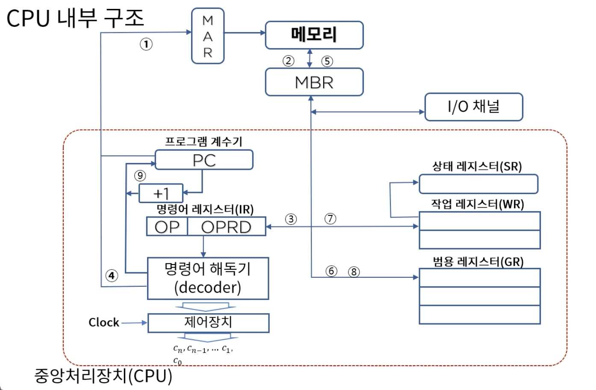
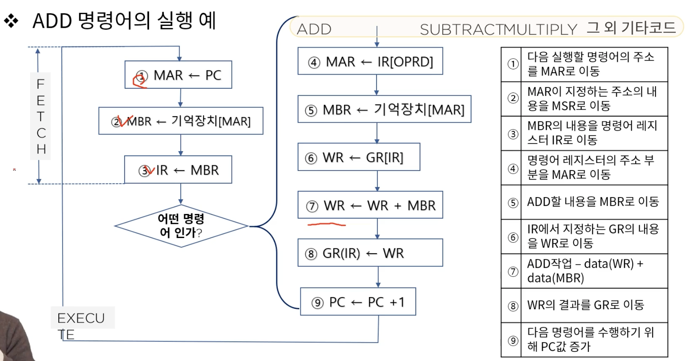
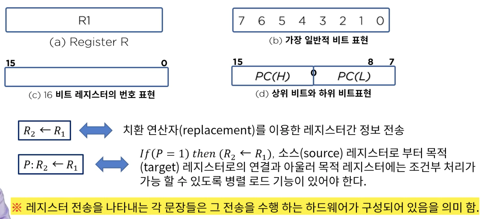
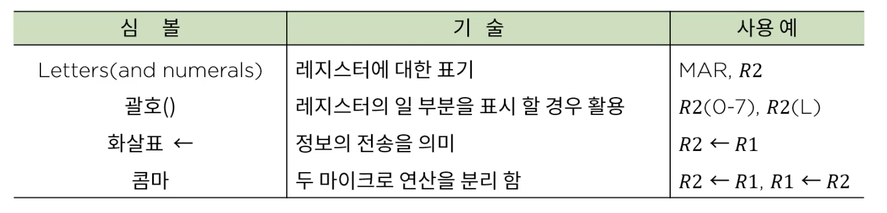
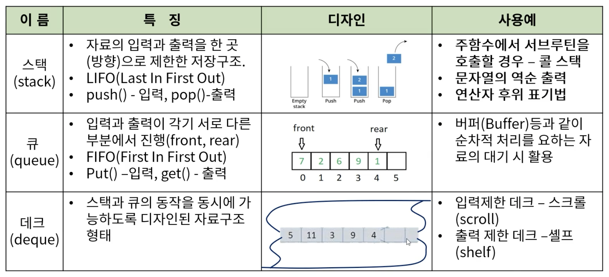
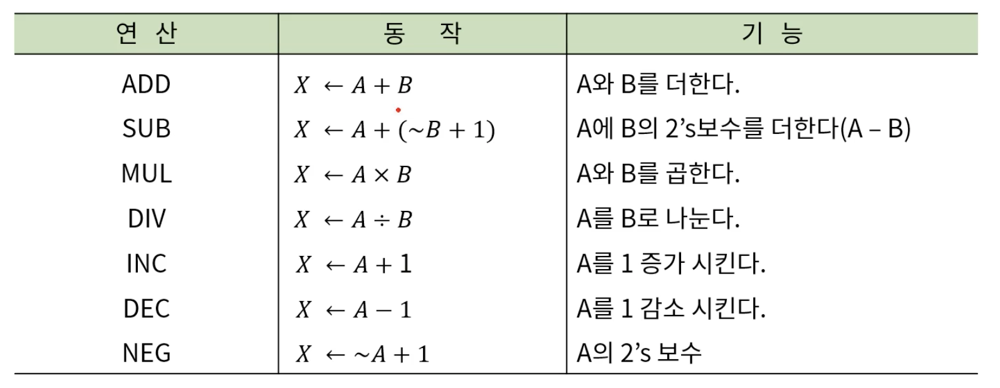
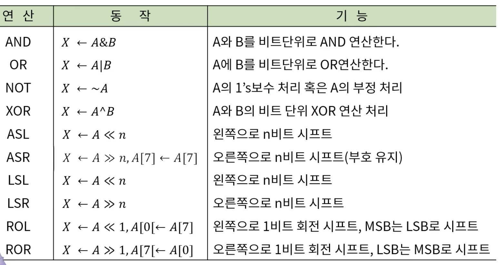
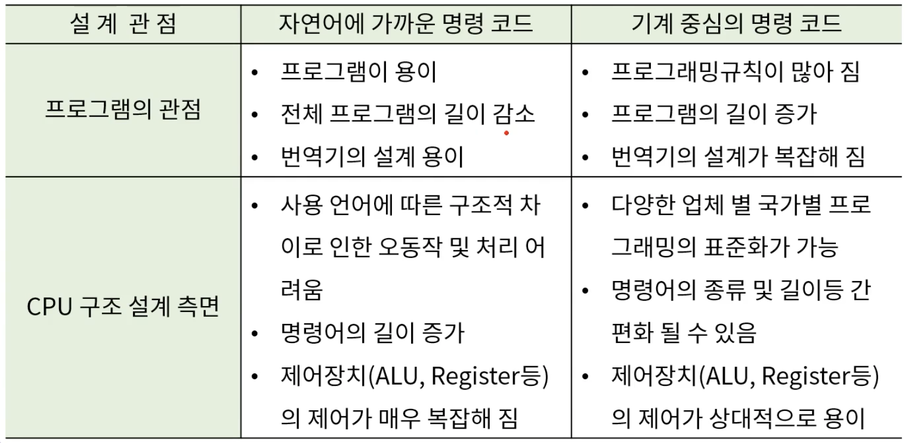
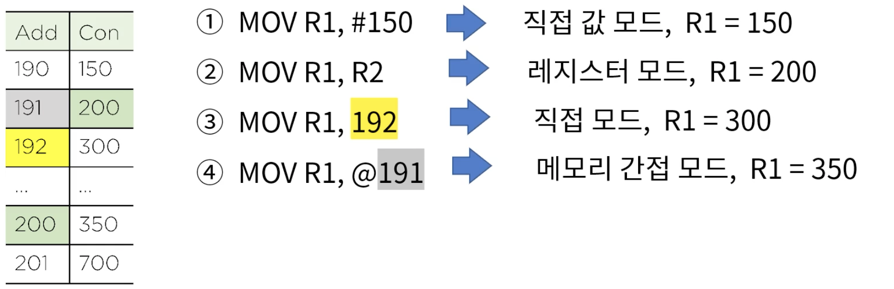
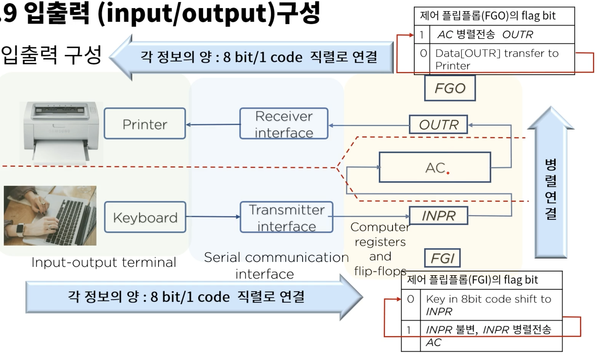

## 3. 중앙처리장치

#### 1. 내부구조 및 레지스터
1. CPU 구성요소
* 컴퓨터 데이터 처리동작을 수행하는 부분을 중앙처리 장치라고 하며 줄여서 CPU(Central Processing Unit) 라고 부른다
* CPU 는 레지스터 세트(Register set), 산술논리장치(ALU: Arithmetic Logic Unit) 그리고 제어장치(Control Unit) 로 구성

2. CPU 내부구조
   
   
3. 레지스터들의 명칭과 기능
* 프로그램 계수기(Program counter)
   * 다음에 수행될 명령어가 들어있는 주기억장치의 주소를 기억하고 있는 레지스터로 IC(instruction counter : 명령어 계수기) 혹은 LC(location counter : 위치 계수기) 라고도 함

* 명령 레지스터(Instruction Register)
   * IR 이라고도 하며 프로그램 계수기(PC)가 지정하는 주소에 기억되어 있는 명령어를 해독하기 위해 임시 기억하는 레지스터
   
* 명령어 해독기(instruction decoder)
   * IR 에 들어있는 명령코드의 해석(각종 명령코드 -> 제어 신호화 하여 기계 사이클ㅁ로 전송)을 담당하는 논리회로
   
* 제어장치(control unit)
   * ID 로 부터 보내져온 신호에 따라 명령어를 실행(clock 에 의해 발생)
   
* 범용 레지스터(general purpose register)
   * 작업 레지스터에서 DATA 가 용이하게 처리되도록 임시로 자료를 저장하는 경우 사용
   
* 작업 레지스터(working register)
   * 산술 논리연산을 실행할 수 있도록 자료를 저장하고 그 결과를 저장
   * GPR 과의 차이점은 ALU 에 연결되어 있는것 차이점
   
* 상태 레지스터(status register)
   * CPU의 상태를 나타내는 특수목적의 레지스터 - 연산결과의 상태, 영 Z (Zero), 부호 S (sign), 오버플로우 V (overflow), 캐리 C (carry), 인터럽트 I (interrupt)
     

#### 2. 내부구조와 명령어 집합
1. 명령어 구성과 실행
* 명령어 코드
   * 컴퓨터의 구조는 내부 레지스터, 타이밍과 제어구조 명령어 집합에 의해 정의
   
* 레지스터 전송 언어
   * 레지스터에 저장된 데이터의 조작을 위해 실행되는 동작을 마이크로연산(micro-operation)이라 함, 이는 하나의 클럽 펄스 내에서 실행되는 기본적인 동작(ex, 시프트(shift), 카운트(count), 클리어(clear), 로드(load))
   
* 디지털 컴퓨터의 구조를 정의하기 위하여 논의 되어야 할 내용
   * 레지스터의 종류와 그 기능
   * 레지스터에 저장된 이진 정보를 가지고 수행되는 일련의 마이크로 연산
   * 일련의 마이크로 동작을 온오프 시킬 수 있는 제어 기능
   
* 레지스터 전송
  
  * 레지스터 전송의 기본 기호
    
    
2. CPU 디자인
* CPU 내의 다양한 디바이스들간 상호 연결
   * 직접 연결 : 연결 복잡도가 장치수의 제곱에 비례
   * 버스 연결 : 공용선에 의한 연결
      * 가장 가성비 높은 연결 방식
      * 관리를 위한 다양한 방법이 제시됨
   
* 공용선에 의한 레지스터 상호 연결 
   - 멀티플렉서를 이용
   - 상태 버스 버퍼
   
* 스택, 큐, 데큐
  
  
#### 3. 마이크로 명령과 ALU
1. 마이크로 연산
* 마이크로 연산은 레지스터에 저장된 데이터에 대한 수행되는 기본적인 연산으로 디지털 컴퓨터에서 흔히 사용되는 마이크로 연산은 다음과 같은 네가지로 분류
  1. 레지스터 사이에서 이진 정보를 전송하는 레지스터 전송 마이크로 연산
  2. 레지스터에 저장된 수치 데이터에 대한 산술 연산을 수행하는 산술 마이크로 연산
  3. 레지스터에 저장된 비수치 데이터에 대한 비트 조작 연산을 수행하는 논리 마이크로 연산
  4. 레지스터에 저장된 데이터에 대해 시프트 연산을 수행하는 시프트 마이크로 연산
  
2. 산술 논리 연산 장치 (Arithmetic Logic Unit, ALU) : 산술 연산과 논리 연산
* 주로 정수 연산을 처리
* 부동 소수 (Floating-point Number) 연산 : FPU(Floating-Point Unit)
* 최근에는 ALU 가 부동 소수 연산까지 처리
* 산술 연산 : 덧셈, 뺄셈, 곱셈, 나눗셈, 증가, 감소, 보수
* 논리 연산 : AND, OR, NOT, XOR, 시프트(shift)

3. 산술 연산
   
   
4. 논리 연산과 산술 시프트 연산
   
   
#### 4. 마이크로 명령어 집합과 구성
1. 명령어 집합
* 실행 순서에 따른 명령어 분류
  * 순차적 실행 명령어 - 전체 실행 명령어의 70 ~ 80 % 차지
  * 분기 명령어
  * 부 함수 호출 명령어
  * 복귀 명령어
  
2. 명령어 구문 형식
  1. 명령 코드 : cpu 가 실행할 수 있또록 디자인 된 연산
  2. 오퍼랜드 : 연산에 사용되는 자료 값, 자료가 저장된 주소에 관한 정보
  3. 주소 지정 모드 (addressing mode) : 오퍼랜드가 저장된 위치를 인덱싱 (지정) 하는 방법

3. 명령어 집합의 설계
   
   
4. 주소지정 모드 (addressing mode)
* 명령어의 구조상 자료가 저장되어 있는 장소를 지정하는 방법이 필요
* 최대한 하드웨어와 소프트웨어의 독립성을 유지하여 프로그램의 유연성(pointer, indexing 등..) 을 가능하게 하여 명령어의 수와 길이를 줄이기 위한 세계적 표준화 기법
* 묵시적 모드 (operand 가 명령어에 포함되어 있지 않은 특수 모드)
  * NOP : NO operation, 오퍼랜드가 필요 없는 명령어
  * INC : 묵시적 오퍼랜드인 누산기(AC) 의 연산 명령어
  * ADD : 스택 구조의 명령어(스택에 오퍼랜드가 저장)

* 직접값 모드 (operand 자체가 명령어에 포함되어 있는 모드)
  * MOV R1, #100; 십진수 값 100이 두번째 오퍼랜드로 직접 명령문에 포함되어 있는 경우
  
* 레지스터 모드 (Register mode : 오퍼랜드가 레지스터에 저장된 모드)
  * ADD R1, R2; 레지스터 R1과 R2에 보유하고 값이 오퍼랜드 임
  
* 메모리 직접 주소 모드 (Direct mode : 오퍼랜드가 저장된 메모리 주소를 나타내는 모드)
  * MOV R1, 100; R1 에 100 번지의 내용을 이동하라는 내용 (물론 기종에 따라 반대의 경우도 가능)
  * 결국 100번지의 내용이 두번째 오퍼랜드임
  
* 메모리 간접 주소 모드 (Memory indirect addressing mode : 메모리를 이용하여 간접적으로 주소를 지정하는 모드)
  * MOV R1, @100; R1 <- M[100] or M[100] <- R1
  
* 예제
  * 다음 마이크로 명령을 수행 한 후, 어떤 변화가 생겼을까? ( 주어진 일부 메모리 내용을 참조 할 것, R1 = 100, R2 = 200 이라고 가정 )
    
    
#### 5. 입출력과 인터럽트
1. 입출력 (input / output)
* 컴퓨터는 사용자와 통신을 하기 위해서 외부 장치 즉 메모리로 데이터와 명령어를 읽어 들일 입력장치와 계산 결과를 사용자에게 표시해 줄 출력 장치를 갖추어야 한다
* 컴퓨터에는 다양한 입출력 장치들을 활용되고 있다

2. 입출력 구성
   
   
3. 인터럽트(interrupt)
* 컴퓨터 실행 속도 대비 외부 입력 장치와의 입출력 속도 차이
  * 컴퓨터의 프로세스 처리 속도 : 10 마이크로 세컨드 - fetch and execute cycle time
  * 입출력 장치의 처리 속도 : 10 문자 / 초 라고 가정한다면
  * 입출력 장치는 1문자 당 100,000 마이크로 세컨드(= 0.1 sec) 의 시간이 소요
  * 결론적으로 매 전송 시 5000번의 플래그 체크가 필요
  
* 이상과 같은 플래그를 사용한 통신 방법을 프로그램 제어 전송(program controlled transfer) 이라고 하는데 이것은 프로세스와 입출력 장치와의 속도차이 때문에 매우 비능률적
* 인터럽트 인 에이블 플립플롭 (interrupt enable flip-flop) IEN
  * 프로그램 제어 전송 대신에 외부장치가 전송 준비가 되었을 때 컴퓨터에 알리는 방법에 활용되는 플립플롭
  * 컴퓨터는 프로그램 실행 도중 플래그를 체크 하지 않으며 플래그가 세트되면 컴퓨터는 즉각 실행중이던 프로그램을 중지하고 플래그의 세트 정보를 받아들여 입출력을 실행, 입출력 실행 후 즉시 원프로그램으로 복귀
  
#### 6. 기본 컴퓨터 프로그래밍
1. 프로그래밍
* 하드웨어와 소프트웨어로 구성
* 하드웨어를 잘 동작 시킬 수 있도록 제어 지시하는 모든 종류의 프로그램을 소프트웨어라고 함
* 소프트웨어는 시스템 소프트웨어와 응용 소프트웨어로 나뉨

2. 프로그램 처리 과정
* 프로그램을 작성하는 일은 일련의 기계 명령어를 직, 간접적으로 기술하는 행위
* 컴퓨터 내부의 기계어는 이진 형태의 의미 파악이 힘든 형태로 구성되어 있어 프로그래머는 영자 숫자 형태의 기호로 프로그램을 작성하는 것이 더욱 편리
* 기계는 이러한 형태의 사용자 위주 프로그래밍 언어를 이해 할 수 없기에 이 기호 프로그램의 내용을 하드웨어가 인지 할 수 있는 이진 프로그램으로 옮길 필요 있음 -> 컴파일

