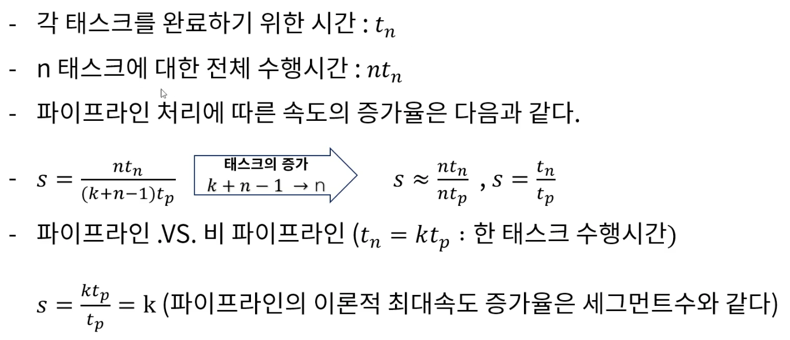
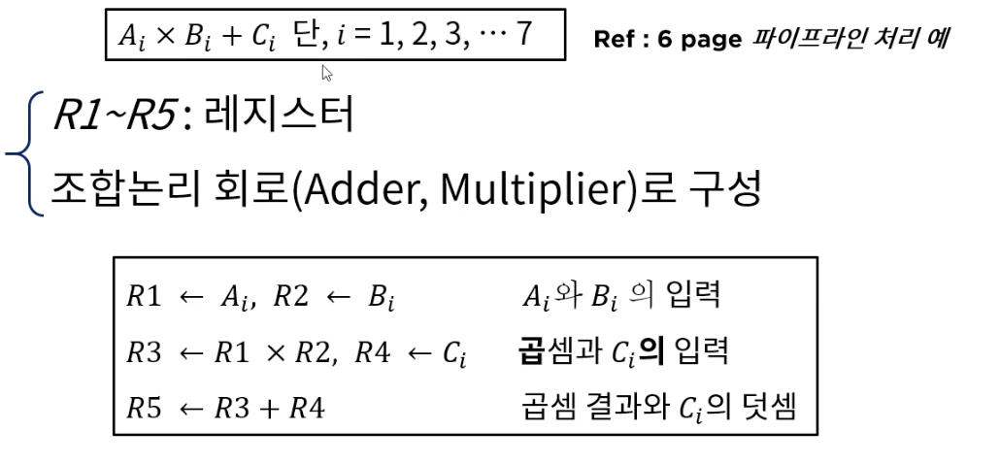
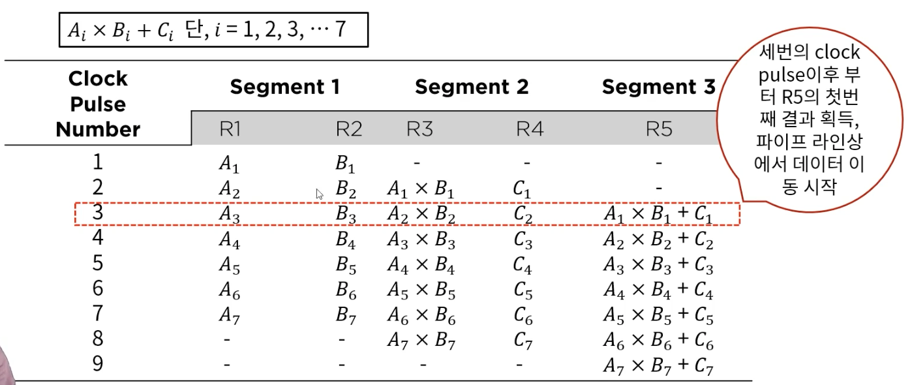
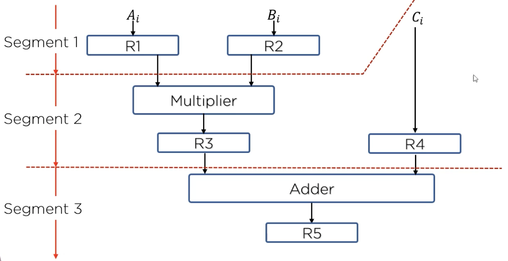
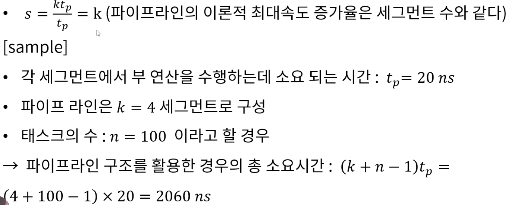
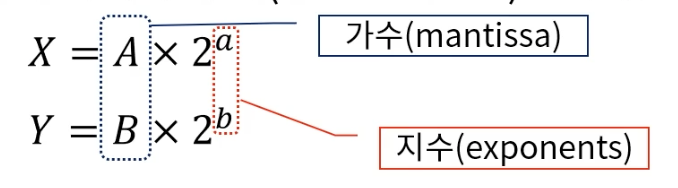

## 4. 파이프라인과 벡터처리
#### 1. 병렬처리
* 병렬 처리 (parallel processing)는 컴퓨터 시스템의 계산 속도 향상을 목적으로 하여 동시 데이터 처리기능을 제공하는 광범위한 개념의 기술을 의미

* 복잡도에 따른 병렬처리의 다양한 단계
    * 사용 레지스터의 형태에 따른 병렬 성 구현
        * 시프트 레지스터 VS 워드 당 동시에 전송이 가능한 병렬성을 갖는 레지스터
    * 동일한 또는 서로 다른 동작을 동시에 수행하는 여러 개의 기능 장치 (functional unit)를 가지고서 데이터를 각각의 장치에 분산 시켜 작업을 수행하는 경우
        * 산술, 논리, 시프트 동작을 세 개의 장치로 분류하고 제어장치의 관리에 따라 피 연산자를 각 장치들 사이에서 전환시킨다.
    
* M.J Flynn 의 분류 방법
    * 동시에 처리되는 명령어와 데이터 항목 에 의해 컴퓨터 시스템의 구조를 파악하려는 분류 방법 제안
        * 명령어 흐름(instruction stream) -> 메모리로 부터 읽어온 명령어의 순서
        * 데이터 흐름(data stream) -> 데이터에 대해 수행 되는 동작
    * SISD -> 단일 명령어 흐름, 단일 데이터 흐름
    * SIMD -> 단일 명령어 흐름, 다중 데이터 흐름
    * MISD -> 다중 명령어 흐름, 단일 데이터 흐름
    * MIMD -> 다중 명령어 흐름, 다중 데이터 흐름
    
* SISD
    * 제어 장치, 처리 장치, 메모리 장치를 가지는 단일 컴퓨터 구조
    * 명령어들은 순차적으로 실행되고 병렬처리는 다중 기능 장치나 파이프라인 처리에 의해서 구현
    
* SIMD
    * 공통의 제어장치 아래에 여러 개의 처리 장치를 두는 구조
    * 모든 프로세서는 동일한 명령어를 서로 다른 데이터 항목에 대하여 실행 시킬 수 있다
    * 모든 프로세서가 동시에 메모리에 접근할 수 있또록 다중 모듈을 가진 공유 메모리 장치가 필요
    
* MISD 
    * 이론적으로만 연구 되고 있음
    
* MIMD
    * 여러 프로그램을 동시에 수행하는 능력을 가진 컴퓨터 시스템
    * 대부분의 다중 프로세서와 다중 컴퓨터 시스템이 이 범주에 속함
    
> 이 분류 방식은 컴퓨터의 구조적 연계방식에 대한 고찰이기 보다는 외양적 행동 양식을 강조한 분류 방식이라고 볼 수 있다
> 
> 결국 이 분류 방식에 적합하지 않는 것이 파이프라인이다.

#### 2. 파이프라인
* 파이프라인 구조의 성능
    * 파이프라인의 동작은 공간, 시간표에 의해 설명
    * 시간에 대한 함수로서 세그먼트의 사용상황을 보여줌
    
    * 비파이프라인의 경우
      

#### 3. 파이프라인 구조
1. 파이프 라인(Pipeline)의 구현
    * 하나의 프로세스를 서로 다른 기능을 가진 여러 개의 서브프로세스로 나뉘어 각 프로세스가 동시에 서로 다른 데이터를 취급하도록 하는 기법
    * 각 세그먼트에서 수행된 연산 결과는 다음 세그먼트로 연속적으로 넘어가게 되어 데이터가 마지막 세그먼트를 통과하게 되면 최정적인 연산 결과를 얻게 됨
    * 하나의 프로세스를 다양한 연산으로 중복시킬 수 있는 근간은 각 세그먼트마다의 레지스터
    * 구현의 예
      
      
    * 파이프라인 처리 예
      
      
2. 파이프 라인 구조와 데이터 처리
* 파이프 라인의 일반적 고찰
    * 동일한 복잡도의 부연산들로 나뉘어지는 어떠한 연산 동작도 파이프라인 프로세서에 의해 구현 될 수 있음
    * 파이프라인 기수리은 매번 다른 데이터 집합을 동일한 태스크에 적용시켜 여러번 반봅하는 응용에 효과적
      
      
#### 4. 산술/명령어 파이프 라인
1. 현실적인 파이프라인 구조
* 파이프라인 구조 VS 병렬적인 다중 기능 장치
    * 실제 파이프라인 구조가 이론적인 최대 속도를 구현하지 못하는 이유
        * 각 세그먼트 들이 부연산을 수행하는 시간이 서로 다름
        * 각 레지스터를 제어하는 클럭 사이클은 최대 전파시간을 갖는 세그먼트의 지연시간과 싱크를 맞추어야함
    * 병렬적인 다중 기능 장치(= 파이프라인 처리 속도)를 고려 할 수 있음
        - 각 P 회로는 전체 파이프라인 회로에서와 동일하게 테스크를 수행
        - 이 구조는 순차적 처리가 아니라 모든 회로가 동시에 데이터를 입력 받아 네 테스크를 한번에 수행
        - SIMD 구조
    * 파이프라인 구조 > 순차적 처리 구조
    
2. 파이프 라인 구조가 적용되는 컴퓨터 설계
* 산술(arithmetic) 파이프 라인
    * 산술 연산들을 부연산으로 나누어 파이프 라인의 세그먼트에서 수행
        * 고속 컴퓨터에서 부동 소수점 연산, 고정 소수점 수의 곱셈, 과학 계산용으로 활용
        * 파이프라인 승산기(배열 승산기 - 부분 곱 사이의 캐리(carry) 전파시간의 최소화를 위한 가산기 보유)
* 명령어(instruction) 파이프 라인
    * 명령어 사이클의 fetch, 디코드, 실행 단계를 중첩 시킴으로 명령어 흐름에 동작
    
3. 산술 파이프 라인
* 부동 소수점 덧셈과 뺄셈을 위한 파이프 라인
    * 입력 : 두개의 정규화 (normalized) 된 부동 소수점 이진수
      
    * 각 세그먼트에서 수행되는 부 연산
        1. 지수의 비교
        2. 가수의 정렬
        3. 가수의 덧셈이나 뺄셈
        4. 결과의 정규화
    
* 산술 파이프 라인의 효율성
    * 부동 소수점 파이프라인의 구성 요소
        * 비교기, 시프터, 가산*감산기, 인크리멘터, 디크리멘터 -> 조합회로
    
4. 명령어 파이프 라인
* 명령어 실행과 파이프라인 구조
    * 명령어 파이프라인은 이전 명령어가 다른 세그먼트에서 실행되고 있는 동안 메모리에 연속적으로 저장되어 있는 다음 명령어를 읽어 옴으로써 fetch 와 실행이 중첩되어 동시에 수행되는 구조
    * 분기가 발생 할 경우(가장 큰 취약점) - 현재의 파이프라인은 모두 비워져야 하고, 분기 명령 이후에 메모리에서 읽어온 명령어는 모두 무시 되어야 함
    
* 보다 효율적 명령어 실행을 위한 파이프 라인 구조
    * 명령어 fetch 장치와 명령어 실행 장치로서 두 세그먼트 파이프라인을 구성하는 컴퓨터를 고려
        * 명령어 fetch 장치 -> FIFO(First-In-First-Out) 에 의한 Queue로 구성되어 queuing 기법에 의한 메모리 참조에 의해 평균 메모리 접근 시간을 효과적으로 줄임
    * 명령어 파이프라인이 수행되는데 있어 발생하는 애로 사항
        * 세그먼트의 수행 시간이 서로 다름(실행되지 않는 세그먼트도 있을 수 있음) ex 레지스터 모드 명령의 경우 - 유효주소 계산 불필요
        * 두개 이상의 세그먼트에 의해 동일한 주소 공간이 참조되는 경우
    
* 네 세그먼트 명령어 파이프라인의 예 - 명령어 파이프라인의 시간 관계
    1. FI 는 명령어를 fetch 하는 세그먼트
    2. DA 는 명령어를 디코드하고 유효주소를 계산하는 세그먼트
    3. FO 는 피연산자를 Fetch 하는 세그먼트
    4. EX 는 명령어를 실행하는 세그먼트
    
#### 5. 파이프라인 CPU 성능 분석
1. 파이프라인 분기 예측
* 명령어 파이프라인이 정상적인 동작에 벗어나게 되는 요인
    * 자원 충돌(Resource conflict)
        * 두 세그먼트가 동시에 메모리를 접근하려고 하는데 기인 -> 명령어 메모리와 데이터 메모리를 분리함으로써 대부분 해결
    * 데이터 의존성(data dependency)
        * 충돌은 어떤 명령어가 이전 명령어의 결과에 의종하여 수행되는데 그 값이 아직 준비되지 않은 경우에 발생
    * 분기 곤란(branch difficulty)
        * 분기 명령어 같이 PC 의 값을 변경 시키려는 명령어에 의해 발생
    
2 데이터 의존성
* 데이터나 주소의 충돌은 명령어 파이프라인의 성능을 저하 시키는 요인
    * 데이터 의존성
        * 아직 준비되지 않은 데이터를 기다리는 경우
        * FO 에 의해 피 연산자를 fetch 하련느 경우 아직 EX 세그먼트에 의해 데이터가 만들어지지 않는 경우
    * 주소 의존성
        * 마이크로 연산 시 레지스터 간접모드를 사용하는 명령어는 이전 명령어가 주소 값을 메모리로 부터 로드 하는 명령어라면 곧바로 피연산자를 fetch 하지 못하고 기다리게 됨
    
* 데이터 의존성 해결방법
    * 하드웨어 인터락(hardware interlock)
        * 어떤 명령어의 피 연산자가 파이프라인에서 앞서간 명령어의 목적지와 일치하는지를 검사하는 회로
        * 이러한 상황이 감지되면 피연산자가 준비되지 않은 명령어는 충돌을 피할 수 있을 만큼 충분한 클럭 사이클을 두어 지연
    * 오퍼랜드 포워딩(operand forwarding)
        * 충돌을 감지하는 경우 특별한 통로를 직접 파이프라인 세그먼트에 전달하는 경우
 
3. 분기 예측   
* 분기 명령어 처리
    * 조건 분기 또는 무조건 분기 등은 처리 여하에 따라 파이프라인의 정상적인 프로그램 순서를 바꾸어 버리기 때문에 파이플아ㅣㄴ 시스템을 채택하고 있는 컴퓨터의 성능을 저하시키는 주 요인으로 간주
        * 순차적으로 처리될 명령어를 분기의 목표가 되는 명령어와 함께 저장하는 방법
        * 분기 목표 버퍼(branch target buffer, BTB) 사용
            * fetch 세그먼트에 속해 있는 associative memory : 이전에 실행된 분기 명령어와 분기 목표 명령어를 지정하여 활용(loop buffer - 일종의 레지스터)

* 분기 명령어의 처리
    * 분기 예측(branch prediction)
        * 실제 다양한 프로그램의 실행 결를 분석한 결과 참조의 시간적 지역성과 유사하게 일부 명령어들은 반복 수행되며 반복 실행시에는 규칙성을 갖음
        * 이러한 예측 기법을 이용하여 분기 및 적제 명령어가 참조하는 오퍼랜드도 반복참조 시 규칙성을 갖고 있으며 이를 이용할 경우 명령어 fetch 과정에서 신속하게 오퍼랜드의 제공 및 fetch 가 수월해 질 수 있다
        * 다만 예측 실패시 지불해야할 패널티(시간 지연)가 있을 수 있다
    
4. RISC Processor
* RISC 프로세서의 설계 목표
    * 실행 명령어 수는 증가 하더라도 작업 처리 시간의 감소가 가능
    * 명령어당 실행 클록 수(CPI)와 클록 주기를 파이프라인 구조를 이용하여 감소시킬 수 있음
    
* RISC 프로세서의 구조적 특징
    * 명령어의 1 사이클 실행을 위한 파이프라인 구조, 메모리 참조를 위한 온칩 캐쉬(CPU 내 메모리 구현, 명령어 캐쉬, 자료 캐쉬로 구성)
    * 간단한 명령 코드와 주소 지정 모드 및 하드 와이어 적 제어 장치
    * 신속한 오퍼랜드 참조/문맥 전환을 위한 레지스터 집합(중첩된 레지스터 윈도우)
    * 실수 연산의 별도 처리를 위한 코프로세서(Co-processor)
 
5. 파이프라인 CPU 성능 분석
* 이론적으로는 명령어 세그먼트의 횟수가 많아질수록 파이프라인의 이론적 최대속도가 증가할 것으로 분석되었으나 실제 상황은 그렇게 단순하지 않음
    * 모든 명령어는 동일한 처리 과정(세그먼트의 적용)으로 처리되어야 함
    * 파이프라인을 구성하는 각 단계의 처리 시간이 일정해야함
    * 모든 명령어는 작성된 순서에 다라 순차적(분기 명령, 함수 호출, 반환 명령 등에 의해 순차성이 깨짐) 으로 실행되어 함
    * 명령어들 처리 시 공유 자원의 충돌이 없어야 함
    

    