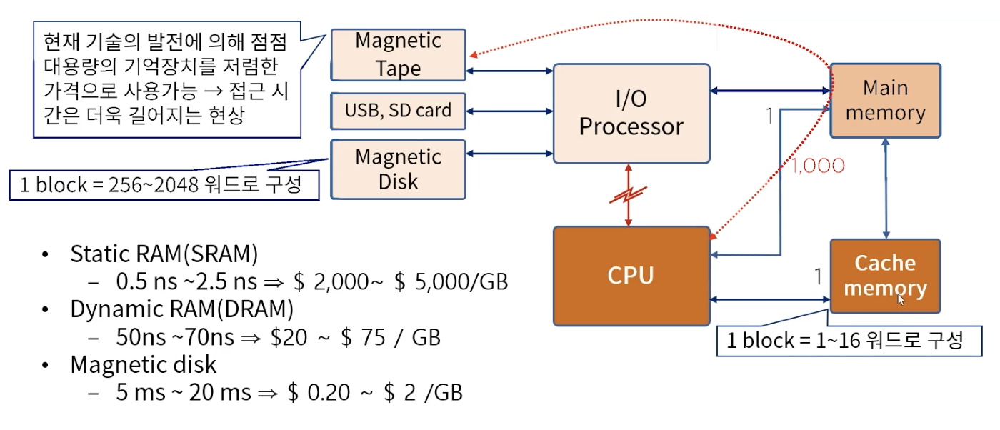
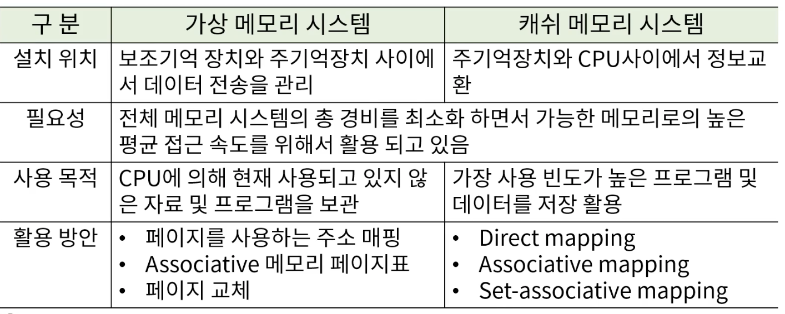

## 5. 메모리 구조

#### 1. 메모리 시스템의 이해
1. 메모리 계층
* 기억장치는 CPU 에 의하여 실행될 프로그램이 저장되는 곳
* 주기억장치, 보조기억장치 그리고 캐시 메모리로 분류
* 주기억장치
    * 마더보드에 장착됨
    * RAM : 비교적 대용량, 고속의 속도, 휘발성 성질
    * ROM : 주 기억장치의 일종
    
* 캐시 메모리
    * 주기억장치 접근 시간 > 프로세스 논리 회로 -> MMS & CPU
    * 현재 진행되고 있는 프로그램의 일부 또는 사용빈도가 높은 임시데이터 저장
    
* 보조 기억 장치
    * 비교적 저속, 대용량의 자료 보관이 가능
    * 보조기억장치내 자료는 필요한 경우 주 기억 장치로 옮겨야함
    * Magnetic Tape, USB, SD card - 필요한 파일의 생성 및 삭제가 가능
    * Magnetic drum, disk - back up 저장 장치
    * 코어(core) 메모리, magnetic bubble, CCD 등의 대용량 저장 장치
    
* 보조기억 장치의 주요 특성
    * 접근 시간 : 메모리내의 기억 장소에 도달하여 그 내용을 얻는데 요구되는 평균 시간을 의미
        * 시크 타임(seek time) : read/write head 가 지정된 기억 장소에 도달하는데 소요 되는 시간
        * 트랜스퍼 타임(Transfer time) : 추출된 데이터를 장치내 또는 장치 밖 필요한 곳으로 전송하는데 요구되는 시간
        * 레코드(record) : 일반적으로 데이터가 기록되는 단위, 시크 타임을 체크하게 되는 기준(일정한 길이의 수치 또는 문자 집합)
        * 전송률 : 장치가 레코드의 시작점에 위치한 다음 단위 시간당 보통 분(minute) 전송 할 수 있는 문자나 워드의 수

* 컴퓨터 시스템의 메모리 계층
  
  
#### 2. 효율적인 메모리 관리 정책
1. Associative Memory
* 내용에 의해 접근하는 메모리 장치를 이르는 용어
    * 메모리 장치란 자료의 저장과 접근을 용이하게 하기 위해 필요로 하는 장치
    * 결국 이상의 필요에 따라 CPU 는 필요한 자료를 얻기 위해 메모리 장치에 탐색을 하게 될수 밖에 없음
    * 좀 더 효율적 탐색이 가능 할 수 있는 저장 공간의 필요에 의해 만들어진 저장 형태 (내용 지정 메모리 (content addressable memory, CAM) 이라고도 함)
    
* 이 방식은 데이터의 내용으로 병렬 탐색을 하기에 적합하게 구성
* 탐색은 전체 워드 또는 한 워드 내의 일부를 가지고 실행
* 각 셀의 능력 뿐 아니라 외부의 인자와 내용을 비교하기 위한 논리회로를 가지고 있기 때문에 RAM 보다 비쌈
* 탐색 시간이 짧아야 하고 그것이 중요한 이슈일 경우 활용

2. 캐시 메모리
* 참조의 국한성(locality of reference)
    * 프로그램이 수행되는 동안 메모리 참조는 국한된 영역에서만 이루어지는 경향이 있음을 확인
        * 프로그램 루프와 서브루틴의 빈번한 활용
        * 순차적 프로그램의 실행
        * 데이터 메모리 참조에서도 동일한 경향이 있음을 확인
            * 테이블-룩업(Look-up) 절차
            * 공통 메모리와 배열 사용 예
    
    * cache 메모리
        * 참조의 국한성을 이용하여 속도는 빠르고(거의 CPU 처리 속도와 동일), 조그마한 메모리(고 비용이)를 이용하여 프로그램을 수행시킬 경우 평균 메모리 접근시간의 단축과 그에 따른 전체 프로그램 수행 시간의 절약을 담보 할 수 있을것이다.
    
* 캐시 메모리의 동작과 성능
    * 캐시의 기본 동작 (CPU 가 메모리에 접근 할 필요가 있을 경우)
        * cache 체크
        * 워드가 cache 에서 발견되면 읽어들이고 아닐 경우 주기억장치에 접근
        * 워드를 포함한 블록을 캐시로 전송
    * Hit ratio
        * Hit / cpu 에 의한 메모리 참조 총 수 
        * 약 0.9
    
* 캐시 메모리 매핑 프로세스
    * 효율적 메모리 관리를 위해서 효과적으로 캐시를 구성하는 방법이 현존하는 메모리 관리 방법 중 최고의 방법
    * 다음과 같은 방법이 존재
        * associative mapping
        * Direct mapping
        * Set-associative mapping

* associative mapping
    * 가장 빠르고 융통성 있는 캐시 구조
    * CPU 의 15bit 주소는 인자 레지스터에 놓여지며 associative memory 내 주소와 같은 12 bit 의 데이터를 읽어 CPU 로 보냄
    * Miss 인 경우 CPU 는 주 기억 장치에서 해당 자료를 찾아 캐시로 옮김
    * 캐시에 여유 공간이 있다면 그 공간에 주소와 데이터를 저장
    * 캐시가 꽉 차 있을 경우 기존 캐시의 주소와 데이터 싸이 중 주어진 알고리즘에 의해 해당 주소 데이터 쌍이 새로운 쌍으로 대체
    
* Direct Mapping
    * SRAM 에 구현한 캐시 메모리
    * 15 bit(CPU address) = 6 bit(Tag field) + 9 bit(index field)
    * Index field - cache 의 색인 주소로 활용
    * Tag field - cache 에서 동일한 index 로 충돌이 발생 시 활용
    * 동일한 인덱스의 다른 태그를 보유한 두개 이상의 워드가 반복하여 접근 할 경우 히트율이 현저히 떨어질 가능성이 높다 - locality of reference
    
* Set-associative mapping
    * Cache 의 각 워드는 같은 인덱스 주소 아래 두개 이상의 메모리 워드를 저장할 수 있게 함으로써 직접 매핑의 단점을 보완한 논리
    * 큰 규모의 캐시는 히트율을 높일 수 있으나 좀 더 복잡한 비교 논리 회로를 필요로 한다
    * 기존 데이터의 대체 알고리즘이 복잡해 짐
    
3. 가상 메모리
   

4. 메모리 관리 하드웨어
* 메모리 관리 시스템
    * 메모리의 광역화(가상 메모리+캐시 메모리) 와 멀티 프로그램의 발달로 인한 시스템 내 상호 간섭도 시스템 기능 저하요인의 중요한 부분
    * 프로그램과 프로그램 사이의 데이터 흐름, 선후 데이터의 활용, 사용 메모리의 양 조절, 다른 프로그램의 흐름에 영향을 끼치지 못하게 하는 제어 등의 역할을 담당
    * 메모리 내의 여러 프로그램을 관리하기 위한 하드웨어와 소프트웨어 절차의 집합체로 메모리 관리 소프트웨어는 운영체제의 일부
    
* 메모리 관리 하드웨어
    * 논리 메모리 참조를 물리 메모리 주소로 변환하는 동적 저장장소 재배치를 위한 기능
    * 메모리내에서 서로 다른 사용자가 하나의 프로그램을 같이 사용하기 위한 편의
    * 사용자 간의 허락되지 않은 접근을 방지하고 사용자가 OS 의 기능을 변경하지 못하도록 하는 정보의 보호
    
#### 3. 다양한 기억장치
1. 주기억장치
* DDR
    * RAM 규격의 일종으로 삼성에 의해 발표된 새로운 규격
    
* SDRM(Synchronous Dynamic Random Access Memory)
    * DRAM 의 발전된 형태, 동기식 DRAM(제어장치 입력 = 클럭 펄스(clock pulse) 주기(Frequency)) 라고 할 수 있음
    
* SDR(Single Data Rate)
    * 클럭 펄스의 변이 (0<->1) 시 단 한 차례의 정보 전송만을 허용하는 구조
    
* DDR SDRAM(Double Data Rate SDRAM)
    * 클럭 신호의 상승 및 하강 에서 데이터를 전송(double pumping) 함으로서 더 큰 대역폭을 달성하는 DDR
    * 클럭 주파수를 증가시키지 않고도 전송 속도를 두 배로 향상시킬수 있음
    
* DDR2 SDRAM(Double Data Rate Two SDRAM)
    * 향상된 버스 신호에 의해 DDR2의 free batch buffer 는 4비트
    * 내부 클럭 속도는 DDR 과 같지만 DDR2 의 전송 속도는 향상된 I/O 버스 신호로 인해 533~800 MT/s에 도달
    * DDR2 533 DDR2 800 메모리 타입 출시
    
* DDR3 SDRAM
    * 40% 의 전력 소비로 낮은 작동 전류 & 전압 제공
    * ASR(Automatic Self-Refresh) SRT(Self-Refresh Temperature)
* DDR4 SDRAM
    * 낮은 작동 전압(1.2V) 높은 전송 속도를 제공
    * DBI(Data bus inversion), CRC(Cyclic Redundancy Check) CA parity 등의 기능 추가로 신호 무결성을 향상
    * 데이터 전송/액세의 안전성 향상
    
2. 보조기억 장치
* SSD (Solid State Drive)
    * 고형 상태 보조기억 장치
    * 출력장치인 액정 디스플레이 , 아몰레드 디스플레이와 비슷한 사례
    * HDD 는 자기 디스크, SSD 는 플래시 메모리로 구성
    * 구동 부가 없으며 소음도 대폭 감소
    * 소모 전력과 발열 수준 낮음
    * 회전판이 제거된 컴퓨터를 제로 스핀 시스템이라고 함
    
* RAID(Redundant Array of Inexpensive(or Independent) Disk)
    * 성능의 향상을 위하여 가격이 저렴하고 크기가 작은 여러 개의 하드 디스크들을 묶어 하나의 기억 장치처럼 사용 할 수 있게 하는 방식
    * 다수의 하드 디스크들은 오류 복구에 대한 정책에 따라 여러가지 방식으로 구분된다.
    * 상호 계층적은 아님
    
    * RAID level 0
        * 성능 향상을 위한 여분 없음
        * 신뢰성 보다는 가격 경쟁력에 집중
        * Strip -> 데이터를 사용 가능한 디스크에 기술하는 방식( 물리적 블록, 섹터 등이 될수 있음 )
    * RAID level 1
        * 단순 복사본으로 구성
    * RAID level 2
        * parity disk(hamming code) 사용
    * RAID level 3
    * RAID level 4~6
        * 각 디스크들의 독립적 Access 가능
    * RAID level 5,6
        * 4 와 차이점 parity disk 의 위치
    
* USB( Universal Serial Bus )
    * 주로 시리얼 포트나 패러럴 포트 등의 데이터 입출력 단자에 연결하여 이용하는 주변 기기들을 좀 더 쉽게 이용하기 위해 만들어진 단자
    
