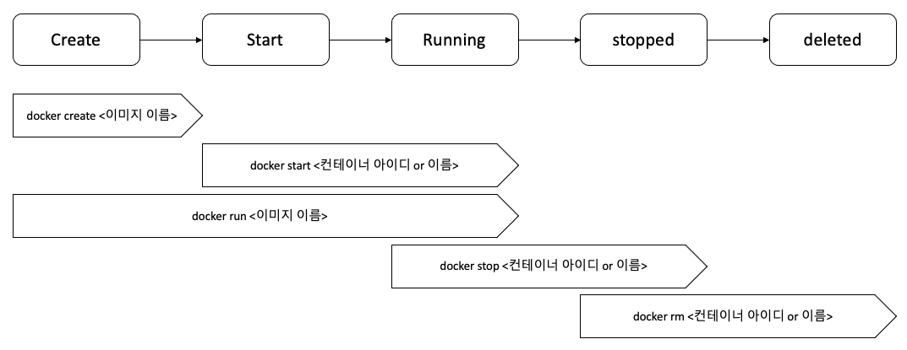

## 3. Docker Life Cycle
#### 1) Docker life cycle
간단하게 Docker Life Cycle을 보면 아래 그림과 같다.

자세한 동작은 하나하나씩 살펴보자



#### 2) docker create, docker start

이전에 공부했던 명령어 docker run 을 사용해서 컨테이너를 생성해봤다.

docker run 은 위에 그리에서 보듯이 create, start 를 합쳐놓은 것입니다.

다시 말해서 

docker run = docker create + docker start

라고 볼 수 있다.

* docker create <이미지 이름>

이미지 파일 스냅샷을 하드디스크에 넣어줌

* docker start <컨테이너 아이디 or 이름>

create 에서 생성한 컨테이너 아이디 혹은 이름을 실행 시킴

[실습]
```
# docker create hello-world
b4739bcaae0ce6b49b71490035f2a61bb80f525bd3e04040ac70fb2bae8659d2
# docker start -a b4739bcaae0ce6b49b71490035f2a61bb80f525bd3e04040ac70fb2bae8659d2
Hello from Docker!
This message shows that your installation appears to be working correctly.
.....
```
   * docker start 시에 -a 옵션은 attach 의 줄임말로 docker 컨테이너가 실행될때 붙어있으면서 output 을 화면에 표출 해주는 것

#### 2) docker stop, docker kill

* Stop 과 Kill 은 공통점?

   - 둘 다 실행중인 컨테이너를 중지
   

* Stop 과 Kill 은 차이점?
   - Stop : 동작하고 있는 작업들을 완료하고 컨테이너를 중지
   - Kill : 바로 컨테이너를 중지

#### 2) docker rm
* 컨테이너를 삭제 하기 전에 중지된 상태여야 한다
1) 중지된 컨테이너 삭제
```
# docker rm <아이디 / 이름>
```

2) 모든 컨테이너 삭제
```
# docker rm `docker ps -a -q`
```

3) 이미지 삭제
```
# docker rmi <이미지 아이디>
```

4) 한꺼번에 컨테이너, 이미지, 네트워크 모두 삭제
```
# docker system prune
```
   * Docker 를 쓰지 않을 때 모두 정리하고 싶을때 사용
   * Docker 를 많이 쓰다보면 용량이 크다 보니깐 정리가 필요할 수도 있음
   * 실행중인 컨테이너에는 영향을 주지 않음


[실습]
```
# docker ps -a
CONTAINER ID   IMAGE         COMMAND            CREATED          STATUS                      PORTS     NAMES
b4739bcaae0c   hello-world   "/hello"           11 minutes ago   Exited (0) 10 minutes ago             great_mccarthy
7f2c5b2b47f5   alpine        "ping localhost"   23 hours ago     Exited (255) 5 hours ago              ecstatic_raman
0f6dc69936aa   hello-world   "/hello"           13 days ago      Exited (0) 13 days ago                awesome_fermi

// 컨테이너 삭제
# docker rm b4739bcaae0c
b4739bcaae0c

docker ps -a
CONTAINER ID   IMAGE         COMMAND            CREATED        STATUS                     PORTS     NAMES
7f2c5b2b47f5   alpine        "ping localhost"   23 hours ago   Exited (255) 5 hours ago             ecstatic_raman
0f6dc69936aa   hello-world   "/hello"           13 days ago    Exited (0) 13 days ago               awesome_fermi

// 컨테이너 전체 삭제
# docker rm `docker ps -a -q`
7f2c5b2b47f5
0f6dc69936aa

# docker ps -a
CONTAINER ID   IMAGE     COMMAND   CREATED   STATUS    PORTS     NAMES

# docker system prune
WARNING! This will remove:
  - all stopped containers
  - all networks not used by at least one container
  - all dangling images
  - all dangling build cache

Are you sure you want to continue? [y/N] y
Deleted Containers : 

Total reclaimed space: 0B
```
