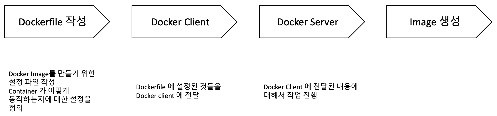

## 5. Docker Image 만들기

* Docker Image 는 컨테이너를 만들기 위해서 필요한 설정이나 종속성을 가지고 있는 패키지

* Docker Hub 에서 다른 사람들이 만든 Image 를 사용할 수 있고 직접 Image 를 만들어서 Docker Hub 에 업로드 할 수 있다.

### 1. Docker 이미지 생성 순서
   

### 2. Dockerfile 만들기

* Docker Image 를 만들기 위해 첫번째로 작성해야하는 설정 파일
* Container 가 어떻게 동작하는지 설정에 대해서 정의

#### Dockerfile 만드는 방법
1. Base 이미지 명시 (파일 스냅샷)
2. 추가로 설치할 파일을 다운 받기 위한 명령어 명시
3. 컨테이너 시작시 실행될 명령어 명시

#### Base 이미지란?
- Docker Image 는 여러개의 Layer 로 이루어져 있다.
- 그 중에 Base Image 는 기반이 되는 설정들을 가지고 있는 이미지라고 볼 수 있다.
- 필요하다면 Base Image 에 또 다른 Layer 를 추가 할 수 있다.

### 3. Docker Client, Docker Server
- Dockerfile 작성이 끝났으면 Docker Client 에 전달되어 Docker Server 가 인식이 되게 해야함
- build 명령어를 사용해서 dockerfile 을 찾아 docker client 에 전달
```
# docker build ./
# docker build .
```

#### * 베이스 이미지에서 다른 종속성이나 새로운 커맨드를 추가할때 임시 Container 를 토대로 새로운 이미지를 만든다. 그 후에 임시 Container 는 지워준다.

### 4. Image 이름 생성

* 원래
* option 을 사용해서 이름을 지정
```
# docker build -t jun/hellotest:latest ./
# docker images
REPOSITORY      TAG       IMAGE ID       CREATED       SIZE
jun/hellotest   latest    2f49cd7c6fc1   2 weeks ago   5.61MB

# docker run -it jun/hellotest
```
* option 에는 3가지 영역이 있음
    * jun -> Docker ID
    * hellotest -> 저장소/프로젝트이름
    * latest -> 버전


[실습]
#### 목표 : Hello World 를 출력하는 이미지 생성

file 이름 : Dockerfile
```
# Base Image 명시
FROM alpine

# 추가적으로 필요한 파일 다운
# RUN command

# 컨테이너 시작시 실행될 명령어
CMD ["echo", "hello world"]
```

 * FROM : 이미지 생성시 기반되는 이미지 레이어 <이미지이름>:<태그> 형식으로 작성. 태그는 생략 가능
 * RUN : Docker Image 가 생성되기 전에 수행할 쉘 명령어
 * CMD : 컨테이너 시작되었을 때 실행 파일 또는 쉘 스크립트

