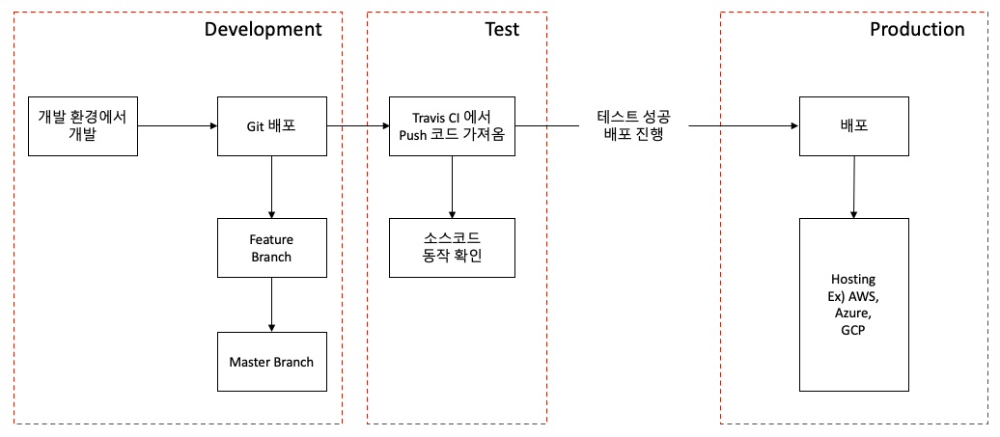

## 8. 간단한 React 앱 개발 - 개발 환경

간단한 단일 Docker Container 로 개발

[개발 구조]



#### 1. project folder 생성

#### 2. React 설치
```
npx create-react-app <폴더경로>
```

* react 실행
```
npm run start
```

* react Test
```
npm run test
```

* react build
```
npm run build
```

#### 3. Docker 이미지 생성
[Dockerfile 생성]
* 개발 환경, 운영 환경 둘다 다르게 작성해주는게 좋음

Dockerfile.dev
```
FROM node:alpine

WORKDIR /usr/src/app

COPY package.json ./

RUN npm install

COPY ./ ./

CMD ["npm", "run", "start"]
```
* Dockerfile.dev 로 이미지 생성
```
build -f Dockerfile.dev -t silentken/sample-code:latest .
```

* Docker 환경에서 실행하려면 node_modules 빌요하지 않음. 오히려 build 시간이 더 늘어남
* 중복이 되지 않기 위해서 node_module 을 지워주면 된다.

#### 4. Docker 실행
```
docker run -it -p 3000:3000 silentken/sample-code
```

#### 5. Volume 을 이용한 소스코드 변경
```
docker run -it -p 3000:3000 -v /usr/src/app/node_modules -v $(pwd):/usr/src/app silentken/sample-code
```

#### 6. Docker Compose 로 실행
[docker-compose.yml]
```
version: "3"
services:
  react:
    build:
      context: .
      dockerfile: Dockerfile.dev
    ports:
    - "3000:3000"
    volumes:
    - /usr/src/app/node_modules
    - ./:/usr/src/app
    stdin_open: true
```

```
docker-compose up -d --build
```

#### 7. React App Test Using Docker

```
docker build -f dockerfile.dev .
docker run -it silentken/sample-code npm run test
```

* docker compose 활용

[docker-compose.yml]
```
version: "3"
services:
  react:
    build:
      context: .
      dockerfile: Dockerfile.dev
    ports:
    - "3000:3000"
    volumes:
    - /usr/src/app/node_modules
    - ./:/usr/src/app
    stdin_open: true
  tests:
    build:
      context: .
      dockerfile: Dockerfile.dev
    volumes:
      - /usr/src/app/node_modules
      - ./:/usr/src/app
    command: ["npm", "run", "test"]
```

```
docker-compose up -d --build
Creating sample-code_tests_1 ... done
Creating sample-code_react_1 ... done
```
