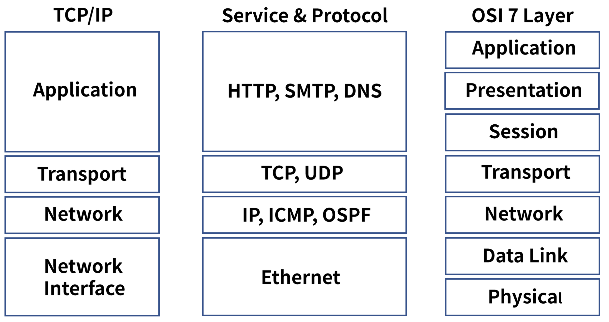
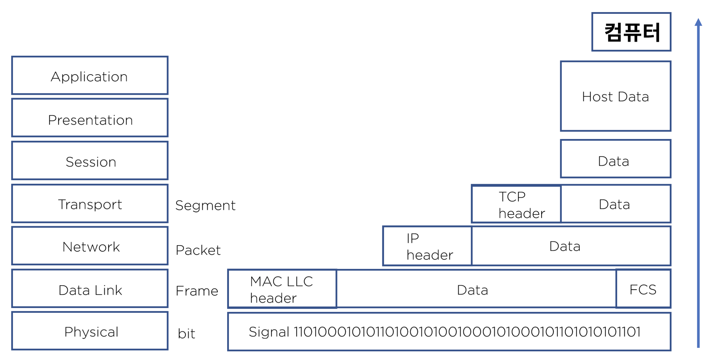

## 1. 네트워크
#### 1. 네트워크란?
* 분산되어 있는 컴퓨터들이 자원을 공유할 수 있게 통신망으로 연결

#### 2. 네트워크의 중요성
* 3차 산업혁명
    * 디지털 + 인터넷 (공유) = 지식 정보화 사회 -> 급격한 기술의 발전
    
* 4차 산업혁명
    * 정보통신 기술의 융합 - 대표 요소 기술로 빅데이터, 인공지능, 사물인터넷 등 7가지
    * On Network - 대부분 요소 기술들은 네트워크 위에서 동작
    * 블록체인 기술은 신뢰 가능한 인터넷
    
* FAANG
    * Facebook, Apple, Amazon, Netflix, Google
    * Network 연결에서 동작하는 서비스
    
* 네트워크 역사
    * 1940 : 전신기를 통해 계산기에 명령어 전달
    * 1962 : 컴퓨터에 전신기 연결
    * 1964 : 시분할 시스템 개발. 전화 연결 및 제어
    * 1968 : 패킷 스위칭, 네트워크 시스템 제안
    * 1969 : 아파넷, 4개 대학으로 망 구성
    * 1982 : 서울대와 구미 연구소, 패킷 스위칭 연결
    * 1986 : LG PC 통신 천리안
    * 1994 : KT 인터넷 상용서비스
    * 1998 : SK 브로드밴드 초고속 인터넷 도입
    * 2010 : 인터넷 보급률 95%

#### 3. 네트워크 형태
* LAN( Local Area Network) 근거리 통신망
    * 사무실 또는 학교 등의 가까운 지역을 한 데 묶은 네트워크
* WAN(Wide Area Network) 장거리 통신망
    * 각각 떨어진 LAN 망을 연결, 규모가 큰 네트워크, ISP 연결
* VPN(Virtual Private Network) 가상 사설망
    * 공중망을 사설망처럼 사용, 암호화
    
#### 4. 네트워크 표준
* 네트워크 표준기구
    * ISO 국제 표준 기구
    * IEEE 미국전기전자협회(주로 LAN)
    * ITU-T 국제 전기통신연합 통신표준본부(주로 WAN)
* 인터넷 표준기구
    * IETF 인터넷 엔지니어 테스크포스
    * RFC - 프로토콜 정의 문서
* 이더넷 -> IEEE 802.3
* TCP/IP -> RFC 1122&1123, HTTP/1.1 -> RFC 2616
* OSI 7 Layer -> ISO Standard Model

#### 5. 네트워크 구조
* 규모
    * 회사나 학교 등의 집단 크기에 따라 구분 - 사용자, 대역폭
    
* 업종
    * 공공기관, 제조, 금융, 게임 등의 업종에 따른 서비스 중요도
    
* 통신 방식과 경로
    * Server & client, Peer to Peer
    
* 토폴로지
    * star
    * ring
    * mesh
    * bus
    * tree
    * redundancy
    
* 홈네트워크
    * 인터넷 - ISP - 모뎀 - 공유기 - 컴퓨터
    
* 기업용 네트워크
    * ISP - 전용선 - 라우터 -방화벽 - L3 백본 - L2 스위치 - 서버,컴퓨터 
                                - L4 로드밸런서 - DMZ

* 클라우드 네트워크
    * 인터넷 - route53 - IGW - VPC - ELB - Auto Scaling - Security Group - EC2
    
#### 6. OSI 7 Layer
1. OSI 7 Layer
* 정의
    * 네트워크 프로토콜과 통신을 7 계층으로 표현
    
* 목적
    * 프로토콜을 기능별로 나누고 계층 별로 구분
    * 벤더간 호환성을 위한 표준 필요 -> 쉬운 접근성으로 기술의 발전
    
* 역사
    * 1970 년대 초 네트워크는 정부 또는 특정 벤더에서 독점 개발, 공개형 모델 필요
    * 1970 년대 말 ISO(국제 표준화 기구)에 의해 관리
    * 1984 년 ISO 7498 릴리즈
    
2. OSI 7 Layer 모델
    1. Physical
        * 네트워크 하드웨어 전송 기술
        * 기능
            * 장치와 통신 매체 사이의 비정형 데이터의 전송을 담당
            * 디지털 bit(0&1)를 전기, 무선 또는 광 신호로 변환
            * 전송되는 방법, 제어 신호, 기계적 속성 등을 정의
            * 케이블, 인터페이스, 허브, 리피터 등이 이에 속함
    2. Data Link
       * 이더넷, 랜카드, Mac 통신, 에러검출/재전송
       * 기능
            * 동일 네트워크 내에서 데이터 전송, 링크를 통해서 연결을 설정하고 관리
            * 물리 계층에서 발생할 수 있는 오류 감지하고 수정
            * IEEE 802 에서 정의
            * MAC(Media Access Control), LLC(Logical Link Control)
            * 모뎀, 스위치
    3. Network
       * IP 통신, 라우팅
       * 기능
            * 다른 네트워크로 데이터 전송 , IP(Internet Protocol) 주소로 통신
            * 출발지 IP 에서 목적지 IP 로 데이터 통신 시 중간에서 라우팅 처리
            * 데이터가 큰 경우 분할 및 전송 후 목적지에서 재 조립하여 메시지 구현
            * IP 통신과 라우팅
            * L3 스위치, 라우터
    4. Transport
       * TCP/UDP
       * 기능
            * 호스트 간의 데이터(서비스) 전송
            * 오류 복구 및 흐름 제어, 완벽한 데이터 전송을 보장
            * TCP/UDP
            * L4 계층을 특정 하드웨어로 구분하기가 모호
            * Port 를 제어한다는 의미로 L4 로드 밸런서가 있음
    5. Session
        * TCP/IP 통신 연결을 수립 / 유지 / 중단
       * 기능
            * 로컬 및 원격 애플리케이션 간의 IP/Port 연결 관리
            * Session Table
    6. Presentation
        * 인코딩 / 암호화 / 압축
        * 기능
            * 사용자 프로그램과 네트워크 형식간에 데이터를 변환하여 표현과 독립성을 제공
            * 인코딩, 디코딩, 암호화, 압축
            * ASCII, JPG, MPEG
    7. Application
        * 응용 서비스 HTTP(웹), SMTP(메일)
        * 기능
            * 사용자와 가장 밀접한 소프트웨어
            * 이메일 서비스 SMTP, 파일전송 FTP

#### 7. TCP-IP Suite 비교와 캡슐화
1. TCP/IP 란?
* 정의
    * 네트워크 프로토콜의 모음으로 패킷 통신 방식의 IP와 전송 조절 프로토콜인 TCP로 이루져 있음
* 역사
    * 1960년대 말 방위고등연구계획국이 연구
    * 1990년대 네트워크 표준이 ISO 모델과 TCP/IP 모델로 좁혀짐
    * 1990년대 말 TCP/IP 모델이 자주 쓰이면서 가장 일반적인 모델이 됨
2. TCP/IP 모델
* Network Interface
    * 물리 계층으로 네트워크 노드들을 상호 연결
* Network
    * 패킷을 처리하고 다른 네트워크로 연결
* Transport
    * TCP/UDP
* Application
    * 응용 프로그램 간 표준화 된 데이터 교환
    
    
3. TCP/IP 와 OSI 7 layer 비교
   
   
4. 인캡슐레이션
   
   
5. 디캡슐레이션
   