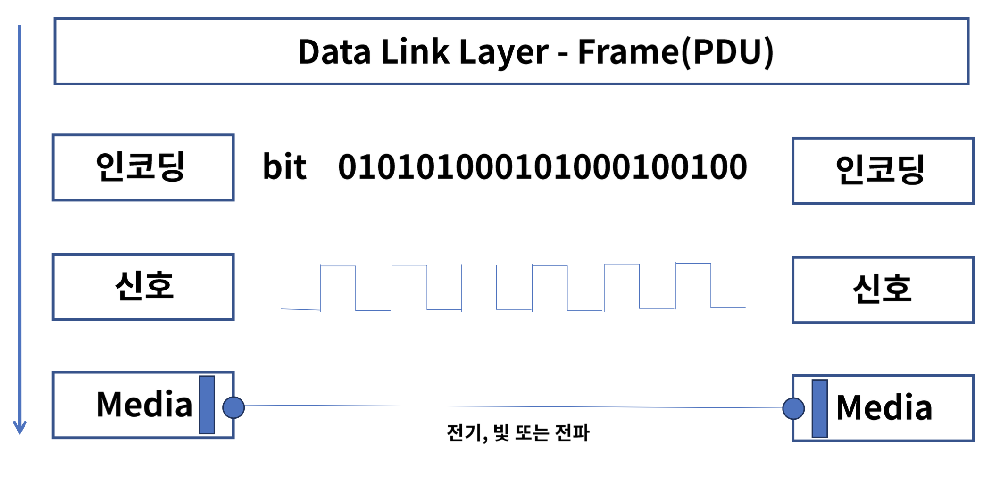
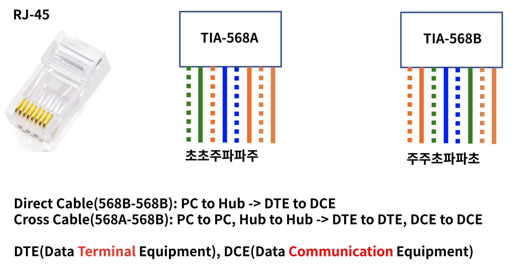
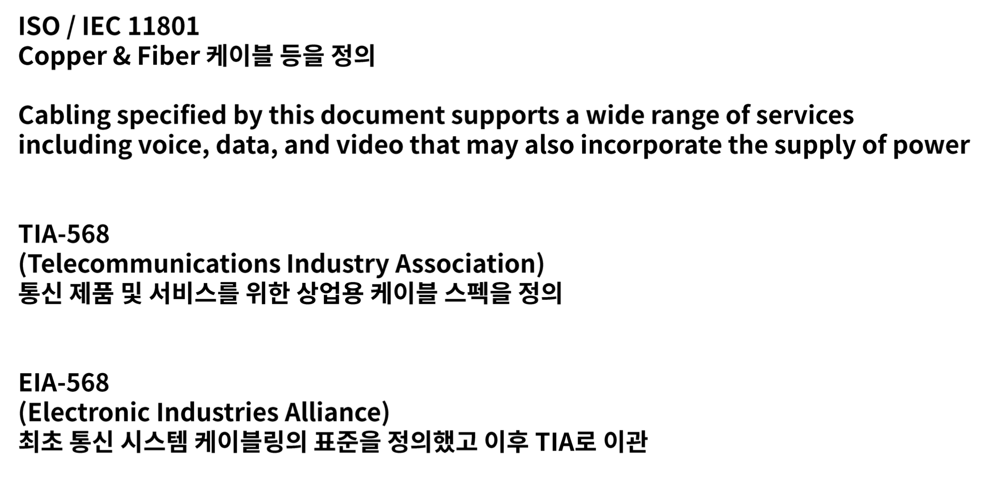
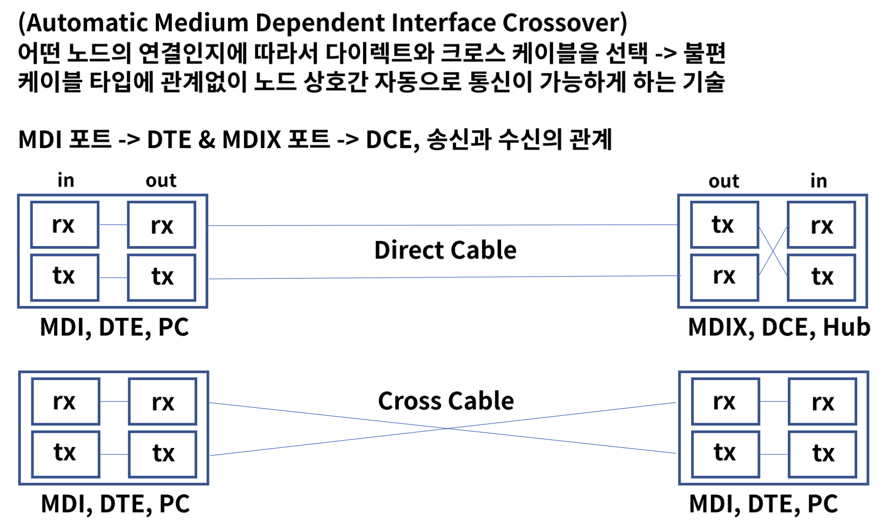
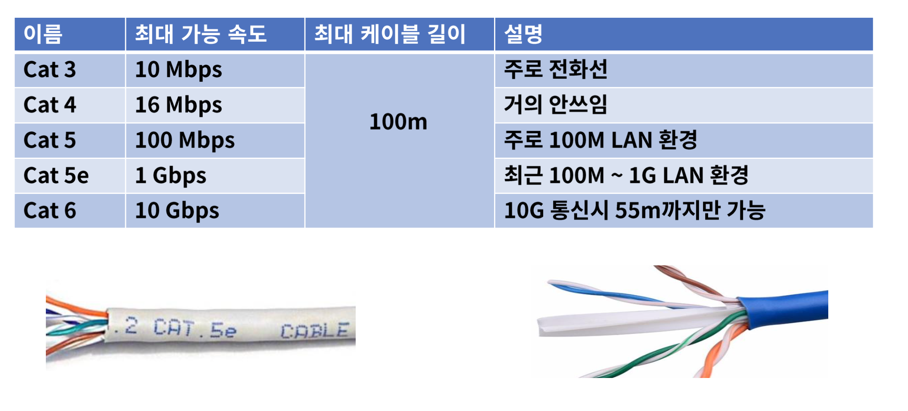

## 2. 물리 계층
#### 1. 물리 계층
* 역할
    * OSI 7 Layer 의 1 계층으로 하드웨어로 표현
    * 네트워크 장치의 전기적, 기계적 속성 및 전송하는 수단을 정의
    * 상위 계층인 데이터 링크 계층의 프레임을 신호로 인코딩 하여 네트워크 장치로 전송
    * 통신 장치와 커넥터, 인코딩(bit -> signal), 송수신을 담당하는 회로등의 요소가 있다
    

#### 2. Signaling 의 종류
1. 전기
* copper 케이블을 사용하며 전화선, UTP, 동축케이블 등이 이에 속함

2. 광(빛)
* Optical Fiber 케이블이 이에 속하며 빛의 패턴을 신호로 사용
> IEEE 802.3 에 명시
> * 이더넷에서 물리계층과 데이터 링크의 매ㅐ체 접근 제어를 정의, 케이블이 이에 속함
> * 주로 쓰이는 1 Gigabit 이더넷 규격

3. 전파
* 무선이 속하며 마이크로파 패턴을 신호로 사용
> IEEE 802.3 에 명시
> 무선랜 규격

#### 3. Signaling 전송 방식
1. 방식
* OSI 7 Layer 2 계층의 Frame 아래와 같은 형태로 전달
  
  
#### 4. 물리 계층 장비
1. 허브와 리피터
* 허브는 전기신호를 증폭하여 포트에 연결된 PC 들끼리 통신이 가능하게 한다
* 리피터는 현재 거의 쓰이지 않는 장비로 신호의 세기를 증폭하여 좀 더 먼거리 까지 통신이 가능

2. 허브의 동작방식
* 단순 중계기의 역할로 허브에 연결된 PC 1 이 다른 PC 2 에게 데이터를 보내려 하면 허브에 연결된 모든 PC 들에게 그 데이터를 전달하게 된다
* 브로드캐스팅 통신 1->ALL
* 유니캐스팅 통신 1->1
* 멀티캐스트 통신 1->n

3. CSMA/CD (carrier sense multiple access/collision detection)
* 송신노드는 데이터를 전송하고, 다음 채널에서 다른 노드의 데이터 충돌 발생을 계속 감지
* 충돌 발생시에는 모든 노드에게 충돌 발생을 통지하고 재전송을 시도
* Carrier Sensing : 데이터를 보내기 전에 다른 노드에서 데이터를 보내는 중인지 확인
* Multiple Access : 데이터를 보내는 곳이 없다면 전송 시작
* Collision Detection : 동 시간대에 데이터를 보내게 되면 충돌이 일어나고 정지. 그 이후 특정 시간이 지나면 다시 첫단계로 반복
* Half Duplex : 반이중 전송 방식

4. 전송방식
* Simplex : 단방향 통신으로 수신측은 송신측에 응답 불가
* Half Duplex : 반이중 전송방식으로 양방향 통신이나 송수신 시간은 정해짐, 무전기
* Full Duplex : 전이중 전송방식으로 동시 양방향 통신이 가능, 전화기

#### 4. 케이블과 커넥터
1. 종류
* 전송 장치에 신호를 전달하는 통로, 주로 케이블로 TP, 동축, Fiber 등이 있다

2. TP(Twisted Pair)
* 총 8가닥의 선으로 구성되며 두개의 선을 서로 꼬아 놓음
* 선을 꼬은 이유는 자기장 간섭을 최소화 하여 성능(속도와 거리)을 향상

3. 동축(Coaxial)
* 선 중앙에 심선이 있으며 그 주위를 절연물과 외부 도체로 감싸고 있다
* 전화 또는 회선망 등 광범위하게 사용

4. 광(Fiber)
* 전기신호의 자기장이 없는 빛으로 통신하기 떄문에 장거리 고속 통신이 가능
* 2개의 모드 (Single, Multi)와 주요 커넥터 타입(LC, SC) 이 있다

5. 광 트랜시버
* 광통신에 사용되는 네트워크 인터페이스 모듈 커넥터로 SFP, GBIC 가 있다
* SFP(Small Form-factor Pluggable transceiver), GBIC(Gigabit Interface Connector)

#### 4. 단위와 성능
1. bit & byte
* bit
* 2 진수는 Binary 0,1 로 이루어지며 True & False 등 신호를 표현
* 1 Byte = 8bit
* bit 는 일반적으로 회선 speed, byte 는 데이터 size 에 쓰임
* 100Mbps 속도 = 100 Mega bit per second, SSD 50GB = 50 Giga Byte
* kilo, Mega, Giga, Tera
* 전산학에서는 2진수 기반이기 때문에 2의 10승은 1024의 표현
* 1024 = 1M, 1024M = 1G, 1024G = 1T

2. Performance
* Bandwidth(대역폭)
    * 주어진 시간대에 네트워크를 통해 이동할 수 있는 정보의 양
    
* Throughput(처리량)
    * 단위 시간당 디지털 데이터 전송으로 처리하는 양
    
* 대역폭이 8차선 도로라면 처리량은 그 도로를 달리는 자동차의 숫자와 같다
* BackPlane
    * 네트워크 장비가 최대로 처리할 수 있는 데이터 용량
    
* CPS (Connections Per Second) : 초당 커넥션 연결수, L4
* CC (Concurrent Connections) : 최대 수용가능한 커넥션
* TPS (Transaction Per Seconds) : 초당 트랜잭션 연결수, L7, 주로 HTTP 성능

#### 5. UTP 케이블
1. UTP 케이블
* Unshielded Twisted Pair, 주로 근거리 통신망(LAN)에서 사용되는 케이블
* 이더넷 망 구성시 가장 많이 보게 되는 케이블
* 알렉산더 그에이엄 벨이 AT&T 에서 발명

2. 코드배열
* 8P8C
    * 8개의 선에 따라 다이렉트 또는 크로스 케이블로 구성
      
* Standard
  
* Auto MDI-X
  
3. UTP 카테고리
* UTP 케이블의 전송 가능한 대역폭을 기준으로 분류
  

#### 6. Wi-Fi
1. wi-fi 란?
* 비영리 기구인 Wi-Fi Aliance 의 상표로 전자기기들이 무선랜에 연결할 수 있게 하는 기술
* 1999 년 몇몇 회사들이 브랜드에 상관 없이 무선 네트워킹 기술의 발전을 위해 협회 결성
* 2000년 wi-fi 용어 채택
* 수백개의 나라에서 수백개 회사가 참여
* 802.11n wifi 4, 802.11ac wifi 5, 802.11ax wifi 6

2. 무선랜 구성
* 인터넷 - ISP - 라우터 - WIPS(Wireless IPS) - AP(Access Point) - 컴퓨터

#### 7. WireShark
* 오픈소스 패킷 분석 프로그램
* 이더리얼로 불렸다가 상표권 문제로 와이어샤크로 변경
* 리눅스 TCPDUMP 와 함께 네트워크 트래픽 분석에 널리 쓰이는 도구
* 인터페이스를 선택하고 패킷을 실시간 확인 및 저장 후 분석이 가능
* pcap 파일을 통해서 frame - L2 - L3 - L4 정보를 확인 가능

