## 3. 데이터 링크 계층
#### 1. 역할과 기능
1. 역할
* OSI 7 Layer 의 2 계층으로 인접한 네트워크 노드끼리 데이터를 전송하는 기능과 절차를 제공
* 물리 계층에서 발생할 수 있는 오류를 감지하고 수정
* 대표적인 프로토콜로 이더넷이 있으면 장비로는 스위치가 있다
  
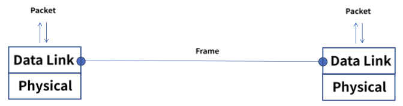

2. 2개의 부 계층으로 구성
*  MAC(Media Access Control)
   * 물리적인 부분으로 매체간의 연결방식을 제어하고 1계층과 연결
    * 48bit(6 Bytes) 로 6자리로 구성, 각 16진수로 표현
    * 앞에 3자리는 OUI(Organization Unique Identifier)
    * 제조사 식별 코드
    * 나머지 3자리는 제조사 내 일련번호
* LLC (Logical Link Control)
    * 논리적인 부분으로 Frame 을 만들고 3계층과 연결

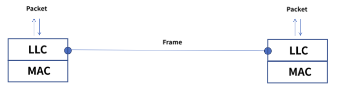

3. 주요 기능
* Framing
    * 데이터그램을 캡슐화 하여 프레임 단위로 만들고 헤더와 트레일러를 추가
    * 헤더는 목적지, 출발지 주소 그리고 데이터 내용을 정의
    * 트레일러는 비트 에러를 감지
      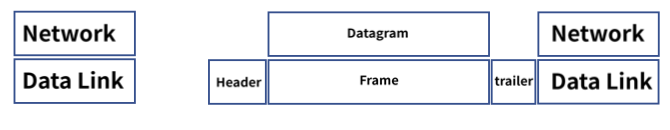
* 회선 제어
    * 신호간의 충돌이 발생하지 않도록 제어
    * ENQ/ACK 방법
    * 전용 전송 링크 1:1
      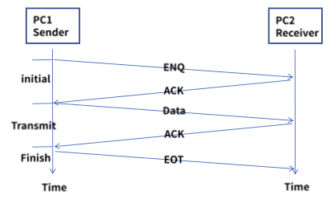
    * polling 방법, 1: 다
    * select 모드 : 송신자가 나머지 수신자들을 선택하여 전송
    * poll 모드 : 수신자에게 데이터 수신 여부를 확인하여 응답을 확인하고 전송 - multipoint
      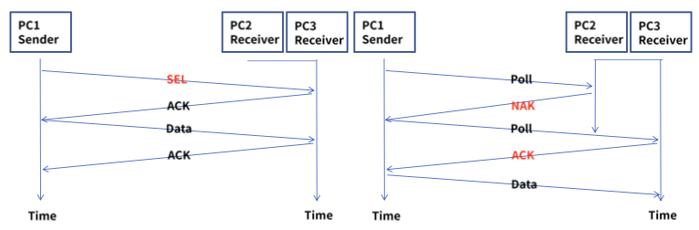
    
* 흐름 제어
    * 송신자와 수신자의 데이터를 처리 하는 속도 차이를 해결하기 위한 제어
    * Feedback 방식의 Flow Control 이며 상위 계층은 Rate 기반
    * Stop & Wait
      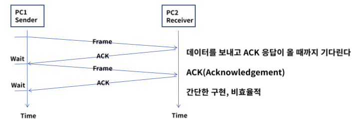
    * Frame 을 전달하고 ACK 이 회선 문제로 응답하지 않는 경우
      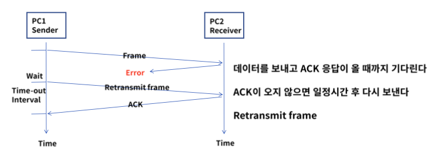
    * Frame 을 재전송하게 되면 Duplicate frame 문제가 발생될 수 있음
    * Sequence number(1 bit) 를 사용하여 동일 frame 인지 구분하여 상위 계층으로 전달
      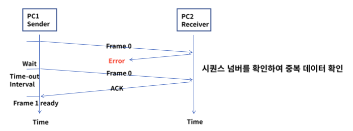
    * sliding window
    * ACK 응답없이 여러 개의 프레임이 연속으로 전송 가능
    * Window size 는 전송과 수신측의 데이터가 저장되는 버퍼의 크기
      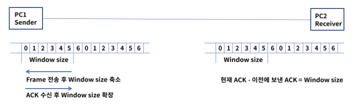
      
* 오류 제어
    * 전송 중에 오류나 손실 발생 시 수신측은 에러를 탐지 및 재전송
    * ARQ(Automatic Repeat Request) : 프레임 손상 시 재전송이 수행되는 과정
    * Stop & Wait ARQ
      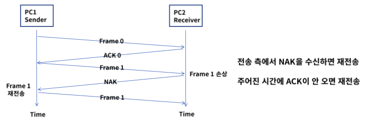
    * Go Back n ARQ
      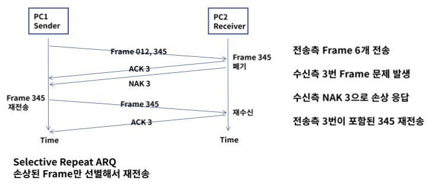

4. 이더넷 프레임 구조
* Ethernet v2
    * 데이터 링크 계층에서 MAC(media access control) 통신과 프로토콜의 형식을 정의
      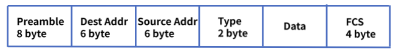
    * Preamble : 이더넷 프레임의 시작과 동기화
    * Dest Addr : 목적지 MAC 주소, Src Addr : 출발지 Mac주소
    * Type : 캡슐화되어 있는 패킷의 프로토콜 정의
    * Data : 상위 계층의 데이터로 46 ~ 1500 바이트의 크기, 46 바이트보다 작은 면 뒤에 패딩이 붙음
    * FCS(Frame Check Sequence) : 에러 체크
    
#### 2. 스위치와 ARP
1. 스위치 정의
* 2 계층의 대표적인 장비로 MAC 주소 기반 통신
* 허브의 단점을 보완
* Half duplex -> Full duplex
* 1 Collision Domain -> 포트별 Collision Domain
* 라이팅 기능이 있는 스위치를 L3 스위치라고도 부름

2. 스위치 동작 방식
* 목적지 주소를 MAC 주소 테이블에서 확인하여 연결된 포트로 프레임 전달
    1. Learning
       * 출발지 주소가 MAC 주소 테이블에 없으면 해당 주소를 저장
    2. Flooding - Broadcasting
       * 목적지 주소가 MAC 주소 테이블에 없으면 전체 포트로 전달
    3. Forwarding
       * 목적지 주소가 MAC 주소 테이블에 있으면 해당 포트로 전달
    4. Filtering - Collision Domain
       * 출발지와 목적지가 같은 네트워크 영역이면 다른 네트워크로 전달하지 않음
    5. Aging
        * MAC 주소 테이블의 각 주소는 일정 시간 이후에 삭제
    
3. Learning
* 4개의 PC 는 스위치에 각 포트에 연결되고 프레임이 스위치에 전달
* 스위치는 해당 포트로 유입된 프레임을 보고 MAC 주소를 테이블에 저장
  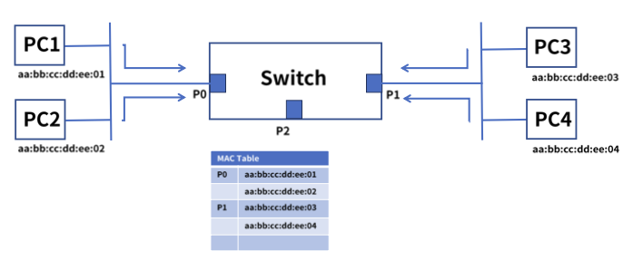
4. Flooding
* PC1 은 목적지 aa:bb:cc:dd:ee:05 주소로 프레임 전달
* 스위치는 해당 주소가 MAC Table에 없어서 전체 포트로 전달
  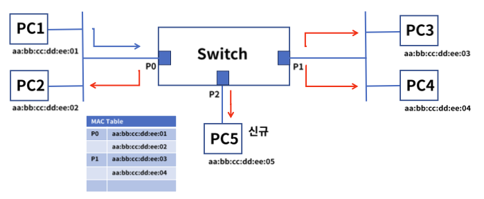
5. Forwarding
* PC1 은 목적지 aa:bB:cc:dd:ee:05 주소로 프레임 전달
* 스위치는 해당 주소가 MAC Table 에 존재하므로 해당 프레임을 PC5에 전달
  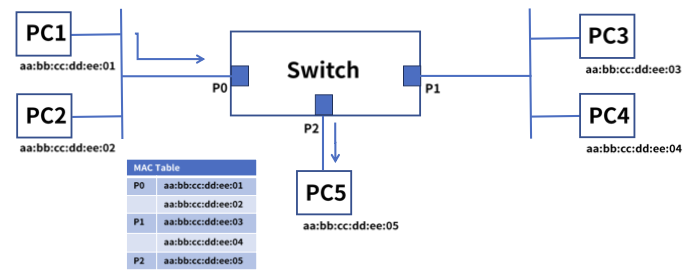
6. Filtering
* PC1 은 목적지 aa:bB:cc:dd:ee:05 주소로 프레임 전달
* 스위치는 해당 주소가 동일 네트워크 영역임을 확인하여 다른 포트로 전달하지 않음
* 필터링은 각 포트별 Collision Domain 을 나누어 효율적 통신이 가능
  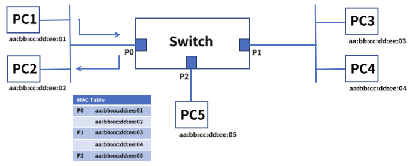
7. Aging
* 스위치의 MAC 주소 테이블은 시간이 지나면 삭제
* 삭제되는 이유는 테이블 저장 공간을 효율적으로 사용
* 해당 포트에 연결된 PC 가 다른 포트로 옮겨진 경우도 발생
* 기본 300초 저장, 다시 프레임이 발생되면 다시 카운트
  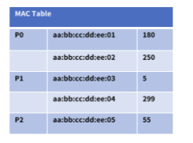
  
> 정리
> 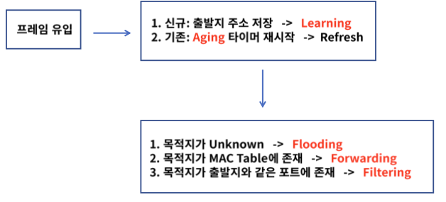

8. ARP 역할
* ARP (Address Resolution Protocol)
* IP 주소를 통해서 MAC 주소를 알려주는 프로토콜
* 컴퓨터 A가 컴퓨터 B에게 IP 통신을 시도하고 통신을 수행하기 위해 목적지 MAC 주소를 알아야함
* 목적지 IP 에 해당하는 MAC 주소를 알려주는 역할을 ARP 가 함
  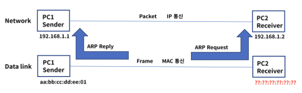
9. ARP 동작과정
   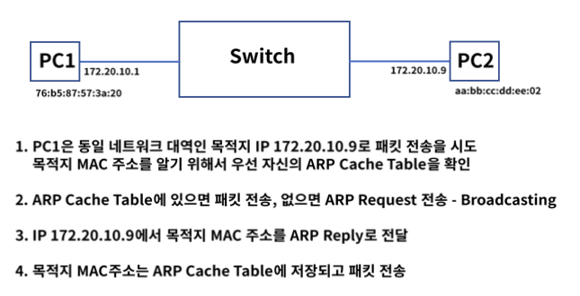
   
   
   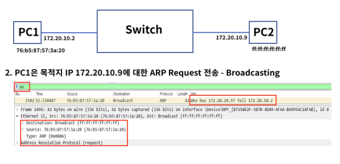
   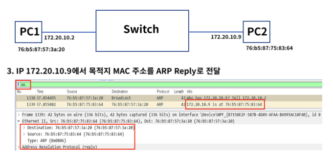
   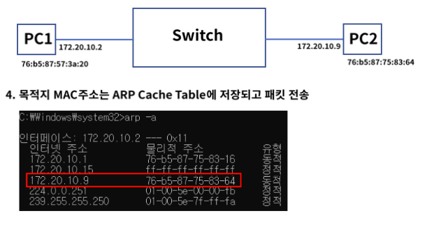
   
10. ARP 헤더 구조
    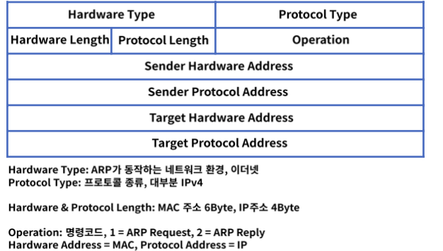
    
11. ARP 헤더 구조 - pcap
    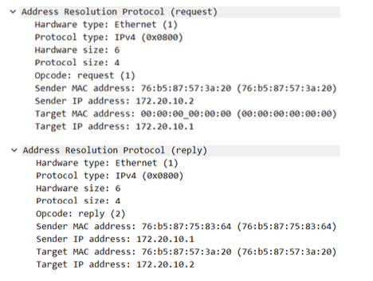
    
#### 3. 스패팅트리 프로토콜
1. Looping 정의
* 같은 네트워크 대역 대에서 스위치에 연결된 경로가 2개 이상인 경우에 발생
* PC 가 브로드캐스팅 패킷을 스위치들에게 전달하고 전달 받은 스위치들은 Flooding 을 한다
* 스위치들끼리 Flooding 된 프레임이 서로 계속 전달되어 네트워크에 문제를 일으킴
* 회선 및 스위치 이중화 또는 증축 등에 의해 발생
* 물리적 포트 연결 실수 또는 잘못된 이중화 구성으로 L2에서 가장 빈번히 발생하는 이슈

2. Looping 구조
   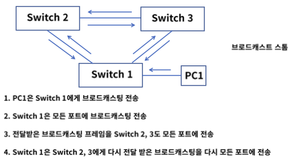
3. STP (Spanning Tree Protocol)
* 자동으로 루핑을 막아주는 알고리즘 -> 스패닝 트리 알고리즘
* 스패닝 트리 알고리즘에서 사용되는 프로토콜 -> STP
    1. Bridge ID
        * 스위치의 우선 순위로 0~65535 로 설정, 낮을수록 우선순위가 높음
    2. Patch Cost
        * 링크의 속도(대역폭), 1000/링크 속도로 계산되며 작을수록 우선순위가 높음
        * 1Gbps 속도가 나오면서 계산법이 적합하지 않아 IEEE에서 각 대역폴 별 숫자 정의
        * 10Mbps = 100, 100M bps = 19, 1Gbps = 4
    
4. STP 요소
   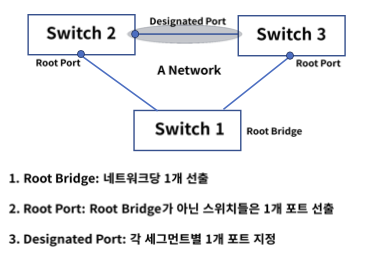
   
5. BPDU(Bridge Protocol Data Unit)
* 스패팅 트리 프로토콜에 의해 스위치간 서로 주고 받는 제어 프레임
    1. configuration BPDU : 구성 관련
        * Root BID : 루트 브리지로 선출된 스위치 정보
        * Path Cost : 루트 브리지까지의 경로 비용
        * Bridge ID, Port ID : 나머지 스위치와 포트의 우선 순위
    2. TCN(Topology Change Notification) BPDU
        * 네트워크 내 구성 변경시 통보
    
* 우선순위 - 낮은 숫자가 더 높은 Priority를 가진다

6. Root Bridge 선출
   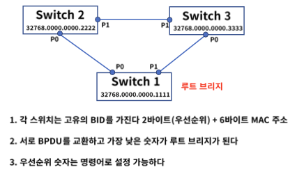
7. Root Port 선출
   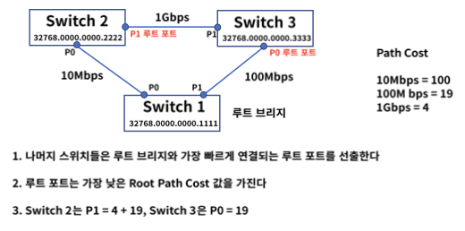
8. Designated Port 선출
   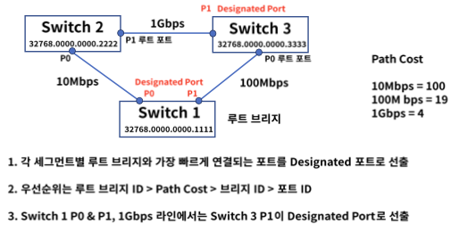
   
9. 상태변화
* 스위치의 포트는 스패닝 트리 프로토콜 안에서 5가지 상태로 표현
    1. Disabled
        * 포트가 shut down 인 상태로 데이터 전송 불가, MAC 학습 불가, BPDU 송수신 불가   
    2. Blocking
       * 부팅하거나 Disabled 상태를 Up 했을 때 첫번째 거치는 단계, BPDU 만 송수신
    3. Listening - 15sec
        * Blocking 포트가 루트 또는 데지그네이티드 포트로 선정되는 단계, BPDU 만 송수신
    4. Learning - 15sec
        * 리스팅 상태에서 특정 시간이 흐른 후 러닝 상태가 됨, MAC 학습 시작, BPDU만 송수신
    5. Forwarding
        * 러닝 상태에서 특정 시간이 흐른 후 포워딩 상태가 됨, 데이터 전송 시작, BPDU만 송수신
    
10. RSTP & MST
* RSTP(Rapid Spanning Tree Protocol)
    * STP를 적용하면 포워딩 상태까지 30~50초 걸림, 이 컨버전스 타임을 1~2 초 내외로 단축
    * Learning & Listening 단계가 없음
    
* MST(Multiple Spanning Tree)
    * 네트워크 그룹이 많아지면 STP or RSTP BPDU 프레임이 많아지고 스위치 부하 발생
    * 여러 개의 STP 그룹들을 묶어서 효율적으로 관리
    
#### 4. VLAN
1. VLAN(Virtual Local Area Network)
* 물리적 구성이 아닌 논리적인 가상의 LAN 을 구성하는 기술
* 불필요한 데이터 차단 : 브로드캐스트 도메인 별로 나누어 관리
* 관리의 용이성과 보안 : 호스트의 물리적 이동 없이 LAN 그룹 변경이 가능
* 비용 절감 : 새로운 LAN 추가시 물리적 스위치 구매 필요 없음

2. 종류
    1. Port 기반 VLAN
        * 여러개의 VLAN을 설정하고 각각의 LAN 에 물리적인 포트를 지정
        * VLAN 변경이 필요한 호스트는 물리적인 포트 또는 스위치의 VLAN 설정을 변경
    2. MAC 주소 기반 VLAN
        * 각 호스트 또는 네트워크 장비의 MAC 주소를 각각의 VLAN 에 정의
        * 호스트가 이동되어도 VLAN 변경 필요 없음, 신규 호스트 연결시 설정 변경 필요
    3. IP 주소 기반 VLAN
        * IP 주소 서브넷 기반으로 VLAN 을 나누는 방법
        * IP(Internet Protocol): 3 계층에서 사용하는 프로토콜
        * 서브넷 : IP 주소의 네트워크 영역의 크기를 나눈 것
    
