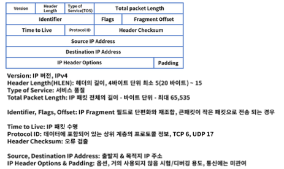

## 4. IP 와 Routing
#### 1. 네트워크 계층
1. 역할
* OSI 7 Layer 의 3 계층으로 패킷 포워딩과 네트워크간 라우터를 통한 라우팅 수행
* IP(Internet Protocol) 주소를 사용하여 통신, 계층적 구조
* 대표적인 장비는 라우터 또는 L3 라고 부름

#### 2. IP
1. IP 란?
* 네트워크 계층에서 통신하는 주요 프로토콜로 라우팅을 구현하고 본질적인 인터넷을 구축하는 계기
* 전송 제어 프로그램의 비연결 데이터그램 서비스로 시작 -> 연결 지향 서비스로 보완
* TCP/IP 모델의 기원

2. IP 구조
* IP 는 헤더와 페이로드로 구성되어 있음
* 헤더는 목적지 * 출발지 IP 주소 등을 포함, 페이로드는 전송되는 데이터를 의미

3. IPv4 헤더 구조

   
#### 3. 라우터
1. 역할
* 목적지 IP 주소를 확인하고 하나 또는 그 이상의 네트워크 간의 패킷의 경로를 선택하여 전송
* Router : 네트워크 간의 패킷을 전송해주는 장비
* Routing : 네트워크 간의 패킷을 전달하는 경로를 선택하는 과정, static & Dynamic
* Routed : 라우터가 라우팅을 해주는 대상, IP

2. 인터페이스
* 라우터의 접속 가능한 포트로 통신용 & 관리용으로 구분
* 통신용은 UTP, 광, 무선으로 구성, WAN(Router to Router) 연결은 시리얼 포트도 존재
* 관리용은 보통 콘솔이라 부르며 원격에서 접속 불가 또는 장애 시 장비에 직접 연결할 때 사용

#### 4. 서브넷 마스크
1. 서브넷 마스크
* 부분망, IP 주소는 네트워크와 호스트로 구분
* 할당된 네트워크 영역을 좀 더 효율적으로 사용하기 위해 서브넷으로 쪼개어 구성
* 네트워크를 여러 개의 작은 네트워크 서브넷으로 구분하는 것 -> 서브넷 마스크

2. 상세
* 디폴트 게이트웨이 : 다른 네트워크로 패킷 전송시 거쳐야 하는 거점
* Prefix 표기법 : 서브넷 마스크 표기를 간단히 표현
* 네트워크 영역의 비트 1의 개수를 의미

#### 4. 라우터 동작 방식
1. static 라우팅
* 가장 기본적인 라우팅 방식으로 수동으로 경로를 라우터에 설정하여 패킷을 처리
* 경로를 라우팅 테이블에 목적지 IP 주소 & 인터페이스 정보를 설정
2. IP 네트워크 할당 - 서브넷 마스크
3. IP 주소 할당
* 각 서브네팅된 네트워크에 맞추어 IP 설정
4. 라우터들의 정적 라우팅 테이블 구성
* 경로 별 네트워크 대역을 확인하여 커넥티드, 정적, 디폴트 라우팅 설정
* 커넥티드는 포트에 직접 연결된 네트워크 대역, 설정 필요 없음

5. Hop & TTL
* 전세계 네트워크 호스트는 IP 라우팅을 통해서 연결
* Hop : 소스와 목적지 간의 경로, TTL(Time to Live) : 패킷이 폐기되기 전 hop 카운트
* 각 라우터는 패킷이 인입되면 TTL 값을 1씩 감소, TTL = 0 이 되면 폐기, 부정확한 패킷의 루프 방지

6. Traceroute or Tracert
* 라우팅 경로 확인 명령어
* 출발지에서 목적지 IP 까지 거치는 라우터 최적 경로 확인

