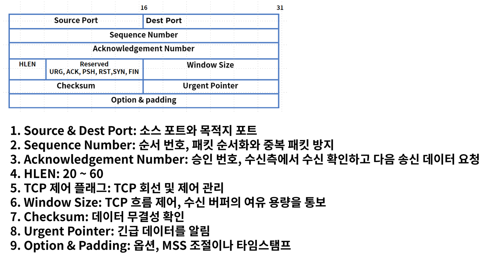
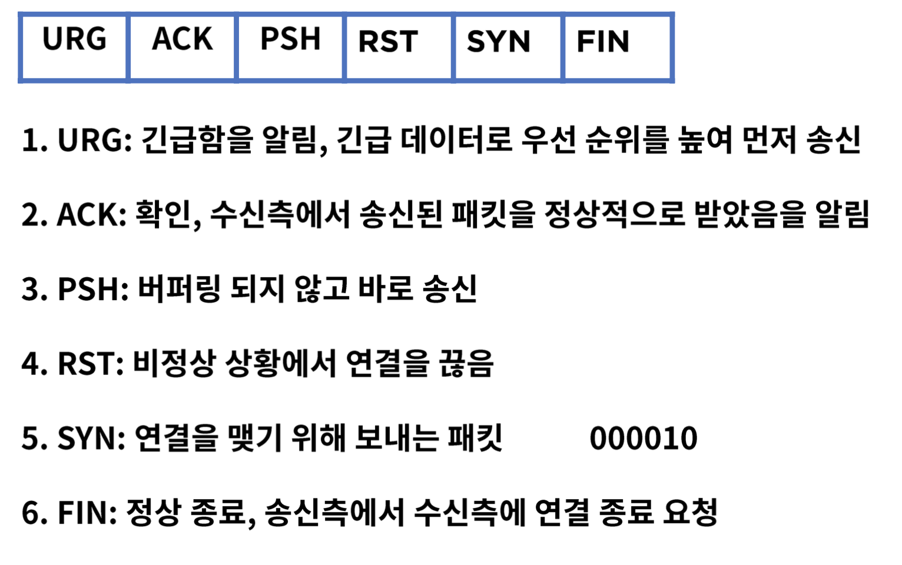
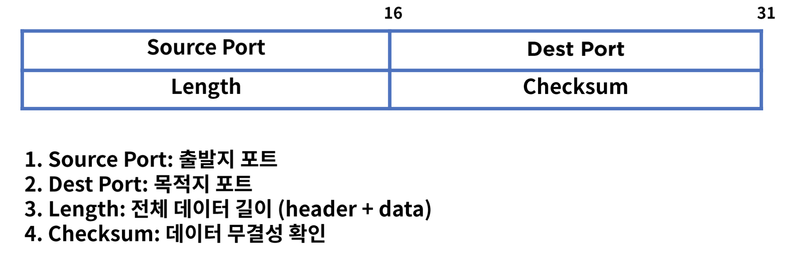
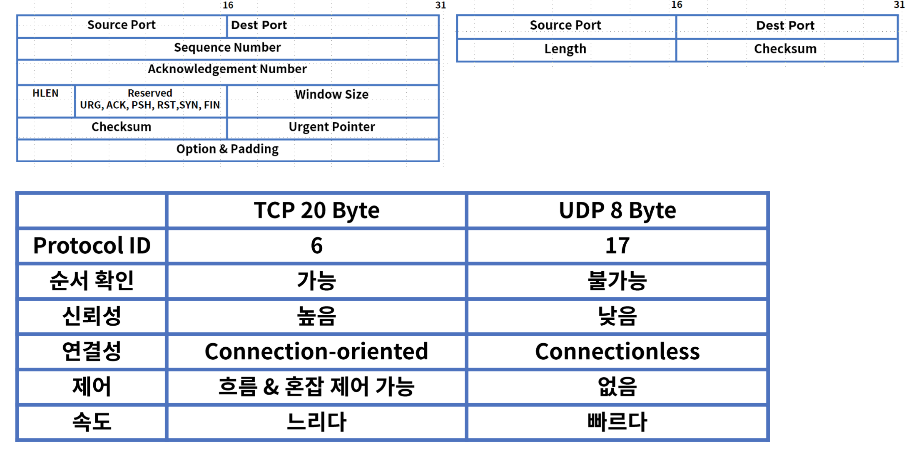
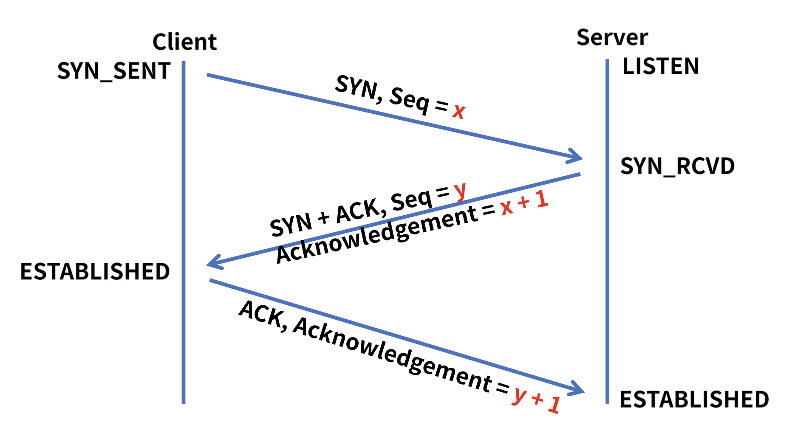
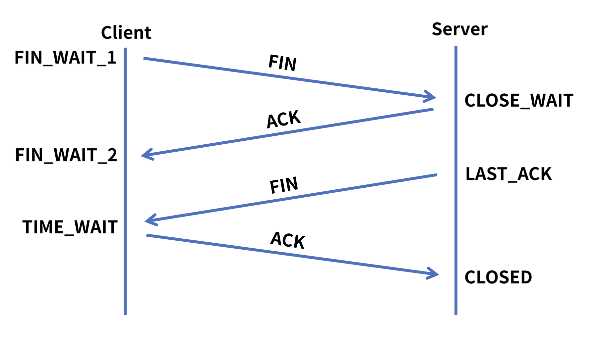
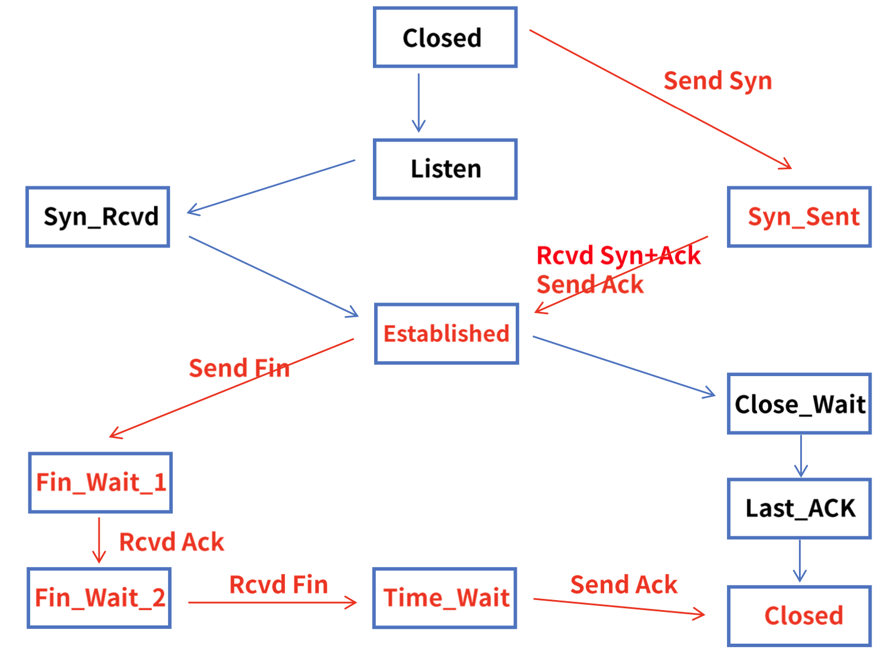
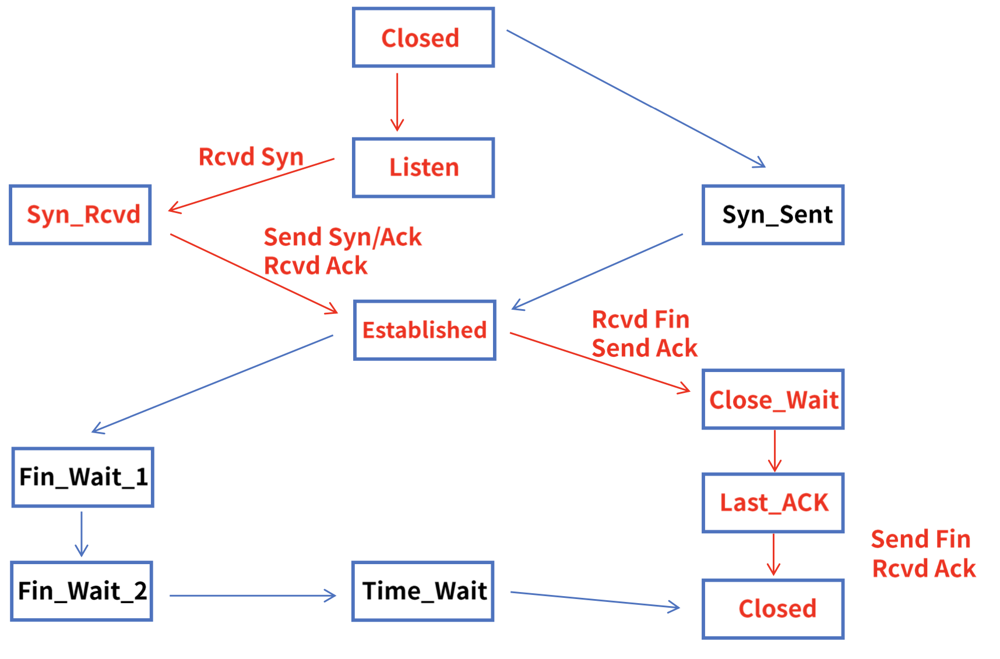

## 6. TCP 와 NAT
#### 1. Transport 계층
1. 역할
* End to End 서비스, 커넥션(연결)을 관리
* Connection - oriented, Reliability, Flow control, Multiplexing
* TCP & UDP 소켓을 통한 프로세스 별 통신
* 5 tuple = Source IP, Source Port, Dest IP, Dest Port, Protocol

2. 포트
* 전송 계층에서 사용되며 특정 프로세스를 구분하는 단위

#### 2. TCP
1. 정의
* TCP(Transmission Control 전송 제어 프로토콜)
    * 인터넷을 구성하는 핵심 프로토콜
    * 신뢰성을 기반으로 데이터를 에러 없이 전송 1:1 통신
    * 연결 지향, connection-oriented 패킷의 상태 정보를 확인하고 유지
    * 에러 발생시 재전송을 요청하고 에러를 복구
    
2. 헤더 포맷
   
   
   
3. TCP 제어 플래그

    

#### 3. UDP
1. 정의
* UDP(User Datagram Protocol)
* 신뢰성은 낮으나 데이터 전송이 빠르다
* 송신 측은 일반적으로 데이터를 보내고 확인 안함. 1:n 통신 가능
* Connectionless, 재전송 불가, 실시간 데이터 전송에 적합
* 스트리밍 서비스의 경우 전송 문제가 발생해도 재전송보다 실시간 데이터 전송이 중요

2. 헤더 포맷
   
   

#### 4. TCP UDP 비교

#### 5. TCP 통신과정
1. 3 way Handshake
* TCP 는 연결 지향 프로토콜로 두 호스트가 통신하기 전에 연결을 위한 관계 수립

2. 4 way Handshake
* 정상적인 연결을 종료

3. TCP 상태 전이도 - client

4. TCP 상태 전이도 - Server

5. TCP 타이머 - Retransmission
* 송신 측이 패킷을 매번 전송할 때 카운트

6. TCP 타이머 - Persistence
* 윈도우 사이즈 관련 타이머
* 수신측에서 용량 부족으로 윈도우 사이즈 없음을 보내고 다시 용량에 여유가 생기면 송신 측에 요청
* 중간에서 윈도우 사이즈 > 0 을 보내는 ACK 이 유실되면 서로 통신 간 문제 발생
* 수신 측 윈도우 사이즈 = 0 을 보낼 경우 Persistence 타이머 가동 - RTO
* Persistence 타이머가 종료되면 Probe(ACK 재전송 요청)를 보내고 타이머 재가동
* 다시 타이머가 종료되기 전에 ACK 을 수신 못하면 시간을 2배로 늘리고 Probe 재전송
* 타이머의 임계치는 60초

7. TCP 타이머 - Time waited
* TCP 연결 종료 후에 특정 시간만 연결 유지

8. TCP 타이머 - Keepalive
* TCP 연결 유지 타이머

#### 6. 흐름 제어
1. Flow Control
* 송신과 수신측의 데이터 처리 속도 차이를 해결

2. Congestion Control
* 수신측으로 유입되는 트래픽의 양이 정해진 대역폭을 넘어가지 않도록 제어

