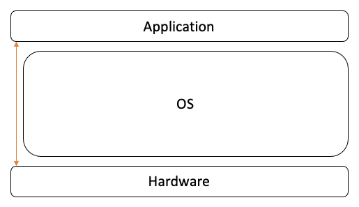

##01. Operating System 역할

###1. Operating System

운영 체제 즉 Operating System 또는 OS 라고 불린다.

운영체제는 어떤 역할을 할까?

> 역할 1 : 시스템 자원(System Resource) 관리자
* 시스템 자원이란?
    - CPU, Memory, I/O (Monitor, Mouse, Keyboard, Network)
    - 저장매체 (SSD, HDD)  
    

* 컴퓨터 하드웨어를 관리하는 소프트웨어
    - 왜 컴퓨터 하드웨어를 관리를 할까?
    - 하드웨어는 스스로 할 수 있는 것이 없다!
    - 얼마나 사용할지 혹은 어느 주소에 저장되어야 하는지, 어느 정도 메모리 공간을 확보하는지 알 수 없다!
    - 운영체제 없이는 동작하지 않는다
    

* 운영체제 종류
    - Windows, Mac OS
    - Unix 계열
        - Unix 와 사용법 혹은 OS 구조가 유사
        - Linux 가 대표적

> 역할 2 : 사용자와 컴퓨터간의 커뮤니케이션 지원
* 사용자와 컴퓨터 하드웨어 간의 커뮤니케이션을 중재하는 역할을 한다.
* OS 가 없다면 하드웨어에 명령을 할 수 없고 반대로 컴퓨터는 사용자에게 응답을 할 수 없다.

> 역할 3 : 하드웨어와 프로그램 제어 및 효율적인 분배

 
* Hardware 위에서 Application 들이 동작 할 수 있도록 중간에 OS 가 실행 제어를 한다.

###2. 응용프로그램(Application)
* 우리가 알고 있는 프로그램은 소프트웨어라고도 부른다.
* 소프트웨어는 운영체제와 응용프로그램 두가지로 볼 수 있다.

> 운영체제와 운영프로그램 관계
 
*  운영체제는 응용 프로그램을 관리
    * 응용프로그램 실행
    * 응용프로그램 **권한** 관리 (유저당 사용할 수 있는 응용프로그램 분리 기능)
    * 응용프로그램 **사용자** 관리 (초기 로그인 화면)
    
* 시스템 자원(System Resource)를 관리
* 사용자가 사용하는 응용프로그램이 효율적으로 적적하게 동작하도록 지원
* 운영체제는 응용 프로그램이 요청하는 시스템 리소스를 효율적으로 분배하고 지원하는 소프트웨어

