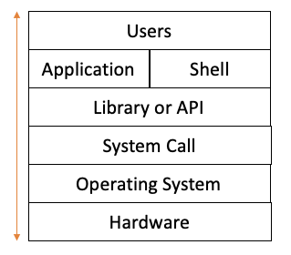

## 02. Operating System 구조

> 응용 프로그램, 운영체제, 컴퓨터 하드웨어 관계

* 운영체제는 응용 프로그램이 요청하는 메모리를 허가하고, 분배한다.
* 운영체제는 응용 프로그램이 요청하는 CPU 시간을 제공한다.
* 운영체제는 응용 프로그램이 요청하는 IO Devices 사용을 허가, 제어한다.

> 운영체제는 사용자 인터페이스 제공

* Shell
    * 사용자가 운영체제 기능과 서비스를 조작할 수 있도록 인터페이스를 제공하는 프로그램
    * Shell 은 터미널(CLI) 과, GUI 환경 두 종류로 분류
    
> 운영체제는 응용 프로그램을 위해서도 인터페이스 제공

* API (Application Programming Interface)
  * 함수로 제공
* 보통은 라이브러리(library) 형태로 제공
  * C library 등등
* 응용 프로그램이 하드웨어에 자원을 달라 요청하는 요청서 같은 역할
* 시스템 콜
  * 시스템 콜 또는 시스템 호출 인터페이스
  * 운영체제가 각 기능을 사용할 수 있도록 시스템 콜이라는 명령 또는 함수 제공
  * API 내부에는 시스템콜을 호출하는 형태로 만들어지는 경우가 대부분

> 운영체제의 구조!

> 운영체제를 개발한다면?

1. 운영체제를 개발(kernel)
2. System call 개발
3. 개발 언어의 API (library) 개발
4. Shell 프로그램 개발
5. 응용프로그램 개발

> 운영체제와 시스템콜

* 시스템콜 정의 
  * POSIX API(리눅스 계열), 윈도우 API
* API : 각 언어별 운영체제 기능 호출 인터페이스 함수
* System call : 운영체제 기능을 호출 하는 함수

> CPU Protection Rings

* CPU 도 권한 모드를 가지고 있음
  * 사용자 모드 (user mode)
  * 커널 모드 (kernel mode) : 특권 명령어 실행과 원하는 작업 수행을 위한 자원 접근 허용
    
    [Reference : wikipedia]
    * Ring 0 : Kernel
    * Ring 1, 2 : OS Service
    * Ring 3 : Application
  * 함부로 응용 프로그램이 전체 시스템을 해치지 못함

> System call 은 커널 모드로 실행

* 커널 모드에서만 실행 가능한 기능들이 있음
* 커널 모드로 실행하려면, 반드시 시스템 콜을 사용
* 다시 말해서 응용프로그램이 API 를 활용해서 시스템콜을 사용해서 커널모드로 CPU 실행
* 시스템 콜은 운영체제 제공

