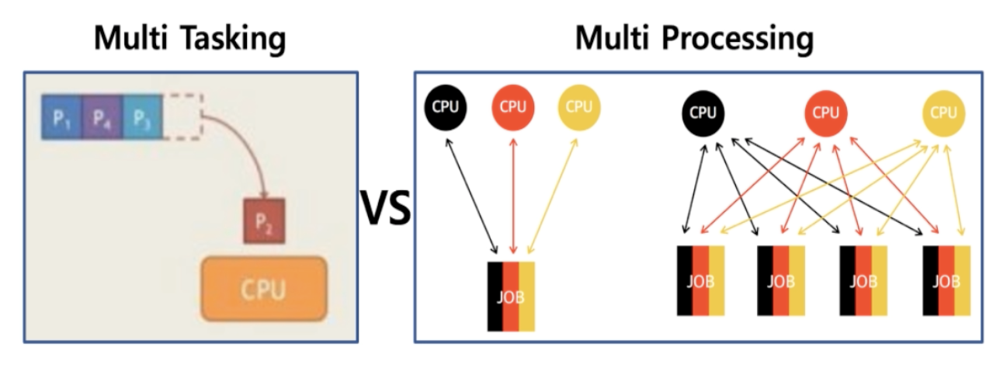

## 03. Process Scheduling

### 1. 배치 처리 시스템
자동으로 다음 응용 프로그램이 이어서 실행될 수 있도록 하는 시스템

Queue 와 비슷한 방식으로 First in First out 으로 동작한다.

### 2. 배치 처리 시스템과 시분할 시스템 / 멀티 프로그래밍
[기존의 작업]
* 여러 프로그램을 순차적으로 실행시킬 수 있도록 하는 것이 배치 처리 시스템

[문제 발생]

* 실행 시간이 많이 걸리는 작업 때문에 다른 프로그램의 실행 대기 시간이 늘어나는 문제
* 프로그램을 동시에 여러 프로그램을 실행 하고 싶은 문제 (동시성)
* 여러 사용자가 동시에 하나의 컴퓨터를 사용하고 싶은 문제 (다중 사용자)

> 문제점을 해결하기 위해서 멀티 프로그래밍과 시분할 시스템이 나옴

### 3. 시분할 시스템

* 다중 사용자 지원을 위해서 컴퓨터 응답 시간을 최소화 하는 시스템

### 4. 멀티 태스킹

* 단일 CPU 에서 여러 응용 프로그램이 동시에 실행되는 것처럼 보이도록 하는 시스템
* 실제 멀티 태스킹 예
    * 1000 밀리초(ms) = 1초
    * 10 ~ 20 ms 단위로도 실행 응용 프로그램이 바뀐다.
    * 사용자에게는 동시에 실행되는것처럼 보임

### 5. 멀티 태스킹과 멀티 프로세싱 차이

[Reference : http://donghoson.tistory.com/15]
* 멀티 태스킹 : 단일 CPU
* 멀티 프로세싱 : 여러 CPU 에 하나의 프로그램을 병렬로 실행해서 실행속도를 극대화 하는 시스템

### 6. 멀티 프로그래밍
* 최대한 CPU 를 많이 활용하도록 하는 시스템
    * 시간대비 CPU 활용도를 높임
    * 응용 프로그램은 짧은 시간 안에 실행 완료 가능
* 응용 프로그램은 온전히 CPU 를 쓰기 보다는 다른 작업을 중간에 필요로 하는 경우가 많음
    * 응용 프로그램이 실행하다가 파일을 읽음
    * 응용 프로그램이 실행되다가 프린팅
    

> 실제로는 시분할, 멀티 프로그래밍, 멀티 태스킹 세가지 모두 유사한 의미로 통용된다.
* 여러 응용 프로그램 실행을 가능하도록 처리
* 응용 프로그램이 동시에 실행되는 것처럼 보이도록 처리
* CPU 를 쉬지 않고 응용 프로그램을 실행토록 해서 짧은 시간 안에 응용 프로그램이 실행 완료 될 수 있도록 처리
* 컴퓨터 응답 시간도 짧게 처리, 다중 사용자 지원

