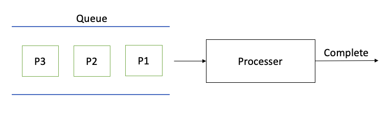
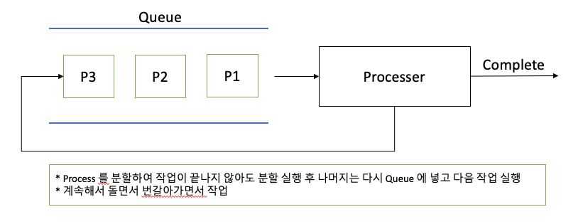
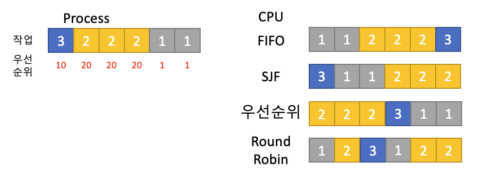

## 04. Scheduling Algorithm

### Process 란?
* 실행 중인 프로그램
    * 메모리에 올라가 실행 중인 프로그램 (폰 노이만)
    * 코드 이미지(binary) : 실행 파일 ex) ELF format
* 응용 프로그램은 프로세스가 아닐 수 있다
    * 여러 개의 프로세스로 이루어질 수 있다
* 하나의 응용 프로그램은 여러 프로세스가 상호작용 하면서 실행될 수  있다
    
> 간단한 프로그램 -> 하나의 프로세스
> 
> 여러 프로그램을 만들어 서로 통신하면서 프로그램 동작(IPC 기법)

> Process 용어는 작업, task, job 용어와 유사한 용어로 혼용 

### Scheduler 와 Process 관계
* Scheduler 가 Process 실행 관리를 한다.

### Scheduling Algorithm
* 어느 순서대로 프로세스를 실행하는가?
* 목표
    * 시분할 시스템 -> process 응답 시간을 가능한 짧게
    * 멀티 프로그래밍 -> CPU 활용도를 최대한 높여서 프로세스를 빨리 실행

### RTOS & GPOS
* RealTime OS (RTOS) : 응용 프로그램 실시간 성능 보장을 목표로 하는 OS
    * 정확하게 프로그램 시작, 완료 시간을 보장
    * Hardware RTOS, Software RTOS
* General Purpose OS(GPOS)
    * 프로세스 시간에 민감하지 않고, 일반적인 목적으로 사용되는 OS (Windows... 등등)

#### 1. FIFO Scheduler
> 프로세스가 저장매체를 읽는 작업, 프린팅하는 작업 없이 CPU 를 처음부터 끝까지 사용
* 가장 간단한 스케쥴러 (배치 처리 시스템)
* FCFS (First Come First Served) 스케쥴러
    

#### 2. 최단 작업 우선(SJF) Scheduler
* SJF(Shortest Job First)  Scheduler
    * 가장 프로세스 실행시간이 짧은 프로세스부터 먼저 실행을 시키는 알고리즘
    * 전체 실행 시간을 다 알아야한다는 단점을 가지고 있음
    
#### 3. 우선순위 기반 Scheduler
* Priority-Based 스케줄러
    * 정적 우선순위
        - 프로세스마다 우선순위를 미리 지정
    * 동적 우선순위
        - Scheduler 가 상황에 따라 우선순위를 동적으로 변경
    
#### 4. RoundRobin 

#### 5. Algorithm 정리
