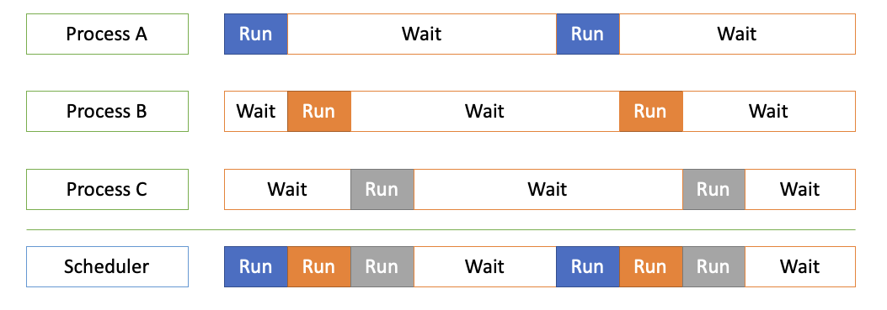
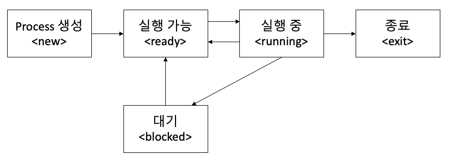
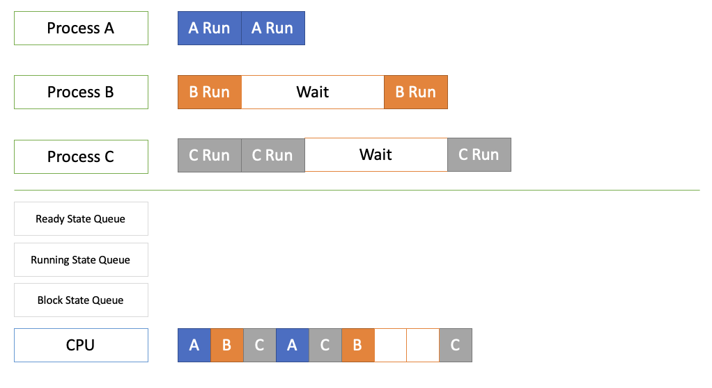
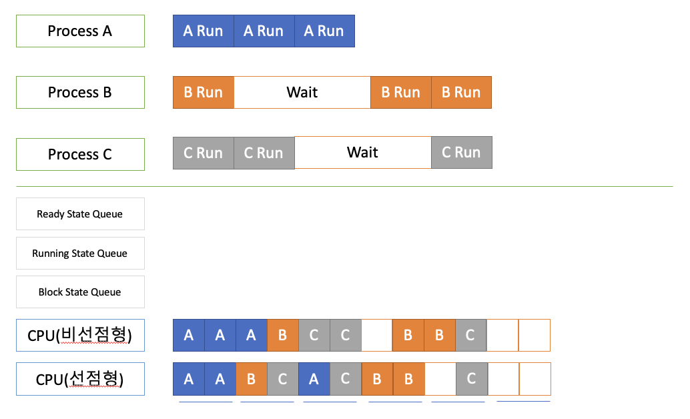

## 05. Process 상태와 Scheduler

#### 1. 멀티 프로그래밍과 wait
* 멀티 프로그래밍 : CPU 활용도를 극대화 하는 Scheduling Algorithm
* Wait : 간단히 저장매체로부터 파일 읽기를 기다리는 시간으로 가정
  
  
#### 2. Process 상태
특정 시점에 어떤 프로세스를 실행해야되는지 판한다는 지표

* running state: 현재 cpu 실행 상태
* ready state: CPU 실행 가능 상태(실행 대기)
* bock state: 특정 이벤트 발생 대기 상태
* exit stats: 시스템 리소스 종료하는 시점이라고도 볼 수 있음

* running -> block  : 특정 이벤트로 프로세스 대기
* ready -> running  : ready 상태 Process 가 선택이 될 경우 running 상태로 전환
* running -> ready  : 다른 process 로 교체 되는 경우 process 를 ready 상태로 전환 (ex: 시분할)
* block -> ready    : Scheduler 에 running 으로 바꿔도 좋다는 의미로 ready 상태로 전달 (프로세스 가능 상태)

#### 3. Process 상태 기반 Scheduling Algorithm

Process 여러개가 CPU 에 작업 요청을 했을때 어떤 process 먼저 실행을 하게 될까?
* 우선순위, 최단시간 스케줄링 등 알고리즘을 적용해서 프로세스 순서를 정하면 아래 순서는 변경된다.

#### 4. 선점형 스케줄러와 비선점형 스케줄러
* 선점형 스케줄러(Preemptive Scheduling)
  - 하나의 프로세스가 다른 프로세스 대신에 프로세서(CPU)를 차지할 수 있음
  - 프로세스 running 중에 스케줄러가 이를 중단하고 다른 프로세스로 교체 가능
* 비선점형 스케줄러(Non-Preemptive Scheduling)
  - 하나의 프로세스가 끝나지 않으면 다른 프로세스는 CPU 를 사용할 수 없음
  - 프로세스가 자발적으로 blocking 상태로 들어가거나 실행이 끝났을 때만 다른 프로세스로 교체 가능

#### 5. 복잡한 스케줄링 알고리즘
  * FIFO, SJF, Priority-based 는 어떤 프로세스를 먼저 실행할지에 대한 알고리즘
  * RoundRobin 시분할 시스템을 위한 기본 알고리즘 (선점형 스케줄러)
  * 우선순위, 선점형, 시분할, 프로세스 상태 조합으로 빠르게 처리 할수 있는 방법을 찾아야 하는것이 이슈

