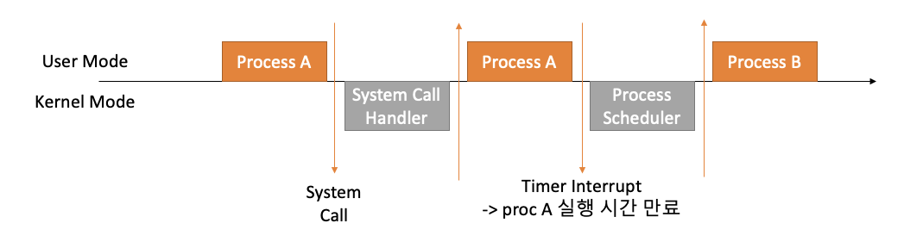

## 06. Interrupt
* 인터럽트는 일종의 이벤트라고도 불림
* CPU 가 프로그램을 실행하고 있을 때, 입출력 하드웨어 등의 장치나 또는 예외상황이 발생하여 처리가 필요할 경우에 CPU 에서 알아서 처리하는 기술


* 인터럽트가 필요한 이유
    * 선점형 스케줄러 구현
        - 프로세스 running 중에 스케줄러가 이를 중단시키고, 다른 프로세스로 교체하기 위해, 현재 프로세스 실행을 중단시킴
        - 그렇게 하기 위해 스케줄러 코드가 실행되어 현 프로세스 실행을 중지해야 함
    * IO Device 와 커뮤니케이션
      * 저장매체에서 데이터 처리 완료시 프로세스 상태 변경 ( block state -> ready state )
    * 예외 상황 핸들링
      * CPU 가 프로그램을 실행중일 때, 입출력 하드웨어 등의 장치나 또는 예외상황이 발생할 경우 CPU 가 해당 처리를 할 수 있도록 CPU 에 알려줘야 함
    
* 인터럽트 처리 예시
    * 입출력 하드웨어 등의 장치 이슈
        * 파일 처리 끝난 상태를 운영체제에 알림
        * 운영체제는 해당 프로세스를 block 에서 ready 상태로 프로세스 상태 변경
    * 예외상황 발생
        * 0 으로 나누는 계산
        * 운영체제가 해당 프로세스 실행 중지 및 에러 표시
    
* 주요 인터럽트
    1) 계산하는 코드에서 0 으로 나누는 코드 실행시 (Divide-by-Zero)
    2) 타이머 인터럽트
        - 선점형 스케줄러 위해 필요
        - 100m/s 마다 프로세스 변경(교체) 할 때 10 m/s 마다 체크를 해주다가 변경 시점에 이벤트 발생
    3) I/O 인터럽트
        - 프린터, 키보드, 마우스, 저장매체 등 동작 이벤트를 처리
    
* 인터럽트 종류
    * 내부 인터럽트
        - 소프트웨어 인터럽트라고도 함
        - 프로그램 내부에서 예외사항 발생
            - 0 으로 나눔
            - 사용자 모드에서 허용되지 않은 명령 또는 공간 접근 (ex: C언어 포인터 주소 오류)
            - 계산 결과가 Overflow/Underflow 나올 때
    * 외부 인터럽트
        - 하드웨어 인터럽트라고도 함
        - 프로그램 외부에서 예외사항 발생 (주로 하드웨어 장비)
            - 전원 이상
            - 기계 문제
            - 키보드 등 I/O 관련 이벤트
            - Timer 이벤트
    
* 시스템 콜 인터럽트
    * 시스템 콜 실행을 위해서는 강제로 코드에 인터럽트 명령을 넣어 CPU 에 실행 시킨다.
    * 예제
        * eax 레지스터에 시스템 콜 번호 넣고
        * ebx 레지스터에 시스템 콜 해당 인자 값 넣고
        * 소프트웨어 인터럽트 명령을 호출하면서 0x80 값 넘김
            * CPU 는 사용자 모드를 커널 모드로 변경
            * IDT (Interrupt Descripotr Table) 에서 0x80에 해당하는 주소(함수)를 찾아서 실행
            * system_call() 함수에서 eax 로부터 시트템 콜 번호를 찾아서 해당 번호에 맞는 시스템 콜 함수로 이동
            * 해당 시스템 콜 함수 실행 후 다시 커널 모드에서 사용자 모드로 변경하고 다시 해당 프로세스 다음 코드 진행
        ```
        mov eax, 1
        mov ebx, 0
        int 0x80
        ```
* 사용자/커널 모드와 프로세스, 인터럽트
  
    
* 인터럽트와 IDT
    * 일터럽트는 미리 정의되어 있어 각각 번호와 실행 코드를 가리키는 주소가 기록되어 있음
        * IDT(Interrupt Descriptor) 에 기록
        * 컴퓨터 부팅시 운영체제에 기록
        * 운영체제 내부 코드
        * 운영체제 내부 코드들이 컴퓨터 부팅시 IDT 에 운영체제가 기록
    
    * 인터럽트 발생시, IDT 확인
    * 시스템 콜 인터럽트 명령은 미리 정의되어 있음
    * 인터럽트에 해당하는 운영체제 코드 실행
    
* 인터럽트와 프로세스
    * 프로세스 실행 중 인터럽트 발생
    * 현재 실행중인 프로세스 실행 중단
    * 인터럽터 처리 함수 실행(운영체제)
    * 중단했던 프로세스 재실행
    
    