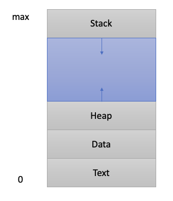

## 07. Process 구조

#### 1. Process 구조

* Text(CODE) : 코드
* data : 변수 / 초기화된 데이터
* stack : 임시 데이터 (함수 호출, 로컬 변수 등)
* heap : 코드에서 동적으로 만들어지는 데이터

* PC(program Counter) + SP(Stack Pointer)
    * PC : 코드를 한줄 한줄 가리키는 주소 레지스터
    * SP : 함수가 실행될 때 최상단 주소 레지스터
    
#### 2. Heap 이란?

