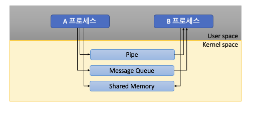

## 09. 프로세스 간 커뮤니케이션
#### 1.  InterProcess Communication (IPC)
* 프로세스 코드가 다른 프로세스의 데이터나 코드를 바꿀수 있는 방법은 제공하지 않는다.
* 즉 프로세스는 다른 프로세스의 공간에 접근할 수 없다.
* 그래서 프로세스간에 커뮤니케이션을 할 수 있는 방법을 제공하는데 이것이 IPC 이다.

> 프로세스간의 통신이 필요한가?

* CPU core 가 여러개. 각각의 core 에 프로세스를 실행 할 수 있도록 운영체제가 지원하면 동시에 동작하여 실행 속도가 높아짐 
* 성능을 높이기 위해서 여러 프로세스를 만들어서 동시 실행 할 수도 있음
* 이때 프로세스간 상태 확인 및 데이터 송수신 필요

> 프로세스간 커뮤니케이션을 한다면 어떻게?
* 프로세스간 통신 방법 제공
* IPC : InterProcess Communication
    * 대부분의 IPC 기법은 결국 커널 공간을 활용
    * 커널 공간은 공유하기 때문
    
#### 2. IPC 기법
1. file 사용
    * 간단히 다른 프로세스에 전달할 내용을 파일에 쓰고, 다른 프로세스가 해당 파일을 읽으면 됨
    * 그러나 실시간으로 직접 원하는 프로세스에 데이터 전달 어려움
2. Pipe
    * 기본 파이프는 단방향 통신
    * fork() 로 자식 프로세스를 만들었을 때, 부모와 자신간의 통신
3. Message Queue
    * 기본은 FIFO 정책으로 데이터 전송
    * 부모 자식이 아니라, 어느 프로세스간에라도 데이터 송수신 가능
    * 단방향, 양방향 가능
4. Shared Memory
    * Kernel space 에 메모리 공간을 만들고, 해당 공간을 변수처럼 사용
    * 해당 메모리 주소를 마치 변수처럼 접근하는 방식
    * 공유 메모리를 key 로 가지고 여러 프로세스가 접근 가능
    

5. Signal
    * 전통적인 기법
    * 커널 또는 프로세스에서 다른 프로세스에 어떤 이벤트가 발생했는지 알려주는 기법
    * 프로세스 관련 코드에 핸들러를 등록해서 시트널 처리 실행
        * 시그널 무시
        * 시그널 블록(블록을 푸는 순간, 프로세스에 해당 시그널 전달)
        * 등록된 시그널 핸들러로 특정 동작 수행
        * 등록된 시그널 핸들러가 없다면 커널에서 기본 동작 수행
   * 주요 시그널
      * SIGKILL : 프로세스 Kill
      * SIGALARM : 알람 발생
      * SIGSTP : 프로세스 stop (ctrl + z)
      * SIGCONT : 멈춘 프로세스 실행
      * SIGINT : 프로세스에 인터럽트를 보내서 프로세스를 죽임 (ctrl + c)
      * SIGSEGV : 프로세스가 다른 메모리 영역에 침범
   * PCB 에 해당 프로세스가 블록 또는 처리해야하는 시그널 관련 정보 관리
6. Socket
    * 네트워크 통신을 위한 기술
    * 기본적으로 클라이언트와 서버 등 두개의 다른 컴퓨터간의 네트워크 기반 통신을 위한 기술
    * Socket 을 이용해서 하나의 컴퓨터 안에서 두개의 프로세스간의 통신 가능하도록 사용
7. Semaphore

   
> 2~7 기법 커널공간 활용

8. And so on....

