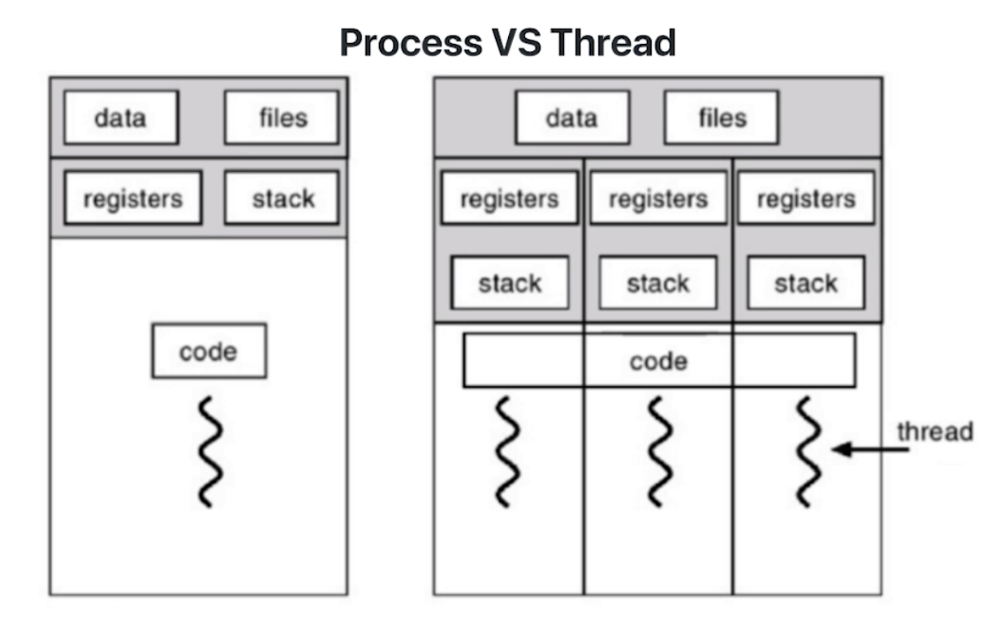
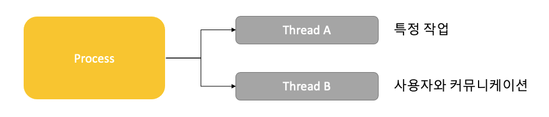

## 10. Thread
#### 1. Thread 란?
* Light Weight Process
* 하나의 프로세스에 여러개 Thread 생성 가능
* Thread 들을 동시에 실행 가능
* Process 안에 있으므로, 프로세스의 데이터를 모두 접근 가능
* Thread 는 각기 실행이 가능한 Stack 존재
  

#### 2. Multi Thread(멀티 스레드)
* 소프트웨어 병행 작업 처리를 위해서 multi thread 사용
    

#### 3. 멀티 프로세싱과 Thread
* 멀티 태스킹과 멀티 프로세싱
    * 멀티 태스킹 : 하나의 CPU 에 여러 프로세스
    * 멀티 프로세싱 : 하나의 프로세스를 여러개의 CPU 를 사용해서 나눠서 병렬 실행
* 최근 CPU 는 멀티 코어를 가지고 있기 때문에 Thread 을 여러 개 만들어서 멀티 코어 활용도를 높임

#### 4. Thread 장점, 단점
[장점]
1. 사용자에 대한 응답성 향상
   
    
2. 자원 공유 효율
    * IPC 기법과 같이 프로세스 간 자원 공유를 위해 번거로운 작업 필요 없음
    * 프로세스 안에 있으므로 프로세스의 데이터를 모두 접근 가능

3. 작업이 분리되어 코드가 간결
    * 간결하게 보일수도 있지만 하기 나름
    
[단점]
1. Thread 중 한 스레드만 문제 있어도 전체 프로세스가 영향을 받음
2. Thread 를 많이 생성하면 Context Switching 이 많이 일어나 성능 저하
    * 리눅스 에서는 Thread 를 Process 와 같이 다룸
    * Thread 를 많이 생성하면 모든 Thread 를 스케쥴링해야 하므로 Context Switching 이 빈번할 수 밖에 없음

#### 5. Process VS Thread
* 프로세스는 독립적, 스레드는 프로세스의 서브셋
* 프로세스는 각각 독립적인 자원을 갖음, 스레드는 프로세스 자원 공유
* 프로세스는 자신만의 주소 영역을 가짐, 스레드는 주소 영역 공유
* 프로세스 간에는 IPC 기법 통신, 스레드는 필요 없음


#### 6. PThread
* POSIX 스레드 (POSIX Threads 약어 PThread)
    * Thread 관련 표준 API
    
#### 7. 동기화(Synchronization) 이슈
* 동기화 : 작업들 사이에 실행 시기를 맞추는 것
* 여러 Thread 가 동일한 자원(데이터) 에 접근시 이슈가 생김
    * Thread 실행 순서는 정해져 있지 않음
    * Scheduler 가 그때 그때 선정해서 실행
    * 순서가 꼬이게 되면 비정상 동작을 할 수 있음 -> 디버깅이 어려움
    * 동일 자원을 여러 Thread 가 동시 수정시 각 Thread 결과에 영향을 줌

> 해결방안

* Mutual Exclusion(상호 배제)
    * 임계 자원 (critical resource)
    * 임계 영역 (critical section)
* Thread 는 프로세스 모든 데이터를 접근할 수 있다
    * 여러 Thread 가 접근 변경하는 공유 변수에 대해서 Exclusive Access 필요
    * 한 Thread 가 공유 변수를 갱신하는 동안 다른 Thread 가 동시 접근하지 못하도록 막음
    
#### 8. 동기화(Synchronization) 과 세마포어(Semaphore)
* Mutex 와 Semaphore
    * Critical Section(임계 구역) 에 접근을 막기 위해 Locking  메커니즘 필요
        * Mutex(binary semaphore)
            * 임계 구역에 하나의 Thread 만 들어갈 수 있음
        * Semaphore
            * 임계 구역에 여러 Thread 들어갈 수 있음
            * counter 를 두어 동시에 리소스에 접근 할 수 있는 허용 가능한 Thread 수 제어

* 세마포어(Semaphore)
    * P : 검사 (임계 영역에 들어갈 때) 
        * S 값이 1이상이면 임계 영역 진입 후 S 값 1 차감 ( S 값이 없으면 대기 )
    * V : 증가 (임계 영역에서 나올 때)
        * S 값을 1 더하고 임계 영역을 나옴
    * S : 세마포어 값 (초기 값만큼 여러 프로세스가 동시 임계 영역 접근 가능)
    
    ```
    P(S) : wait(S){
        while S <= 0 // 대기
        S--; // 다른 프로세스 접근 제한    
    }
    ```
  
    ```
    V(S) : signal(S){
        S++;
    }
    ```
  
    * wait() 은 S 가 0 이라면, 임계 영역에 들어가기 위해, 반복문 수행
            * 바쁜 대기, busy waiting
        
    * Semaphore - 대기 큐
        * S 가 음수일 경우 바쁜 대기 대신 대기큐에 넣는다

        ```
        wait(S) {
            S -> count--;
            if (S->count < 0) {
                add this process to S->queue;
                block()
            }
        }
        ```
        
        * wakeup() 함수를 통해서 대기 큐에 있는 프로세스 재실행
        ```
        wait(S) {
            S -> count++;
            if (S->count <= 0) {
                remove a process P from S->queue;
                wakeup(P)
            }
        }
        ```
    * 참고 : 세마포어 함수 (POSIX Semaphore)
        * sem_open(): 세마포어 생성
        * sem_wait(): 임계 영역 접근 전 세마포어를 잠그고 세마포어가 잠겨있으면 풀릴 때까지 대기
        * sem_post(): 공유자원에 대한 접근이 끝났을 때 세마포어 잠금 해지

#### 9. deadlock 과 starvation
* Deadlock (교착상태)
    * 무한 대기 상태 : 두개 이상의 작업이 서로 상대방의 작업이 끝나기만을 기다리고 있기 때문에 다음 단계로 진행하지 못하는 상태
    * 배치 처리 시스템에서는 일어나지 않는 문제
    * 프로세스 Thread 둘다 이와 같은 상태가 일어날 수 있음
    
    * 발생 조건
        1. 상호배제(Mutual Exclusion)
            * 프로세스들이 필요로 하는 자원에 대한 배타적인 통제권을 요구
        2. 점유 대기(Hold and wait)
            * 프로세스가 할당된 자원을 가진 상태에서 다른 자원 대기
        3. 비선점(No preemption)
            * 프로세스가 어떤 자원의 사용을 끝낼 떄까지 자원을 뺏을 수 없다
        4. 순환대기(Circular wait)
            * 각 프로세스가 순환적으로 다음 프로세스가 요구하는 자원을 가지고 있다.
    * 해결 방법
        * 조건의 일부를 코드에서 제외

* Starvation(기아상태)
    * 특정 프로세스의 우선순위가 낮아서 원하는 자원을 계속 할당 받지 못하는 상태
    * 교착상태와 기아상태
        * 교착상태는 여러 프로세스가 동일 자원 점유를 요청할 때 발생
        * 기상태는 여러 프로세스가 부족한 자원을 점유하기 위해 경쟁할 때 특정 프로세스는 영원히 자원 할당이 안되는 경우를 주로 의미

    * 해결 방안
        * 우선순위 변경
            * 프로세스 우선순위를 수시로 변경
            * 오래 기다린 프로세스 우선순위 높이기
            * 요청 순서대로 처리하는 FIFO 기반 요청 큐 사용

