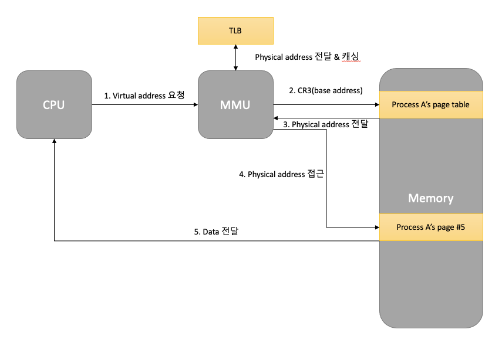

## 11. 가상메모리 (Virtual Memory System)

#### 1. 가상 메모리
* 실제 각 프로세스마다 충분한 메모리를 할당하기에는 메모리 크기가 한계 있음
* 폰 노이만 구조기반이므로 모든 코드는 메모리에 반드시 있어야함
* 가상메모리 : 메모리가 실제 메모리보다 많아 보이게 하는 기술
    * 실제 사용하는 메모리는 작다는 점에 착안해서 고안된 기술
    * 프로세스 간 공간 분리로 프로세스 이슈가 전체 시스에 영향을 주지 않을 수 있다
* 메인 메모리에 실제 각 프로세스의 데이터가 조각으로 씌여 있다.

#### 2. 가상 메모리가 필요한 이유
    * 하나의 프로세스만 실행 가능한 시스템(배치 처리 시스템 등)
    1. 프로그램을 메모리로 로드
    2. 프로세스 실행
    3. 프로세스 종료(메모리 해제)
    * 여러 프로세스 동시 실행 시스템
    1. 메모리 용량 부족 이슈
    2. 프로세스 메모리 영역간에 침범 이슈

#### 3. 가상메모리와 MMU
* 가상메모리 기본 아이디어
    * 프로세스는 가상 주소를 사용하고 실제 해당 주소에서 데이터를 읽고 쓸때만 물리 주소로 바꿔준다
    * Virtual Address : 프로세스가 참조하는 주소
    * Physical Address : 실제 메모리 주소
    
* MMU (Memory Management Unit)
    * CPU 에 코드 실행시 가상 주소 메모리 접근을 필요할 때 해당 주소를 물리 주소값으로 변환해주는 하드웨어
    
* 가상 메모리와 MMU 관계
    * CPU 는 가상 메모리를 다루고 실제 해당 주소 접근시 MMU 하드웨어 장치를 통해 물리 메모리 접근
    * 하드웨어 장치를 이용해서 주소 변환이 빠르기 떄문에 별도 장치를 둔다
    

#### 4. 페이징 시스템(paging system)
* 페이징(paging) 개념
    * 크기가 동일한 페이지로 가상 주소 공간과 이에 매칭하는 물리 주소 공간을 관리
    * 하드웨어 지원이 필요
    * 리눅스에서는 4kb로 paging
    * 페이지 번호를 기반으로 가상주소/물리주소 매핑 정보를 기록하고 사용
    
* 실질적인 예
    * 프로세스 (4GB) 의 PCB 에 Page Table 구조체를 가리키는 주소가 들어 있음
    * Page Table 에는 가상 주소와 물리 주소간 매핑 정보가 있음
    
* 페이징 시스템 구조
    * page 또는 page frame : 고정된 크기의 block
    * paging system
        * 가상 주소 v = (p,d)
            * p: 가상 메모리 페이지
            * d: p 안에서 참조하는 위치
              
    * 페이지 크기가 4KB 예
        * 가상 주소의 0 비트에서 11 비트가 변위 (d) 를 나타내고
        * 12 비트 이상이 페이지 번호

#### 5. 페이지 테이블(Page Table)
    * page table
        * 물리 주소에 있는 페이지 번호와 해당 페이지의 첫 물리 주소 정보를 매핑한 표
        * 가상 주소 v = (p, d) 라면
            * p: 페이지 번호
            * d: 페이지 처음부터 얼마 떨어진 위치
    * paging system 동작
        * 해당 프로세스에서 특정 가상 주소 엑세스를 하려면
            * 해당 프로세스의 page table 에 해당 가상 주소가 포함된 page 번호가 있는지 확인
            * page 번호가 있으면 page 가 매핑된 첫 물리 주소를 알고 (p')
            * p' + d 가 실제 물리 주소가 됨

#### 6. 페이징 시스템과 MMU(컴퓨터 구조)
* CPU 는 가상 주소 접근시
    * MMU 하드웨어 장치를 통해 물리 메모리 접근
* 프로세스 생성시 페이지 테이블 정보 생성
    * PCB 등에서 해당 페이지 테이블 접근 가능하고 관련 정보는 물리 메모리에 적재
    * 프로세스 구동 시 해당 페이지 테이블 base 주소가 별도 레지스터에 저장
    * CPU 가 가상 주소 접근시 MMU 가 페이지 테이블 base 주소를 접근해서 물리 주소를 가져옴

#### 7. 다중 단계 페이징 시스템
* 32 bit 시스템에서 4kb 페이지를 위한 페이지 시스템
    * 하위 12bit 오프셋
    * 상위 20bit 페이징 번호
    * 2^20(1048576) 개의 페이지 정보가 필요
* 페이징 정보를 단계를 나누어 설정
    * 필요 없는 페이지는 생성하지 않으면 공간 절약 가능
    
* MMU 와 TLB(컴퓨터 구조)
    * MMU 가 물리 주소를 확인하기 위해 메모리를 갔다와야 함
    * TLB(Translation Lookaside Buffer) : 페이지 정보 캐쉬
      

#### 8. 페이징 시스템과 공유 메모리
    * 프로세스간 동일한 물리 주소를 가리킬 수 있음(공간 절약, 메모리 할당 시간 절약)
    * 물리 주소 데이터 변경시
        * 물리 주소에 데이터 수정 시도시 물리 주소를 복사할 수 있다(copy-on-write)
        * 프로세스 생성시간 줄일 수 있음
        * 커널, 공유 메모리, 공유 데이터는 물리 메모리 공간 공유

#### 9. 요구 페이징(Demand Paging 혹은 Demanded Paging)
* 프로세스 모든 데이터를 메모리로 적재하지 않고 실행 중 필요한 시점에서만 메모리로 적재
    * 선행 페이징(anticipatory paging 혹은 prepaging) 의 반대 개념 : 미리 프로세스 관련 모든 데이터를 메모리에 올려놓고 실행하는 개념
    * 더 이상 필요하지 않은 페이지 프레임은 다시 저장매체에 저장( 페이지 교체 알고리즘 필요 )
  
#### 10. 페이지 폴트 (page fault)
* 어떤 페이지가 실제 물리 메모리에 없을 때 일어나는 인터럽트
* 운영체제가 page fault 가 일어나면, 해당 페이지를 물리 메모리에 올림
  
* 페이지 폴트가 자주 일어나면 실행되기 전에 해당 페이지를 물리 메모리에 올려야 하기 때문에 오래 걸림
* 페이지 폴트가 안일어나게 하려면 향후실행/참조될코드/데이터를 미리 물리 메모리에 올리면 됨->예측이 어려움

#### 11. 페이지 교체와 알고리즘
1) 페이지 교체 정책(page replacement policy)
* 운영체제가 특정 페이지를 물리 메모리에 올리려 하는데 물리 메모리가 차있다면?
  * 기존 페이지 중 하나를 물리 메모리에서 저장 매체로 내리고 (저장)
  * 새로운 페이지를 해당 물리 메모리 공간에 올림
  
  > 어떤 페이지를 물리 메모리에서 저장매체로 내릴것인가? -> Page Replacement(Swapping) Algorithm

2) 페이지 교체 알고리즘 (FIFO)
  * FIFO Page Replacement Algorithm
    * 가장 먼저 들어온 페이지를 내림
  
3) 페이지 교체 알고리즘 (OTP)
  * 최적 페이지 교체 알고리즘 (OPTimal Replacement Algorithm)
    * 앞으로 가장 오랫동안 사용하지 않을 페이지를 내림
    * 일반 OS 에서는 구현 불가
  
4) 페이지 교체 알고리즘(LRU) 
  * LRU(Least Recently Used) Page Replacement Algorithm
    * 가장 오래 전에 사용된 페이지를 교체 <- 가장 많이 사용
    * OPT 교체 알고리즘이 구현이 불가하므로 과거 기록을 기반으로 시도

5) 페이지 교체 알고리즘 (LFU)
  * LFU (Least Frequently Used) Page Replacement Algorithm
    * 가장 적게 사용된 페이지를 내리는 알고리즘

6) 페이지 교체 알고리즘 (NUR)
* NUR(Not Used Recently) Page Replacement Algorithm
    * LRU 와 마찬가지로 최근에 사용하지 않은 페이지부터 교체하는 기법
    * 각페이지마다 참조 비트(R), 수정 비트(M) 을 둠(R, M)
        * (0,0), (0,1), (1,0), (1,1) 순으로 페이지 교체
    
#### 12. 스레싱(Thrashing)
* 반복적으로 페이지 폴트가 발생해서 과도하게 페이지 교체 작업이 일어나 실제로는 아무일도 하지 못하는 상황

#### 13. 세그멘테이션 기법
* 가상 메모리를 서로 크기가 다른 논리적 단위인 세그먼트(Segment)로 분할
    * 페이징 기법에서는 가상 메모리를 같은 크기의 블록으로 분할
    * Ex) x86
        * CS(Code Segment), DS(Data Segment), SS(Stack Segment), ES(Extra Segment) 로 세그멘트를 나누어 메모리 접근
    
* 세그멘트 가상 주소
    * v = (s, d): s 는 세그먼트 번호, d는 블록 내 세그먼트의 변위
    
* 세그멘테이션은 크기가 다른 segment 단위로 물리 메모리에 로딩
* 내부 단편화(페이지 기법)
    * 페이지 블록만큼 데이터가 딱 맞게 채워져 있지 않을 때 공간 낭비
* 외부 단편화(세그멘테이션 기법)
    * 물리 메모리가 원하는 연속된 크기의 메모리를 제공해주지 못하는 경우
* 세그멘테이션 / 페이징 모두 하드웨어 지원 필요
    * 다양한 컴퓨터 시스템에 이식성을 중요기하는 리눅스는 페이징 기법을 기반으로 구현
