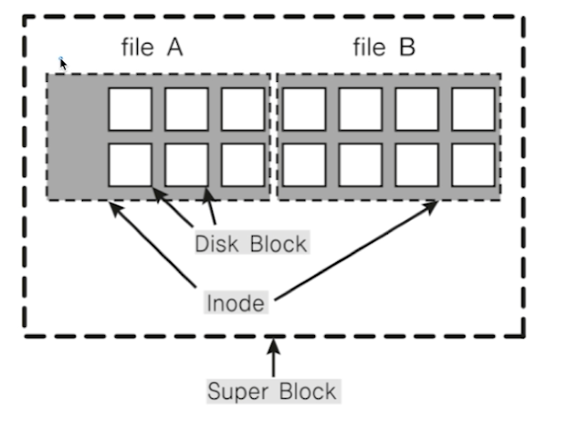

## 12. 파일 시스템 (File System)
* 운영체제가 저장 매체에 파일을 쓰기 위한 자료구조 또는 알고리즘

#### 1. 파일 시스템이 만들어진 이유
* 0 과 1의 데이터를 어떻게 저장매체에 저장하나?
    * 비트로 관리하기는 오버헤드가 너무 큼
    * 블록 단위로 관리하기로 함
    * 블록마다 고유 번호를 부여해서 관리
* 사용자가 각 블록 고유 번호를 관리하기 어려움
    * 추상적(논리적) 객체 필요 : 파일
* 사용자는 파일단위로 관리
    * 각 파일에는 블록 단위로 관리
* 저장매체에 효율적으로 파일을 저장하는 방법
    * 가능한 연속적인 공간에 파일을 저장하는 것이 좋음
    * 외부 단편화, 파일 사이즈 변경 문제로 불연속 공간에 파일 저장 기능 지원 필요
        * 블록 체인 : 블록을 링크드 리스트로 연결
            * 끝 블록을 찾으려면 맨 처음 블록부터 주소를 따라가야함
        * 인덱스 블록 기법 : 각 블록에 대한 위치 정보를 기록해서 한번에 끝 블록을 찾아갈 수 있도록 한다

#### 2. 파일시스템 종류
* windows : FAT, FAT32, NTFS
    * 블록 위치를 FAT 라는 자료 구조에 기록
* 리눅스(UNIX) : ext2, ext3, ext4
    * 일종의 인덱스 블록 기법인 inode 방식 사용

#### 3. 파일 시스템과 시스템 콜
* 동일한 시스템콜을 사용해서 다양한 파일 시스템 지원 가능토록 구현
    * read/write 시스템 콜 호출시, 각 기기 및 파일 시스템에 따라 실질적인 처리를 담당하는 함수 구현
    * 파일을 실제 어떻게 저장할지는 다를 수 있음
        * 리눅스 경우 ext4 외 NTFS, FAT32 파일 시스템 지원
          
            |함수| 의미|
            |:---:|:---:|
            |open|이미 존재하는 파일을 읽기 또는 쓰기용으로 열거나 새로운 파일을 생성하여 연다|
            |creat|새로운 파일을 생성해서 연다|
            |close|open 또는 creat 로 열려진 파일을 닫는다|
            |read|열려진 파일로부터 데이터를 읽어 들인다|
            |write|열려진 파일에 데이터를 쓴다|
            |lseek|파일 안에서 읽기 / 쓰기 포인터를 지정한 바이트 위치로 이동한다|
            |unlnk/remove|파일을 삭제한다|

#### 4. inode 방식 파일 시스템
* 파일 시스템 기본 구조
    * 수퍼 블록 : 파일 시스템 정보
    * 아이노드 블록 : 파일 상세 정보
    * 데이터 블록 : 실제 데이터
          

* inode 와 파일
    * 파일 : inode 고유값과 자료구조에 의해 주요 정보 관리
        * '파일이름:inode' 로 파일이름은 inode 번호와 매칭
        * 파일 시스템에서는 inode 를 기반으로 파일 엑세스
        * inode 기반 메타 데이터 저장
    * 프로세스 생성 -> process ID -> PCB <-- 스케줄링
    * 파일 생성 -> inode 번호 -> inode 블록 <-- 파일 처리
    
* inode 구조
    * inode 기반 메타 데이터 (파일 권한, 소유자 정보, 파일 사이즈, 생성시간 등 시간 관련 정보, 데이터 저장 위치 등)
    
#### 5. 디렉토리 엔트리
* 리눅스 파일 탐색
    * 각 디렉토리 엔트리를 탐색
        * 각 엔트리는 해당 디렉토리 파일, 디렉토리 정보를 가짐
    * '/' entry 에서 디렉토리를 찾고 또 그 안에 디렉토리에서 파일이름에 해당하는 inode 를 얻음
    
#### 6. 가상 파일 시스템 (Virtual File System)
* network 등 다양한 기기도 동일한 파일 시스템 인터페이스를 통해 관리 가능
* 예 : read/write 시스템콜 사용, 각 기기별 read_spec/write_spec 코드 구현(운영체제 내부)

