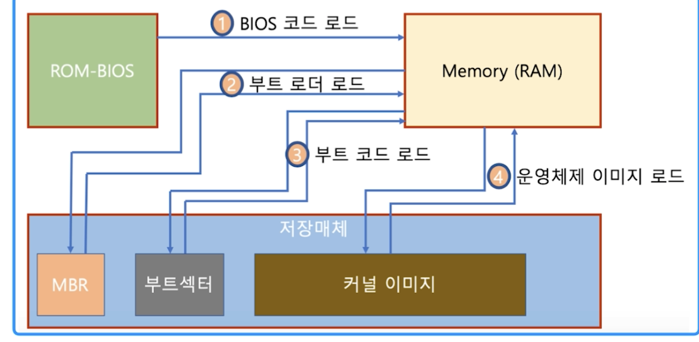

## 13. Boot

#### 1. Boot
* 컴퓨터를 켜서 동작시키는 절자
* Boot 프로그램
    * 운영체제 커널을 Storage 에서 특정 주소의 물리 메모리로 복사하고 커널의 처음 실행 위치로 PC를 가져다 놓는 프로그램
    
#### 2. Booting 절차
* BIOS 가 특정 Storage 읽어와 bootstrap loader 를 메모리에 올리고 실행
* bootstrap loader 프로그램이 있는 곳을 찾아서 실행
     

