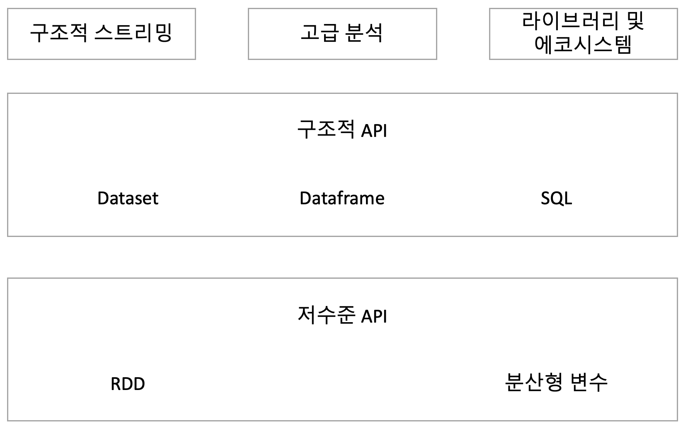

## 1. Apache Spark

#### 1. Apache Spark
* 통합 컴퓨팅 엔진
* 클러스터 환경에서 데이터를 병렬로 처리하는 라이브러리 집합
* Python, Java, Scala, R 언어를 지원
* 단일 노트북 환경에서 수천대의 서버로 구성된 클러스터까지 다양한 환경에서 실행 가능
* 빅데이터 처리를 쉽게 시작할 수 있고 엄청난 규모의 클러스터로 확장 가능



#### 2. Apache Spark 철학
* 빅데이터를 위한 통합 컴퓨팅 엔진과 라이브러리 집합
1. 통합
    * 빅데이터 애플리케이션 개발에 필요한 통합 플랫폼을 제공하는것이 목표
    * 일관성 있는 조합형 API 를 제공하여 코드나 기존 라이브러리를 사용해서 애플리케이션 생성
    * 직접 스파크 기반 라이브러리를 만들 수 있음
    * 범용 API 와 처리 능력의 결합으로 대화형 분석 및 운영용 애플리케이션에 필요한 플랫폼 만들 수 있음
    * 예
        * SQL 쿼리로 데이터를 읽고 ML 라이브러리로 머신러닝 모델 평가
        * 두 단계를 하나로 병합 데이터를 한번만 조회
    
2. 컴퓨팅 엔진
    * 저장소 시스템의 데이터를 연산하는 역할만 수행하고 저장소 역할은 수행하지 않음
    * Azure Storage, S3, Hadoop, Cassandra, Kafka 등의 저장소를 지원
    * 연산 기능에만 초점을 맞추고 있음
    * 공개형 클라우드 환경이나 스트리밍 애플리케이션 같은 연산 노드와 저장소를 별도로 사용하는 환경에서 많이 사용(Hadoop 은 저장소와 시스템 같이 개발)
    
3. 라이브러리
    * 데이터 분석 작업에 필요한 통합 API 를 제공하는 통합 엔진 기반의 자체 라이브러리
    * 라이브러리는 지속적으로 발전중
    * SQL 구조화된 데이터를 제공하는 Spark SQL
    * 머신러닝을 지원하는 MLlib
    * 스트림 처리 기능하는 Spark Streaming
    * 그래프 분석 엔진인 GraphX
    * 외부 라이브러리 목록은 spark-packages.org 에서 확인 가능
    
#### 3. Apache Spark 설치 for mac
```
# brew install apache-spark
```
