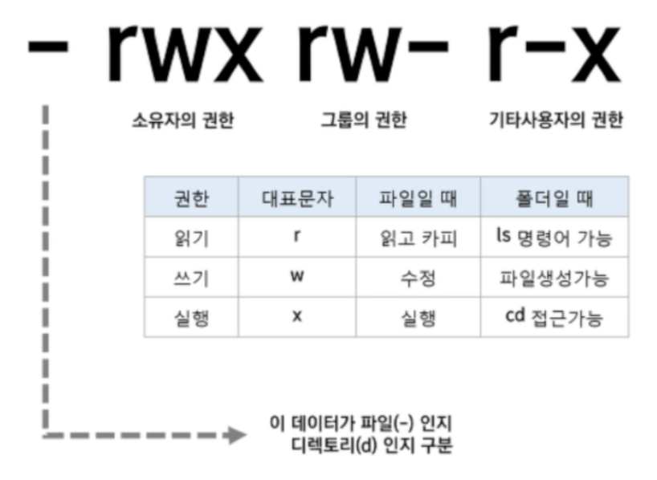
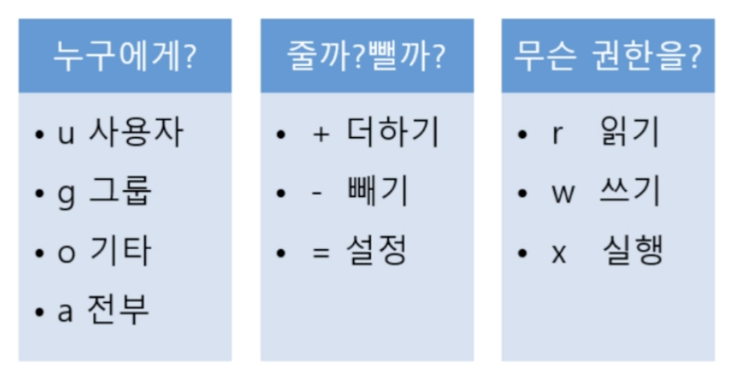
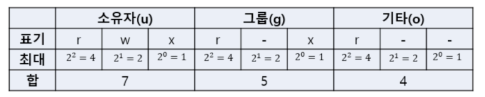
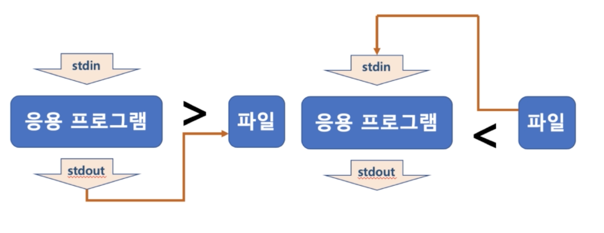
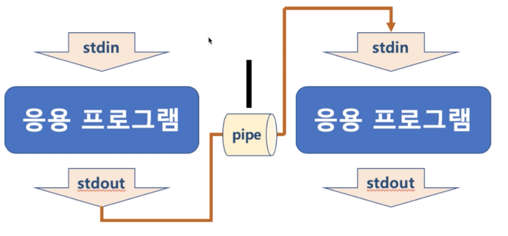

## 3. 시스템 기본 프로그래밍 - 1

#### 1. 다중 사용자 지원
1. 쉘 종류
* 사용자와 컴퓨터 하드웨어 또는 운영체제간 인터페이스
    * 사용자의 명령을 해석해서 커널에 명령을 요청해주는 역할
    * 관련된 시스템콜을 사용해서 프로그래밍이 작성되어 있음
* Bourne-Again Shell(bash) : GNU 프로젝트 일환으로 개발, 리눅스 거의 디폴트
* Bourne Shell(sh)
* C Shell(sch)
* Korn Shell(ksh) : 유닉스에서 가장 많이 사용

2. 리눅스 기본 명령어
* 리눅스 명령어는 결국 쉘이 제공하는 명령어
* 리눅스 기본 쉘이 bash 이므로 bash 에서 제공하는 기본 명령어

3. 다중 사용자 명령어
* whoami : 로그인한 사용자 ID 호출
```
# whoami
ubuntu
```

* passwd : 로그인한 사용자 ID의 암호변경
```
# passwd
Changing password for ubuntu.
Current password:

# sudo passwd jun
```

* useradd 와 adduser
    * useradd 는 사용자 기본 설정 자동으로 하지 않음
    * adduser 는 사용자 기본 설정을 자동으로 수행
```
# sudo adduser jun
```

* sudo 명령어 : root 권한으로 실행
    * root 계정으로 로그인 하지 않은 상태에서 root 권한이 필요한 명령을 실행할 수 있도록 하는 프로그램
    * 기본 사용법
        * sudo 명령어
        * 사용 예
            * sudo apt-get update
    
* su : 사용자 변경
    * 보통 su - 와 함께 사용
        * su root : 현재 사용자의 환경설정 기반 root 로 변경
        * su -root : 변경되는 사용자의 환경설정 기반으로 root 전환
    
```
# su - root
# su - jun
```

* sudo 명령어 : root 권한으로 실행
    * /etc/sudoers 설정 파일에서 다음과 같이 설정을 변경할 수 있음
        * visudo 가 설치 되어 있다면 해당 명령을 통해 설정 파일이 오픈되어 바로 수정 가능
```
1. 특정 사용자가 sudo 를 사용할 수 있도록 설정
    userid      ALL=(ALL)       ALL
2. 특정 그룹에 포함된 모든 사용자가 sudo를 사용할 수 있도록 설정
    %group      ALL=(ALL)       ALL
3. 패스워드 생략 설정
    %group      ALL=(ALL)       NOPASSWD: ALL
    userid      ALL=(ALL)       NOPASSWD: ALL
```
    * 예: sudo apt-get update


#### 2. 파일 및 권한 관리
* pwd : 현재 디렉토리 위치
```
# pwd
```

* cd : 디렉토리 이동
```
# cd /home
```

* ls : 파일 목록 출력
```
# ls
# ls -al
```

* ls 와 와일드 카드
    * * 는 임의 문자열
    * ? 는 문자 하나
    
```
# ls debi*
debian-start
debian.cnf
```

* man 명령어
    * manual 이라는 의미, man rm 을 입력하면 매뉴얼이 나옴
    
* ls 와 파일 권한
    * 파일마다 소유자, 소유자 그룹, 모든 사용자에 대해
        * 읽고 쓰고 실행하는 권한 설정
        * 소유자 접근 구너한 정보는 inode 에 저장
    
```
# ls .bash* -al
-rw------- 1 ubuntu ubuntu   73 May 19 01:23 .bash_history
-rw-r--r-- 1 ubuntu ubuntu  220 Feb 25  2020 .bash_logout
-rw-r--r-- 1 ubuntu ubuntu 3771 Feb 25  2020 .bashrc
```
   

* 파일권한
    * 사용자
        * 소유자 : 소유자에 대한 권한
        * 그룹 : 소유자가 속해 있는 그룹에 대한 권한
        * 공개 : 모든 사용자들에 대한 권한
    * 퍼미션 종류, (권한 기호)
        * 읽기(r) : 읽기 권한
        * 쓰기(w) : 쓰기 권한
        * 실행(x) : 실행 권한
    
* chmod : 파일 권한 변경
    * 기호 문자를 사용하는 방법
         
      ```
      # chmod g+rx test.c
      # chmod u+rw test.c
      # chmod ug+rw text.c
      # chmod u=rwx, g=rw, o=rx, text.c
      ```
    * 숫자를 사용하는 방법
         
    ```
    rxwrwxrwx = 777
    r-xr-xr-x = 555
    r-------- = 400
    rwx------ = 700
    ```
    ```
    # chmod 400 aws_test.pem
    ```
    * 주로 사용하는 옵션
        * chmod -R 777 directory
    
* chown : 소유자 변경
    * chown [옵션][소유자:소유그룹][파일]
    ```
    # chown root:root file
    # chown root: file
    # chown :root file
    ```
    * 주로 사용하는 옵션
        * chown -R root:root directory
    * 참고: 소유자 그룹 변경
        * chgrp [옵션][그룹][파일]
        * 예: chgrp -R root directory
    
* cat : 파일 보기
    ```
    # cat mysql.cnf
    mysql.cnf 파일 내용이 출력
    ```
  
* head/tail : head 는 파일 시작부분, tail 은 끝 부분을 보여줌
```
# head mysql.cnf
mysql.cnf 파일 앞부분만 출력(기본 10줄)
# tail mysql.cnf
mysql.cnf 파일 뒷부분만 출력(기본 10줄)
```

* more : 파일 보기(화면이 넘어갈 경우 화면이 넘어가기전까지 보여줌)
```
# more mysql.cnf
```

* rm : 파일 및 폴더 삭제
    * 주로 사용하는 명령어 형태 : rm -rf
    * r 옵션 : 하위 디렉토리를 포함한 모든 파일 삭제
    * f 옵션 : 강제로 파일이나 디렉토리 삭제
    ```
    # rm mysql.cnf
    ```

#### 3. 리눅스 리다이렉션(redirection) 과 파이프(pipe)
1. Standard Stream(표준 입출력)
* command 로 실행되는 프로세스는 세자기 스트림을 가지고 있음
    * 표준 입력 스트림 (standard Input Stream) - stdin
    * 표준 출력 스트림 (standard Output Stream) - stdout
    * 오류 출력 스트림 (Standard Error Stream) - stderr
    
* 모든 스트림은 일반적인 Plain Text 로 console 에 출력하도록 되어 있음

2. 리다이렉션 (redirection)
* 표준 스트림 흐름을 바꿔줄 수 있다
    * **>** , **<** 을 사용
    * 주로 명령어 표준 출력을 화면이 아닌 파일에 쓸 때
         
      
* 예
    * ls > files.txt
        * ls 로 출력되는 표준 출력 스트림의 방향을 files.txt 로 바꿔줌 (files.txt 에 ls로 출력되는 결과가 저장됨)
    * head < files.txt
        * files.txt 의 파일 내용이 head 라는 파일의 처음부터 10 라인까지 출력해주는 명령으로 넣어짐 (files.txt 의 앞 10 라인이 출력됨)
    * head < files.txt > files2.txt
        * files.txt 의 파일 내용이 head 로 들어가서 files.txt 의 앞 10 라인 출력
        * head 의 출력 스트림은 다시 files2.txt 로 들어감
        * head 는 files.txt 내용을 출력하지 않고, 해당 출력 내용이 다시 files2.txt 에 저장됨 (결과적으로 files.txt 의 앞 라인이 files2.txt 에 저장됨)
    * 기존 파일에 추가는 >> 또는 << 사용
        * ls >> files.txt
        * 기존에 있는 files.txt 파일 끝에 ls 출력 결과를 추가
    
3. 파이프 (pipe)
* 두 프로세스 사이에서 한 프로세스의 출력 스트림을 또 다른 프로세스의 입력 스트림으로 사용할 때 사용됨
  
  
* 예
    * ls | grep files.txt
        * ls 명령을 통한 출력 내용이 grep 명령의 입력 스트림으로 들어감
        * grep files.txt 는 grep 명령의 입력 스트림을 검색해서 files.txt 가 들어있는 입력 내용만 출력해줌
        * 따라서 ls 명령으로 해당 디렉토리, 파일 중에 files.txt 파일이 있는지를 출력해줌
    
> grep 명령어

* grep : 검색 명령어
    * grep [-option] [pattern] [file or directory name]
    
```
<option>
    -i : 영문의 대소문자를 구별하지 않는다.
    -v : pattern 을 포함하지 않는 라인을 출력한다
    -n : 검색 결과의 각 행의 선두에 행 번호를 넣는다 (first line is 1)
    -l : 파일 명만 출력한다
    -c : 패턴과 일치하는 라인의 개수만 출력한다
    -r : 하위 디렉토리까지 검색한다
```
    * 예
        * grep python files.txt
            * files.txt 파일에서 python 라는 문구가 들어간 모든 행 출력
        * grep -n python files.txt
            * files.txt 파일에서 python 문구가 들어간 모든 행을 라인까지 출력      
        * grep -r python foldername
            * 폴더 내의 모든 파일 중 python 라는 문구가 들어간 행 출력
        * grep -i python files.txt 
            * files.txt 파일에서 python 라는 문구를 대, 소문자 구분 없이 검색해서 출력
        * grep -E "go|python|java" files.txt 
            * files.txt 파일에서 go, java 또는 pyhthon 이 있는 모든 행 출력

