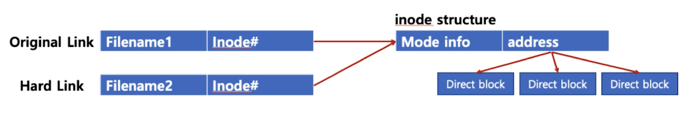

## 5. 시스템 기본 프로그래밍 - 3

#### 1. 파일 시스템
1. 리눅스와 파일
* 모든 것은 파일이라는 철학을 따름
    * 모든 인터렉션은 파일을 읽고 쓰는 것처럼 이루어져 있음
    * 마우스 키보드와 같은 모든 디바이스 관련된 기술도 파일로 같이 다루어짐
    * 모든 자원에 대한 추상화 인터페이스로 파일 인터페이스를 활용

2. 가상 파일 시스템
* 파일 네임스페이스
    * 전역 네임스페이스 사용
        * /media/floofy/image.jpg
        * 예 ) cat tty

3. 슈퍼블록, inode 파일
* 슈퍼블록
    * 파일 시스템의 정보
* 파일
    * inode 고유값과 자료구조에 의해 주요 정보 관리
        * '파일:inode' 로 파일 이름은 inode 번호와 매칭
        * 파일 시스템에서는 inode 를 기반으로 파일 엑세스
        * inode 기반 메타 데이터 저장
        * inode 기반 메타 데이터
            * 파일권한, 소유자 정보, 파일 사이즈, 생성시간 등 시간 관련 정보, 데이터 저장 위치 등...

4. 파일과 inode
* 리눅스 파일 탐색
    * 예 ) /home/ubuntu/link.txt
    * 각 디렉토리 엔트리(dentry)를 탐색
        * 각 엔트리는 해당 디렉토리 파일/디렉토리 정보를 가지고 있음
    * '/' dentry 에서 'home'을 찾고 'home' 에서 'ubuntu'를 찾고 'ubuntu'에서 link.txt 파일이름에 해당하는 inode 를 얻음
    * 각각 파일이나 디렉토리는 inode 를 가지고 있음

#### 2. Hard Link 와 Soft Link
1. cp 명령 
* 파일 복사
* A 와 B 는 각각 물리적으로 저장
```
# cp A B 
```

2. Hard Link
```
# ln A B
# ls -i (파일 inode 확인)
# ls -al (완전 동일한 파일)

```
* 동알한 파일을 가진 이름을 하나 더 만든 것
* inode 는 동일
* 전체 파일 용량은 달라지지 않음
* rm A 로 A 를 삭제하면 B 는 그래도 해당 파일 접근 가능
    *  해당 inode 정보만 삭제되고 inode 를 가진 실제 파일은 그대로 남음
    
* Hard Link 와 inode
  

3. Soft Link
```
ln -s A B
```
* 바로가기와 동일
* ls -al 하면 소프트링크 확인 가능
* rm A 로 삭제하면 B 는 파일 접근 불가

* Soft Link 와 inode
  

> Hard Link, Soft Link 둘다 어느 하나 파일을 수정하면 각 파일이름으로 동일한 내용 접근 가능

#### 3. 특수 파일
* 디바이스
    * 블록 디바이스(Block Device)
        * HDD, CD/DVD 와 같이 블록 또는 섹터 등 정해진 단위로 데이터 전송, IO 송수신 속도가 높음
    * 캐릭터 디바이스(Character Device)
        * 키보드, 마우스 등 byte 단위 데이터 전송, IO 송수신 속도가 낮음
        
    * cd /dev, cat tty

    
