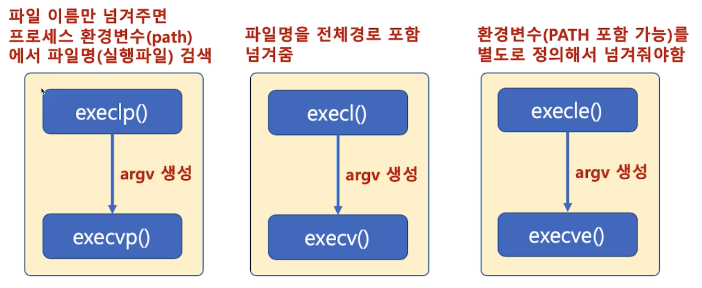
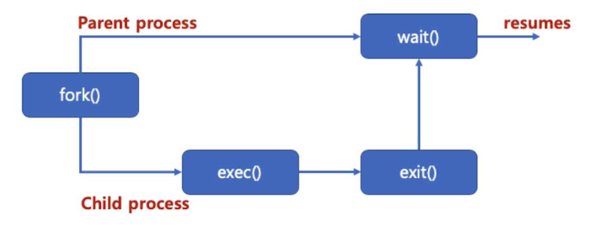
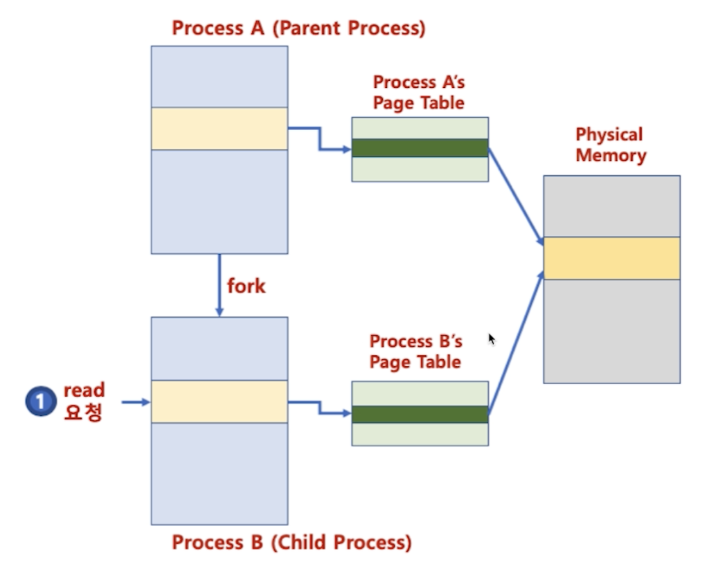
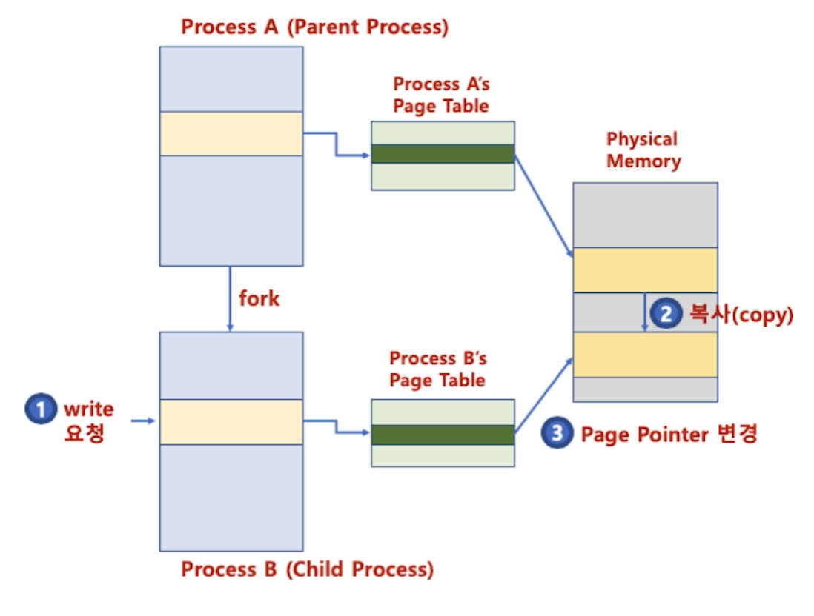

## 8. 프로세스 생성

#### 1. 프로세스 생성
* 기본 프로세스 생성 과정
    * TEXT, DATA, BSS, HEAP, STACK 의 공간을 생성
    * 프로세스 이미지를 해당 공간에 업로드 하고 실행 시작
* 프로세스 계층
    * 다른 프로세스는 또 다른 프로세스로부터 생성
    * 부모 프로세스, 자식 프로세스
    1. 공간만들고 
    2. 이미지 다운
    3. 실행 (stack/heap)

#### 2. fork() 와 exec() 시스템 콜
* fork() 시스템 콜
    * 새로운 프로세스 공간을 별도로 만들고, fork() 시스템콜을 호출한 프로세스(부모 프로세스) 공간을 모두 복사
        * 별도의 프로세스 공간을 만들고 부모 프로세스 공간의 데이터를 그대로 복사
    ```
    헤더 파일 : <unistd.h>
    함수 원형 : pid_t fork(void); <- void 인자 없음
    ```
    ```
    #include <sys/type.h>
    #include <unistd.h>
    #include <stdio.h>
    int main(){
        pid_t pid;
        print("Before fork() call \n");
        pid = fork();
  
        if(pid == 0)
            printf("This is Child process. PID is %d\n", pid);
        else if(pid>0)
            printf("This is Parent process. PID is %d\n", pid);
        else
            printf("fork() is failed \n");
        return 0;
    }
    ```
    * pid = fork() 가 실행되면 부모 프로세스와 동일한 자식 프로세스가 별도 메모리 공간에 생성
    * 자식 프로세스는 pid 가 0 으로 리턴, 부모 프로세스는 실제 pid 리턴
    * 두 프로세스의 변수 및 PC(Program Count) 값은 동일
    * 새로운 프로세스 공간을 별도로 만들고, fork() 시스템콜을 호출한 프로세스(부모 프로세스) 공간을 모두 복사한 후, fork() 시스템콜 이후 코드부터 실행

* exec() 시스템 콜
    * exec() 시스템콜을 호출한 현재 프로세스 공간의 TEXT, DATA, BSS 영역을 새로운 프로세스의 이미지로 덮어 씌움
        * 별도의 프로세스 공간을 만들지 않음
    
    * exec() 시스템콜 family
    ```
    헤더 파일: <unistd.h>
    함수 원형:
    int execl(const char *path, const char *arg, ...);
    int execlp(const char *file, const char *arg, ...);
    int execle(const char *path, const char *arg, ..., char * const envp[]);
    int execv(const char *path, char *const argv[]);
    int execvp(const char *file, char *const argv[]);
    int execvpe(const char *file, char *const argv[], char *const envp[]);
    ```
    * execl() 시스템콜
    ```
    execl("디렉토리와 파일 이름이 합친 전체 이름", "명령어 인수 리스트", "끝은 NULL 로 끝나야 함");
    ```
    ```
    #include <unistd.h>
    #include <stdio.h>
    #include <stdlib.h>
    int main(){
        printf("execute ls \n");
        execl("/bin/ls","ls","-l", NULL);
        perror("execl is failed \n");
        exit(1);
    }
    ```
    * execlp() 시스템콜
    ```
    // 파일 이름을 해당 프로세스를 실행한 프로세스의 환경변수(path)를 검색함
    execlp("파일 이름","명령어 인수 리스트", "끝은 NULL 로 끝나야 함");
    ```
    ```
    execlp("ls","ls","-al", NULL);
    ```
    
    * execle() 시스템콜 
    ```
    // 환경 변수를 지정하고자 할 때
    char *envp[] = {"USER=dave", "PATH=/bin", (char *)0};
    execlp("ls","ls","-al", NULL, envp);
    ```
    * execv() 시스템콜
    ```
    // 인수 리스트를 내용으로 하는 문자열 배열
    execv("/bin/ls", arg);
    ```
    * execvp() 시스템콜
    ```
    // 파일 이름을 해당 프로세스를 실행한 프로세스의 환경변수 (path) 를 검색
    // 인수 리스트를 내용으로 하는 문자열 배열
    char *arg[] = {"ls", "-al", NULL};
    execvp("ls", arg);
    ```
    * execve() 시스템콜
    ```
    // 환경변수를 지정하고자 할때
    char *envp[] = {"USER=dave", "PATH=/bin", (char *)0};
    // 인수 리스트를 0내용으로 하는 문자열 배열
    char *arg[] = {"ls", "-al", NULL, envp};
    execve("ls", arg);
    ```
    
    
#### 3. 프로세스 생성
* wait() 시스템콜
    * wait() 함수를 사용하면 fork() 함수 호출시 자식 프로세스가 종료할 때까지 부모 프로세스가 기다림
    * 자식 프로세스와 부모 프로세스의 동기화. 부모 프로세스가 자식 프로세스보다 먼저 죽는 경우를 막기 위해 사용(고아 프로세스)
      

* fork(), excel(), wait() 시스템 콜
    * execl() 만 사용하면 부모 프로세스 사라짐
    * 이를 유지하기 위해 fork() 로 새로운 프로세스 공간 복사 후 execl() 사용
    * wait() 함수를 사용해서 부모 프로세스가 자식 프로세스가 끝날 때까지 기다릴 수 있음
    > 쉘 프로그램은 fork(), exec() 계열, wait() 함수를 기반으로 작성 가능
    ```
    int main(){
        int pid;
        int child_pid;
        int status;
        pid = fork();
        switch (pid){
            case -1:
                perror("fork is failed \n");
                break;
            case 0:
                execl("/bin/ls", "ls", "-al",NULL);
                perror("execl is failed\n");
                break;
            default:
                child_pid = wait(NULL);
                printf("ls is complete\n");
                printf("Parent PID (%d), Child PID (%d) \n", getpid(), child_pid);
                exit(0);
        }
    }
    ```
  
#### 4. Copy-on-write
* fork() 는 새로운 프로세스 공간 생성 후 기존 프로세스 공간 복사
> 4GB 를 복사한다면 프로세스 생성 시간이 오래 걸림
* 자식 프로세스 생성시 부모 프로세스 페이지를 우선 사용
* 부모 또는 자식 프로세스가 해당 페이지를 읽기가 아닌 쓰기를 할때
    * 페이지를 복사하고 분리
* 장점
    * 프로세스 생성 시간을 줄임
    * 새로 생성된 프로세스에 새롭게 할당되어야 하는 페이지 수도 최소화
* **read** 시
    * 자식 프로세스 생성시 부모 프로세스 페이지를 우선 사용
    
* **write** 시
    * 부모 또는 자식 프로세스가 해당 페이지를 읽기 아닌 쓰기 처음 요청시 페이지 복사 및 분리
    
      


