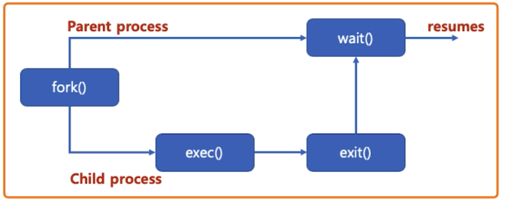

## 9. 프로세스 종료

#### 1. 프로세스 종료
* exit() 시스템콜 : 프로세스 종료
```
#include <stdilib.h>
void exit(int status);
```

* main 함수의 return 0; 와 exit(0); 의 차이
    * exit() 함수 
        * 즉시 프로세스를 종료함 (exit() 함수 다음에 있는 코드는 실행되지 않음)
    * return 0 
        * main() 이라는 함수를 종료
        * main() 에서 return 시 c 언어 실행 파일에 기본으로 포함된 _start() 함수를 호출하게 되고 해당 함수는 결국 exit() 함수를 호출
> main() 함수에서 return 0; 은 exit() 호출과 큰 차이가 없음

* 부모 프로세스는 status & 0377 계산 값으로 자식 프로세스 종료 상태 확인 가능
```
#include <stdlib.h>
void exit(int status);
```
* 기본 사용 예
```
exit(EXIT_SUCCESS); // EXIT_SUCCESS 는 0
exit(EXIT_FAILURE); // EXIT_FAILURE 는 1
```

* exit() 시스템콜 주요 동작
    * atexit() 에 등록된 함수 실행
    * 열러 있는 모든 입출력 스트림 버퍼 삭제
    * 프로세스가 오픈한 파일을 모드 닫음
    * tmpfile() 함수를 통해 생성한 임시 파일 삭제
        * 참고 : tmpfile() - 임시 파일을 wb+ (쓸 수 있는 이진파일 형태) 모드로 오픈 가능
        ```
        #include <stdio.h>
        FILE *tmpfile(void);
        ```
      
* atexit() 함수
    * 프로세스 종료시 실행될 함수를 등록하기 위해 사용
    * 등록된 함수를 등록된 역순서대로 실행
    
#### 2. wait() 시스템콜 상세
* wait() 함수를 사용하면 form() 함수 호출시 자식 프로세스 종료할 때까지 부모 프로세스가 기다림
* 자식 프로세스가 종료되면 좀비 프로세스가 되어 해당 프로세스 조사를 위한 최소 정보만 가지고 있는 상태가 됨
* 완전히 끝나면 해당 정보도 삭제되고 부포 프로세스에 SIGCHLD 시그널이 보내짐
  
  
* wait() 리턴값
    * 에러가 발생한 경우
    ```
    #include <sys/wait.h>
    pid_t wait (int *status)
    // 리턴값은 종료된 시작 프로세스의 pid
    ```
    * status 정보를 통해 기본적인 자식 프로세스 관련 정보를 확인할 수 있음
    ```
    int WIFEXITED(status);
    // 자식 프로세스가 정상 종료 시 리턴값은 0이 아닌 값이 됨
    ```
  
#### 3. 우선순위 기반 스케줄러
* priority-based 스케줄러
    * 정적 우선순위
        * 프로세스마다 우선순위를 미리 지정
    * 동적 우선순위
        * 스케줄러 상황에 따라 우선순위를 동적으로 변경
    
1. 우선순위 변경 - nice()
* 프로세스 중 사실상 root 가 소유한 프로세스만 우선순위를 높일 수 있음
    * 다른 프로세스는 우선순위를 낮출 수 만 있음
    * 스케쥴링 방식에 따라 우선순위가 적용될 수 도 있고 안될수도 있음
    
```
#include <unistd.h>
int nice(int inc);
```
2. 우선순위 변경 - getpriority(), setpriority()
```
#include <sys/resource.h>
int getpriority(int which, id_t who);
int setpriority(int which, id_t who, int value);
```
* which : 프로세스(PRIO_PROCESS), 프로세스 그룹(PRIO_PGRP), 사용자(PRIO_USER) 별로 우선순위를 가져올 수 있음

* 예제 - priority.c(root 소유로 실행)
    * 이외에 스케줄링 조작 시스템콜 기본 제공(POSIX 기반), 스테줄링 알고리즘 변경으로 사용은 어려움
    
```
#include <sys/resource.h>
int which = PRIO_PROCESS;
id_t pid;
int ret;
pid = getpid();
ret = getpriority(which, pid);
```

