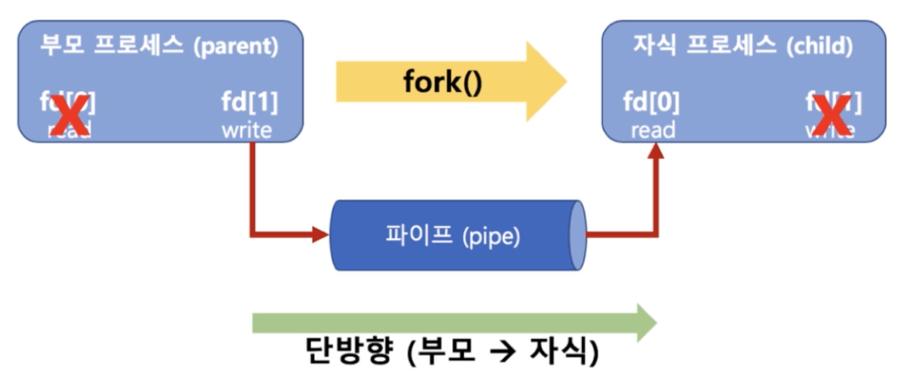

## 10. IPC 기법
* IPC
    * InterProcess Communication
    1. file 사용
    2. Message Queue
    3. Shared Memory
    4. Pipe
    5. Signal
    6. Semaphore
    7. Socket
    ...

#### 1. Pipe (파이프)
* 기본 파이프는 단방향 통신
* fork() 로 자식 프로세스 만들었을 때 부모와 자식간의 통신
  

#### 2. 메시지 큐(message queue)
* 큐니까 기본 FIFO 정책으로 데이터 전송

```
msqid = msgget(key, msgflg)
```
* msgflg 설정
    * IPC_CREAT
        * 새로운 키면 식별자를 새로 생성, IPC_CREAT|접근권한   
        * IPC_CREAT|0644 -> rw-r--r--
    
```
msgnd(msqid, &sbuf, buf_length, IPC_NOWAIT)
```
* msgflg 설정 : 블록모드(O) / 비블록모드(IPC_NOWAIT)

* 메시지큐 전송 프로그램 일부 코드
```
msqid = msgget(1234, IPC_CREAT|0644)
msgsnd(msqid, &sbuf, buf_length, IPC_NOWAIT)
```

```
ssize_t msgrcv(int msqid, void *msgp, size_t msgsz, long msgtyp, int msgflg)
msgrcv(msqid, &rbuf, MSGSZ, 1, 0)
```
* msgtyp 설정
    * 0 이면 번째 메시지 양수이면 타입이 일치하는 첫번째 메시지
* msgflg 설정: 블록모드(O) / 비블록모드(IPC_NOWAIT)
* 메시지큐 전송 프로그램 일부 코드
```
msqid = msgget(1234, IPC_CREAT|0644)
msgrcv(msqid, &sbuf, MSGSZ, 1, 0)
```

#### 3. ftok() - 참고
* ftok() 키 생성을 위한 함수
    * path 경로명의 inode 값과 숫자값(id) 를 기반으로 키 생성
    * 경로 삭제 후 재생성시 inode 값이 달라지므로 이전과는 다른 키값이 리턴
    ```
    #include <sys/ipc.h>
    key_h ftok(const char *path, int id);
    key = ftpk("keyfile", 1);
    id = msgget(key, IPC_CREAT|0640);
    ```

#### 4. IPC 기법과 커널모드
* pipe, message queue 모두 커널 공간을 사용
* ipcs 명령으로 message queue, 공유메모리, semaphore 확인해보기
```
# ipcs
```

#### 5. 공유 메모리(shared memory)
* 노골적으로 kernel space 에 메모리 공간을 만들고 해당 공간을 변수처럼 쓰는 방식
* message queue 처럼 FIFO 방식이 아니라 해당 메모리 주소를 마치 변수처럼 접근하는 방식
* 공유메모리 key를 가지고 여러 프로세스가 접근 가능
1. 공유 메모리 생성
```
#include <sys/types.h>
#include <sys/ipc.h>
#include <sys/shm.h>

// key : 임의 숫자 또는 ftok 함수로 생성한 키 값
// size : 공유 메모리 크기
// shmflg : 공유 메모리 속성
// 리턴 값 : 공유 메모리 식별자 리턴
int shmget(key_t key, size_t size, int shmflg);

shmid = shmget((key_t)1234, SIZE, IPC_CREAT|0666))
```

2. 공유 메모리 연결
```
#include <sys/types.h>
#include <sys/shm.h>
// shmid : shmget 함수로 생성한 공유 메모리 식별자
// shmaddr : 공유 메모리 연결 주소 ( 보통 (char *) NULL 으로 설정하면, 알아서 적절한 주소로 연결)
// shmflg : 공유 메모리의 읽기/쓰기 권한 (0 이면 읽기/쓰기 가능, SHM_RDONLY면 읽기만 가능)
// 리턴 값 : 성공시 연결된 공유 메모리의 시작 주소를 리턴
void *shmat (int shmid, const void *shmaddr, int shmflg);
shmaddr = (char *) shmat(shmid, (char *)NULL, 0)
```

3. 공유 메모리 해제
```
#include <sys/types.h>
#include <sys/shm.h>
int shmdt(char *shmaddr);
```

4. 공유 메모리 읽기
```
printf("%s\n", (char *) shmaddr)
```

5. 공유 메모리 쓰기
```
strcpy((char *) shmaddr, "Linux Programming")
```

